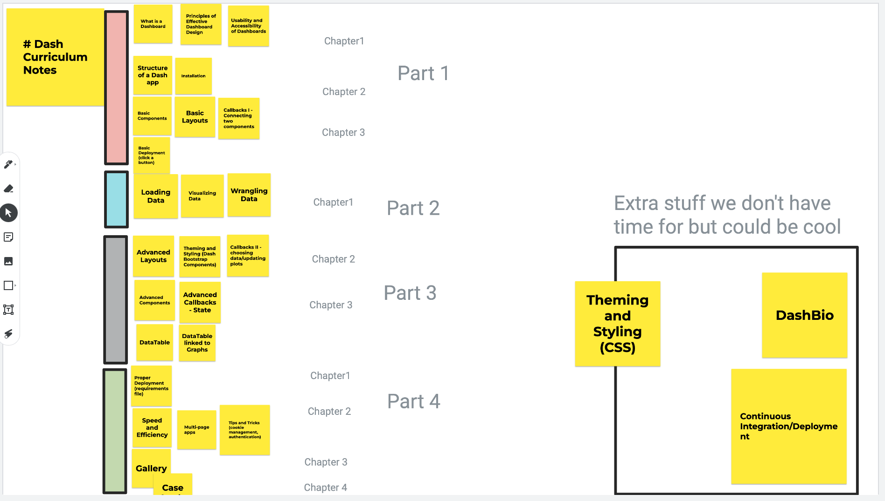

# Overview of Dash Curriculum

## Part 1: Introduction
 - What Dash is. Who Plotly is.

### Chapter 1: What is a dashboard

- Sample Dashboards
- Theory on Dashboards
- Principles of effective dashboard design
- Usability and Accessibility of Dashboards
- Web app versus dashboard

### Chapter 2: Getting Started with Dash

 - Structure of a Dash app
 - Installation

### Chapter 3: sadfdsf

 - dsafdsaf

### Chapter 4: Deploying app to the Web

 - Basic deployment to Heroku

## Part 2: Data Science

## Part 3: Dash

## Part 4: Important stuff
