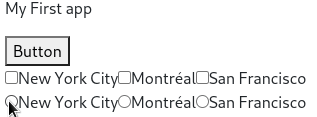
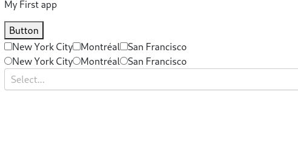
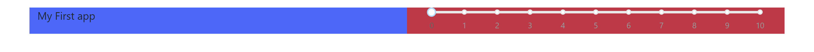
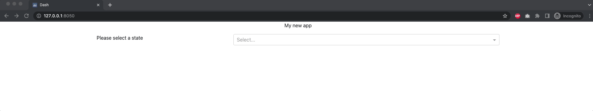

# Chapter 3 - Dash Components and Layouts

## What you will learn

In this chapter we will introduce you to the Dash Core and HTML components which are used to create rich app interfaces. These include the dropdown, the checklist, the button, and many more. We will also show you how to use Dash Bootstrap Components to design the layout of your app.

```{admonition} Learning Intentions
- Dash Core Components
- Dash HTML Components
- Desgining an App Layout 
```

By the end of this chapter you will know how to build this app:


````{dropdown} See Code
    :container: + shadow
    :title: bg-primary text-white font-weight-bold
  
```
# Import packages 
from dash import Dash, html, dcc
import dash_bootstrap_components as dbc

# Initialise the App 
app = Dash(__name__, external_stylesheets=[dbc.themes.BOOTSTRAP])

# Create app components
markdown = dcc.Markdown(children='My First app')
button = html.Button(children="Button")
checklist = dcc.Checklist(options=['New York City', 'Montréal', 'San Francisco'])
radio = dcc.RadioItems(options=['New York City', 'Montréal', 'San Francisco'])
dropdown = dcc.Dropdown(options=['NYC', 'MTL', 'SF'])
slider = dcc.Slider(min=0, max=10, step=1)

# App Layout 
app.layout = dbc.Container(
    [
        dbc.Row([dbc.Col([markdown], width=8)]),
        dbc.Row(
            [
                dbc.Col([dropdown], width = 3), 
                dbc.Col([slider], width = 9),
            ]
        ),
        dbc.Row(
            [
                dbc.Col([checklist], width = 6),
                dbc.Col([radio], width = 6),
            ]
        ),
        dbc.Row([dbc.Col([button], width = 11)]),
    ]
)

# Run the App 
if __name__ == '__main__':
    app.run_server()
```

````

[Click to download the complete code file for this chapter](https://raw.githubusercontent.com/open-resources/dash_curriculum/main/tutorial/part1/ch3_files/app.py)

## 3.1 Dash Components

**Components** are the building blocks of a Dash app. In this chapter, we will learn about a few common and useful components: Button, Checklist, RadioItems, Dropdown, and Slider. Check the Dash documentation for a full list of [Core components](https://dash.plotly.com/dash-core-components) and [HTML components](https://dash.plotly.com/dash-html-components).

**Properties** are attributes of components, such as an `id` or `children`, which allow us to fully build the component.

````{dropdown} Buttons
    :container: + shadow
    :title: bg-primary text-white font-weight-bold
  
Buttons are clickable components that will be used to trigger other actions such as submitting a form or plotting data.  We will pass the **children** property to give the button a name in the dashboard.


```python
# Import packages 
from dash import Dash, html, dcc
import dash_bootstrap_components as dbc

# Initialise the App 
app = Dash(__name__, external_stylesheets=[dbc.themes.BOOTSTRAP])

# Create app components
markdown = dcc.Markdown(children='My First app')
button = html.Button(children="Button")

# App Layout 
app.layout = dbc.Container([
    markdown,
    button,
])

# Run the App 
if __name__ == '__main__':
    app.run_server()
```


````

````{dropdown} Checklist
    :container: + shadow
    :title: bg-primary text-white font-weight-bold

Checklists display a set of options for the user to choose.
We will pass in a list of **options** when we create the checklist component below:


```python
# Import packages 
from dash import Dash, html, dcc
import dash_bootstrap_components as dbc

# Initialise the App 
app = Dash(__name__, external_stylesheets=[dbc.themes.BOOTSTRAP])

# Create app components
markdown = dcc.Markdown(children='My First app')
button = html.Button(children="Button")
checklist = dcc.Checklist(options=['New York City', 'Montréal', 'San Francisco'])

# App Layout 
app.layout = dbc.Container([
    markdown,
    button,
    checklist,
])

# Run the App 
if __name__ == '__main__':
    app.run_server()

```


  
````

````{dropdown} Radio items
    :container: + shadow
    :title: bg-primary text-white font-weight-bold

  

Radio items are lists of options from which the user can select only one option.
Similar to the checklist, we will pass in a list of **options** when creating the component.

```python
# Import packages 
from dash import Dash, html, dcc
import dash_bootstrap_components as dbc

# Initialise the App 
app = Dash(__name__, external_stylesheets=[dbc.themes.BOOTSTRAP])

# Create app components
markdown = dcc.Markdown(children='My First app')
button = html.Button(children="Button")
checklist = dcc.Checklist(options=['New York City', 'Montréal', 'San Francisco'])
radio = dcc.RadioItems(options=['New York City', 'Montréal', 'San Francisco'])

# App Layout 
app.layout = dbc.Container([
    markdown,
    button,
    checklist,
    radio,
])

# Run the App 
if __name__ == '__main__':
    app.run_server()

```



````

````{dropdown} Dropdown
    :container: + shadow
    :title: bg-primary text-white font-weight-bold
    
Dropdowns allow the user to select from a list of options. Similar to the checklist, we will pass in a list of **options** when creating the component.
    
```python
# Import packages 
from dash import Dash, html, dcc
import dash_bootstrap_components as dbc

# Initialise the App 
app = Dash(__name__, external_stylesheets=[dbc.themes.BOOTSTRAP])

# Create app components
markdown = dcc.Markdown(children='My First app')
button = html.Button(children="Button")
checklist = dcc.Checklist(options=['New York City', 'Montréal', 'San Francisco'])
radio = dcc.RadioItems(options=['New York City', 'Montréal', 'San Francisco'])
dropdown = dcc.Dropdown(options=['NYC', 'MTL', 'SF'])

# App Layout 
app.layout = dbc.Container([
    markdown,
    button,
    checklist,
    radio,
    dropdown,
])

# Run the App 
if __name__ == '__main__':
    app.run_server()

```


  
````

````{dropdown} Slider
    :container: + shadow
    :title: bg-primary text-white font-weight-bold
    
Sliders allow the user to select a value by moving an indicator.  We pass in the (**start**, **end**, **increment**) `properties` to this component.

```python
# Import packages 
from dash import Dash, html, dcc
import dash_bootstrap_components as dbc

# Initialise the App 
app = Dash(__name__, external_stylesheets=[dbc.themes.BOOTSTRAP])

# Create app components
markdown = dcc.Markdown(children='My First app')
button = html.Button(children="Button")
checklist = dcc.Checklist(options=['New York City', 'Montréal', 'San Francisco'])
radio = dcc.RadioItems(options=['New York City', 'Montréal', 'San Francisco'])
dropdown = dcc.Dropdown(options=['NYC', 'MTL', 'SF'])
slider = dcc.Slider(min=0, max=10, step=1)

# App Layout 
app.layout = dbc.Container([
    markdown,
    button,
    checklist,
    radio,
    dropdown,
    slider,
])

# Run the App 
if __name__ == '__main__':
    app.run_server()
```


````

## 3.2 Layout

So far, we've only organized our app **layout** in a `dbc.Container()` without any further specifications. We've seen that this will place our app components sequentially in one single column. To further customise the layout, we will use the [dash-bootstrap-components](https://dash-bootstrap-components.opensource.faculty.ai/docs/components/layout) library components `dbc.Row()` and `dbc.Col()`. This will allow us to declare the number of rows and columns in the layout as well as dictate the exact place where Dash components should appear (Markdown and Slider in our example). 

```
# Import packages 
from dash import Dash, dcc
import dash_bootstrap_components as dbc

# Initialise the App 
app = Dash(__name__, external_stylesheets=[dbc.themes.BOOTSTRAP])

# Create app components
markdown = dcc.Markdown(children='My First app')
slider = dcc.Slider(min=0, max=10, step=1)

# App Layout
app.layout = dbc.Container([
    dbc.Row([
        dbc.Col([
            markdown
        ], width=6),
        
        dbc.Col([
            slider
        ], width=6)
    ])
])


# Run the App 
if __name__ == '__main__':
    app.run_server()
```



```{admonition} Note
- The colors above are for demonstration purposes, you will not see them in your local dashboard
```

Best practices when constructing your layout using **Dash Bootstrap Components**:

1. First, define the `Containter`, which will contain the entire app layout
2. Then, inside the `dbc.Containter()`, define the `Rows`
3. Then, inside each `dbc.Row()`, define the `Columns`
4. Then, inside each `dbc.Col()`, insert the app `Components`

You can see from the code above that we define the `width` property for each `dbc.Col` as 6. Note that the total width of columns inside the `dbc.Row()` is 12. Make sure that you never assign more than 12 columns within each Row. 

Let's see another example of a layout with multiple rows and columns:

```python
# Import packages 
from dash import Dash, html, dcc
import dash_bootstrap_components as dbc

# Initialise the App 
app = Dash(__name__, external_stylesheets=[dbc.themes.BOOTSTRAP])

# Create app components
markdown = dcc.Markdown(children='My First app')
button = html.Button(children="Button")
checklist = dcc.Checklist(options=['New York City', 'Montréal', 'San Francisco'])
radio = dcc.RadioItems(options=['New York City', 'Montréal', 'San Francisco'])
dropdown = dcc.Dropdown(options=['NYC', 'MTL', 'SF'])
slider = dcc.Slider(min=0, max=10, step=1)

# App Layout 
app.layout = dbc.Container(
    [
        dbc.Row([dbc.Col([markdown], width=8)]),
        dbc.Row(
            [
                dbc.Col([dropdown], width = 3), 
                dbc.Col([slider], width = 9),
            ]
        ),
        dbc.Row(
            [
                dbc.Col([checklist], width = 6),
                dbc.Col([radio], width = 6),
            ]
        ),
        dbc.Row([dbc.Col([button], width = 11)]),
    ]
)

# Run the App 
if __name__ == '__main__':
    app.run_server()
```


We see there are four rows with columns of various widths which contain components. Notice that the total column width in the first and last row is 8 and 11 respectively. Having less than 12 assigned to column width is fine, just remember that the total amount of column width within each row should **never surpasses 12**.  

  * Play around with the `width` value of the column containing the dropdown and slider to see how it changes the app layout.
  * Try to move the button to be in the same row as the Checklist and RadtioItem

## Exercises
(1) Import the relevant package and build a `Dropdown` component with the following options: 'CA','FL','DC'. Save the dropdown as a variable with name dropdown1
````{dropdown} See Solution
    :container: + shadow
    :title: bg-primary text-white font-weight-bold
  
```
from dash import dcc
dropdown1 = dcc.Dropdown(options=['CA','FL','DC'])
```

````
(2) Using the `Dropdown` component we just built, create and launch an app with the following structure:
- one entire row dedicated to the title of the app, which should be "My new app" with `width=12` and center aligned
- a second row with two columns: the first with `width=4` and a `Markdown` component saying "Please select a state"; the second with `width=8` and our `Dropdown` component. Start from the code of any app provided in the chapter and modify it accordingly.
````{dropdown} See Solution
    :container: + shadow
    :title: bg-primary text-white font-weight-bold
  
```
# Import packages
from dash import Dash, html, dcc
import dash_bootstrap_components as dbc

# Initialise the App
app = Dash(__name__, external_stylesheets=[dbc.themes.BOOTSTRAP])

# Create app components
title_ = dcc.Markdown(children='My new app', style={'textAlign': 'center'})
markdown_ = dcc.Markdown(children='Please select a state')
dropdown1 = dcc.Dropdown(options=['CA','FL','DC'])

# App Layout
app.layout = dbc.Container(
    [
        dbc.Row([dbc.Col([title_], width=12)]),
        dbc.Row(
            [
                dbc.Col([markdown_], width = 4),
                dbc.Col([dropdown1], width = 8),
            ]
        ),
    ]
)

# Run the App
if __name__ == '__main__':
    app.run_server()
```


````
## Summary
In this chapter we learned about several useful Dash **components** and how to organize them in a **layout**. In the next chapter we will learn how to create an interactive app by linking the components together.
