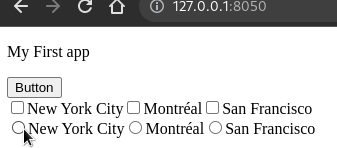
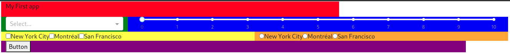

# Chapter 3 - Dash Components and Layouts

## What you will learn

In this chapter we will explore various Dash **components** and how to position them within the app **layout**.

[Click here to download the complete code file for this chapter](https://github.com/open-resources/dash_curriculum/blob/main/tutorial/part1/ch2_files/chapter3_app.py)

## 3.1 Dash Components

**Components** are the building blocks of the app such as dropdown menus, buttons (radio, checkbox, etc...), slider bars, graphs, and many others.
In this chapter, we will learn about a few common and useful components.

**Properties** are attributes of components such as their `id` or `children`.

````{dropdown} Buttons
    :container: + shadow
    :title: bg-primary text-white font-weight-bold
  
Buttons are clickable components that will be used to trigger other actions such as submitting a form or plotting data.  We will pass the **children** property to give the button a name in the dashboard.


```python
# Import packages 
from dash import Dash, html, dcc
import dash_bootstrap_components as dbc

# Initialise the App 
app = Dash(__name__, external_stylesheets=[dbc.themes.BOOTSTRAP])

# Create app components
markdown = dcc.Markdown(children='My First app')
button = html.Button(children="Button")

# App Layout 
app.layout = dbc.Container([
    markdown,
    button,
])

# Run the App 
if __name__ == '__main__':
    app.run_server()
```


````

````{dropdown} Checklist
    :container: + shadow
    :title: bg-primary text-white font-weight-bold

Checklists display a set of options for the user to choose.
We will pass in a list of **options** when we create the checklist component below:


```python
# Import packages 
from dash import Dash, html, dcc
import dash_bootstrap_components as dbc

# Initialise the App 
app = Dash(__name__, external_stylesheets=[dbc.themes.BOOTSTRAP])

# Create app components
markdown = dcc.Markdown(children='My First app')
button = html.Button(children="Button")
checklist = dcc.Checklist(options=['New York City', 'Montréal', 'San Francisco'])

# App Layout 
app.layout = dbc.Container([
    markdown,
    button,
    checklist,
])

# Run the App 
if __name__ == '__main__':
    app.run_server()

```


  
````

````{dropdown} Radio items
    :container: + shadow
    :title: bg-primary text-white font-weight-bold

  

Radio items are lists of options from which the user can select only one option.
Similar to the checklist, we will pass in a list of **options** when creating the component.

```python
# Import packages 
from dash import Dash, html, dcc
import dash_bootstrap_components as dbc

# Initialise the App 
app = Dash(__name__, external_stylesheets=[dbc.themes.BOOTSTRAP])

# Create app components
markdown = dcc.Markdown(children='My First app')
button = html.Button(children="Button")
checklist = dcc.Checklist(options=['New York City', 'Montréal', 'San Francisco'])
radio = dcc.RadioItems(options=['New York City', 'Montréal', 'San Francisco'])

# App Layout 
app.layout = dbc.Container([
    markdown,
    button,
    checklist,
    radio,
])

# Run the App 
if __name__ == '__main__':
    app.run_server()

```



````

````{dropdown} Dropdown
    :container: + shadow
    :title: bg-primary text-white font-weight-bold
    
Dropdowns allow the user to select from a list of options. Similar to the checklist, we will pass in a list of **options** when creating the component.
    
```python
# Import packages 
from dash import Dash, html, dcc
import dash_bootstrap_components as dbc

# Initialise the App 
app = Dash(__name__, external_stylesheets=[dbc.themes.BOOTSTRAP])

# Create app components
markdown = dcc.Markdown(children='My First app')
button = html.Button(children="Button")
checklist = dcc.Checklist(options=['New York City', 'Montréal', 'San Francisco'])
radio = dcc.RadioItems(options=['New York City', 'Montréal', 'San Francisco'])
dropdown = dcc.Dropdown(options=['NYC', 'MTL', 'SF'])

# App Layout 
app.layout = dbc.Container([
    markdown,
    button,
    checklist,
    radio,
    dropdown,
])

# Run the App 
if __name__ == '__main__':
    app.run_server()

```


  
````

````{dropdown} Slider
    :container: + shadow
    :title: bg-primary text-white font-weight-bold
    
Sliders allow the user to select a value by moving an indicator.  We pass in the (**start**, **end**, **increment**) `properties` to this component.

```python
# Import packages 
from dash import Dash, html, dcc
import dash_bootstrap_components as dbc

# Initialise the App 
app = Dash(__name__, external_stylesheets=[dbc.themes.BOOTSTRAP])

# Create app components
markdown = dcc.Markdown(children='My First app')
button = html.Button(children="Button")
checklist = dcc.Checklist(options=['New York City', 'Montréal', 'San Francisco'])
radio = dcc.RadioItems(options=['New York City', 'Montréal', 'San Francisco'])
dropdown = dcc.Dropdown(options=['NYC', 'MTL', 'SF'])
slider = dcc.Slider(min=0, max=10, step=1)

# App Layout 
app.layout = dbc.Container([
    markdown,
    button,
    checklist,
    radio,
    dropdown,
    slider,
])

# Run the App 
if __name__ == '__main__':
    app.run_server()
```


````

## 3.2 Layout

So far, we've only organized our app **layout** in a `dbc.Container()` without any further specifications. We've seen that this will place our app components sequentially in one single column.  To customise the layout, we will use the [dash-bootstrap-components](https://dash-bootstrap-components.opensource.faculty.ai/docs/components/layout) library components `dbc.Row()` and `dbc.Col()`.

Best practices when constructing your layout using **Dash Bootstrap Components**:

1. First, define the `Containter`, which will contain the entire app layout
2. Then, inside the `dbc.Containter()`, define the `Rows`
3. Then, inside each `dbc.Row()`, define the `Columns`
4. Then, inside each `dbc.Col()`, insert the app `Components`

```{admonition} Note
- The total `width` of columns in each row is 12
- In the code below we define the `width` property for each `dbc.Col`
```

```python
# Import packages 
from dash import Dash, html, dcc
import dash_bootstrap_components as dbc

# Initialise the App 
app = Dash(__name__, external_stylesheets=[dbc.themes.BOOTSTRAP])

# Create app components
markdown = dcc.Markdown(children='My First app')
button = html.Button(children="Button")
checklist = dcc.Checklist(options=['New York City', 'Montréal', 'San Francisco'])
radio = dcc.RadioItems(options=['New York City', 'Montréal', 'San Francisco'])
dropdown = dcc.Dropdown(options=['NYC', 'MTL', 'SF'])
slider = dcc.Slider(min=0, max=10, step=1)

# App Layout 
app.layout = dbc.Container(
    [
        dbc.Row([dbc.Col([markdown], width=8)]),
        dbc.Row(
            [
                dbc.Col([dropdown], width = 3), 
                dbc.Col([slider], width = 9),
            ]
        ),
        dbc.Row(
            [
                dbc.Col([checklist], width = 6),
                dbc.Col([radio], width = 6),
            ]
        ),
        dbc.Row([dbc.Col([button], width = 11)]),
    ]
)

# Run the App 
if __name__ == '__main__':
    app.run_server()
```



We see there are 4 rows with columns of various `widths` which contain components.  Make sure that the total amount of column `width` within each row **never surpasses 12**.  

  * Play around with the `width` value of the column containing the dropdown and slider to see how it changes the app layout.
  * Try to move the button to be in the same row as the Checklist and RadtioItem

```{admonition} Note
- The colors above are for demonstration purposes, you will not see them in your local dashboard
```

## Summary
In this chapter we learned about several useful Dash **components** and how to organize them in a **layout**. In the next chapter we will learn how to create an interactive app by linking the components together.
