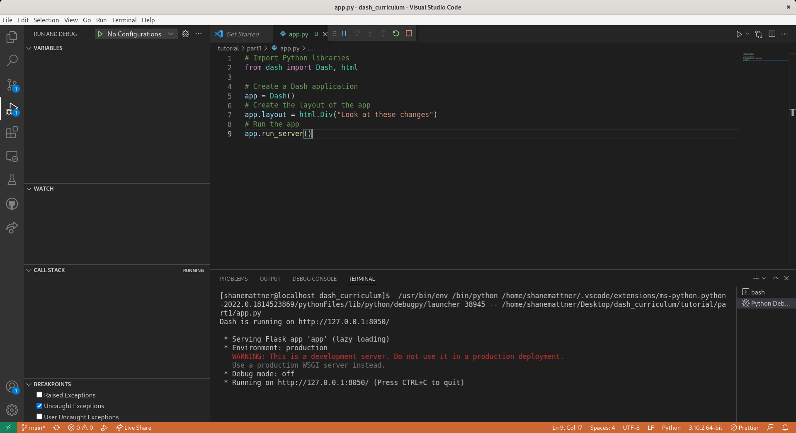
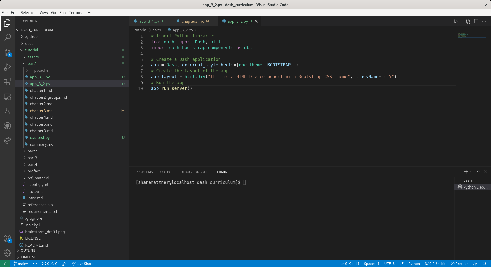

# Chapter 3 - Dash Components and Layouts
## Overview

In this chapter we explore Dash **layouts** and the **components** that make up the layout.

## Dash Layout
Dash applications are comprised of 2 parts:
- Layout: What the application looks like
- Callabacks: Interactivity of the application

The **layout** is made up of **components**.  Let's make a minimal Dash application to demonstrate this concept:
<details>
  <summary>Minimal Dash App</summary>
  
Create **app_3_1.py** in the `tutorial/part1` directory:


Copy/paste the minimal Dash app code:  
```python
# Import Python libraries
from dash import Dash, html 

# Create a Dash application
app = Dash()
# Create the layout of the app
app.layout = html.Div("This is a HTML Div component")
# Run the app
app.run_server()
```

Now **Run/Debug** the code:



Open a web browser, enter http://127.0.0.1:8050/ in the address bar, and you should see our minimal application:

</details>

Next, we'll add some styling with **CSS**.   We'll use a [stylesheet](https://www.w3schools.com/css/css_intro.asp) from the **Bootstrap** library.  
<details>
  <summary>CSS</summary>

Create **app_3_2.py** in the `tutorial/part1` directory:



Copy/paste the minimal Dash + CSS app code:  
```python
# Import Python libraries
from dash import Dash, html 
import dash_bootstrap_components as dbc

# Create a Dash application, pass in a stylesheet from Bootstrap
app = Dash( external_stylesheets=[dbc.themes.BOOTSTRAP] )
# Create the layout of the app
app.layout = html.Div("This is a HTML Div component with Bootstrap CSS theme", className="m-5")
# Run the app
app.run_server()
```

Run the code, open a web browser, enter http://127.0.0.1:8050/ in the address bar, and you should see our minimal application with a slightly different style this time:


</details>
