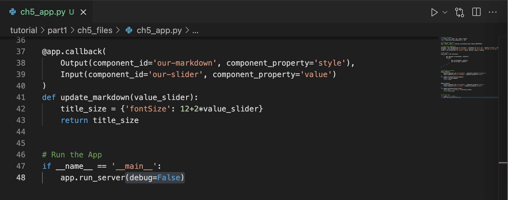
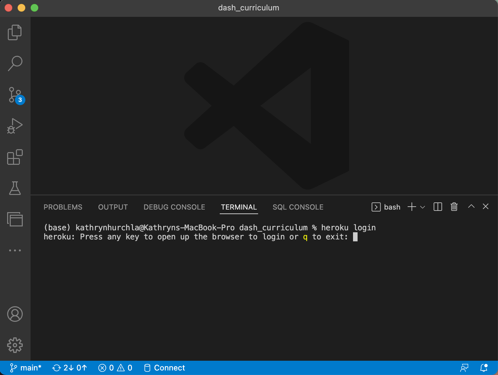

# Chapter 5 - App Deployment

Using your Dash app on your computer is great, but the magic happens when you deploy your app so you can share it with your friends! __Heroku__ is a platform as a service (PaaS) that supports Python where you can deploy and manage public Dash applications. Heroku uses containers called "dynos" to deploy your app by packaging its code and dependencies and executing it in a virtualized environment in a way that's scalable according to the changing resource needs of your application. 

This example uses Visual Studio Code, a Heroku account, and Git. It's free to create a Heroku user account, and a Free tier is available for a basic app. Additional tier options support the needs of more complex apps or those requiring additional memory (RAM), and you can read more about [Heroku pricing](https://www.heroku.com/pricing).


## Learning Intentions

In this chapter we intend you to learn:

```{admonition} Learning Intentions

- how to check Python version compatibility with Heroku
- how to turn off interactive debugging mode
- how to install Heroku Command Line Interface (CLI)
- how to deploy your Dash application to the web publicly using CLI
```

## App at the Start

As a framework for this chapter, [here is a file](./ch5_files/ch5_app.py) of what your app should look like when you start.

```{note} 
Make sure you have set up Git version control on your project folder directory by following those steps in Git documentation from chapter 0, and that you've successfully tested your Dash app locally on your computer.
```

## 5.1 Check your Python version compatibility

```{warning}
Heroku has specific requires for what Python version you are using locally to ensure your app can be deployed properly.Check Heroku's website for its [current Python requirements](https://devcenter.heroku.com/articles/getting-started-with-python), and upgrade your Python version before deploying.
```

Open Visual Studio Code (VS Code), and in its Terminal window, type this command.
```python --version```

The output returns your Python version, for example:
```Python 3.10.0```

If you are using Python3, but also have an instance of Python2 installed which is common on some computers, then ```python``` commands will by default return results for the Python2 version. Use the ```python3``` command instead to check your Python3 version.
```python3 --version```.

```{note}
For help with installing or upgrading Python, refer to chapter 0 for your operating system which includes links to helpful resources.
```

## 5.2 Turn off Debugging mode

In VS Code, open your ```ch5_app.py``` script file and turn off the interactive debugging mode by changing your run statement from ```debug=True``` to ```debug=False```.

Your last lines of code should now look like this.

```
# Run the app
if __name__ == '__main__':
    app.run_server(debug=False)
```
Here is a view of the updated run statement showing this change in your Visual Studio Code (VS Code) editor's main window.



Save and close the ```ch5_app.py``` file.

## 5.3 Log in to Heroku user account

From a web browser, [log in](https://id.heroku.com/login) or sign up if you are new to Heroku.

- Follow the prompts to verify your identity for security purposes using one of Heroku's available verifaction methods.
- This takes you to your user account dashboard in your web browser.

### 5.3.1 Install the Heroku Command Line Interface (CLI).

[The Heroku CLI](https://devcenter.heroku.com/articles/heroku-cli) article provides instructions for installation and first time setup on multiple computer platforms (macOS, Windows, or Ubuntu).

### 5.3.2 Connect the Heroku CLI to your Heroku account

In your VS Code Terminal window, type the command ```heroku login```.

This will return the output:
```heroku: Press any key to open up the browser to login or q to exit:```

Press any key.

Here is a view of entering this command in a VS Code Terminal window.


```{note} 
If you have not already logged into your Heroku user account, this will open a new window in your web browser where you can follow the prompts to log in.
```

Once logged in successfully, Heroku will display a confirmation page in your browser indicating you can return to your CLI (command line interface). 

Close the web browser window and return to the VS Code Terminal window.


## 5.4 Install the Green Unicorn ```gunicorn``` Web Server Gateway Interface (WSGI)

For UNIX systems, you will need an additional dependency called ```gunicorn``` which is a Python WSGI HTTP Server that handles Python web application traffic for UNIX systems.

Type the ```pip install gunicorn``` command in your VS Code Terminal window.

This should return output indicating that it was successfully installed showing the most current stable version.
```Successfully installed gunicorn```

Here's a view of installing ```gunicorn``` in your VS Code Terminal successfully.


```{note} 
If you want to learn more about the Gunicorn server, visit [gunicorn.org](https://gunicorn.org/).
```  

## 5.5 Prepare the necessary additional files for deployment.

Create the following new files in the root directory of your project, in other words at the same folder or directory level where the main app file ```ch5_app.py``` file is saved.

### 5.5.1 Make a __Procfile__ *without a file extension*. This file tells Heroku all the commands that must be executed by the app on startup.

From the VS Code Explorer pane select the New File icon icon or use a corresponding key command.

You will be promted to name the file in the Explorer pane.  
By default, an icon appears beside the empty File Name box indicating Plain Text file format by default.

Name the file ```Procfile```. Press the return key on your keyboard.

The icon beside the file name will change to a purple Heroku icon, indicating that the nature and use of your file has been recognized. No file extension will be added as is required.

Open the file. Type the following single line of text in the first line of the file.

```web: gunicorn app:server``` 

Save and close the ```Procfile``` file.

```{warning} Make sure the first letter '_P_' is capitalized in _Procfile_ and that you spell it exactly that way or Heroku cannot recognize it.
```
```{note}
There are alternate ways to create this file. If you instead select New File from the Toolbar File Menu in VS Code, you may be prompted to ```Select the Language```. Select ```Plain Text```. Once you have completed the file, if you see a file ending, remove it using the Rename menu option from the Explorer pane, which you can access such as by right-clicking a mouse or keypad on the file name itself.
```

### 5.5.2 Make a ```requirements.txt``` text file describing your Python dependencies. 

From the VS Code Explorer pane select the New File icon icon or use a corresponding key command.

In the Explorer pane, type the file name ```requirements.txt``` in the empty name box that appears. Press the return key on your keyboard.

```{note}
The ```requirements.txt``` file should have a .txt file ending. Otherwise it is similar to the Procfile steps, and you can follow alternate steps to create a plain text file if you prefer, such as using the Toolbar File Menu options.
```

Open the file. Type the package names and version numbers of all of the packages your app requires to run, in a list with each package on its own single line. Type nothing else in this file.

Include all packages listed in your import statements in your ```ch5_app.py``` file, and ```gunicorn```

Your file should look similar to the following text, replacing the explicitly specified version numbers to match the package versions that you have installed and are using with your app.

```
dash==2.3.1
dash_bootstrap_components==1.0.3
gunicorn==20.1.0
```

```{note}
An easy way to check the versions of Python packages you are using is to enter the ```pip list``` or ```pip3 list``` command in your VS Code Terminal window. In this example, you are working in a base system wide Python environment, and the output will show any and all Python packages you have installed there.
```
```{note}
If you are deploying an app with Plotly Express graphs, include the Pandas library and Plotly Express in your requirements list. Pandas is required by Plotly Express, and both were installed in chapter 0.
```

Save and close the ```requirements.txt``` file.

```{note} 
In a later chapter as part of a more complex deployment process, you will learn how to create this file automatically with the command ```pip freeze > requirements.txt``` while working in a virtual environment.
```

## 5.6 Add files to Git

Type these commands in your VS Code Terminal window to update changes——added and updated files——with git version control tracking.

See all the changed files available.
```
git status
```

Add all of the listed files to git to be tracked. ```-a``` means all in this command.
```
git add -a
```
Commit file changes to git. ```-m``` means message in this command.
```
git commit -m "type a brief message describing updates here"
```

Push changes to the master branch in your git repository.
```
git push
```

## 5.7 Create and initialize Heroku Remote application

From your app's root directory in your VS Code Terminal window, type the following command replacing ```my-dash-ch5-app``` with a specific name for your app.
```
heroku create -a app my-dash-ch5-app
```

```{note}
If you want more information, see Heroku's [Deploying with Git](https://devcenter.heroku.com/articles/git) documentation. 
```

## 5.8 Deploy

Type the following command in your shell to deploy your app to Heroku using the default Python Buildpack.

```
git push heroku main
```

This should return the following result. 
_Initializing repository, done._

You should now be able to view your app at ```http://my-dash-ch5-app.herokuapp.com``` (changing ```my-dash-ch5-app``` to the name you used when you created your Heroku remote app in the step above.


## 5.9 Common errors

Common deployment errors you could encounter for this example app include:
- Missing a package dependency in your requirements file
- Mispelling the ```Procfile``` preventing Heroku from finding it
- Using a Python version that is not compatible with Heroku 

Refer to the Heroku documentation articles for [common error codes](https://devcenter.heroku.com/articles/error-codes) and [troubleshooting & support](https://devcenter.heroku.com/categories/troubleshooting).

```{note}
In addition to minimum requirements, some new Python versions may not yet be supported on Heroku. For example, if Heroku supports Python 3.10.0, and your app is running a newer 3.11 version.
```

## App at the end

At the end of this chapter, [here is a zipped file](./ch5_files/ch5_app.zip) of what your app should look like.
