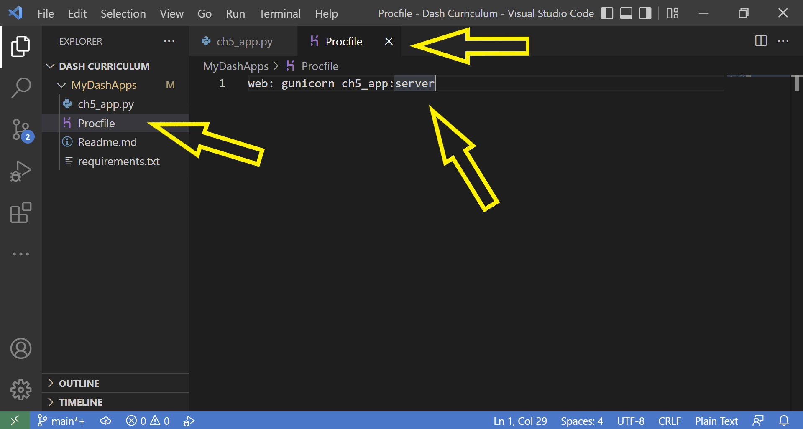

# Chapter 5 - App Deployment

## What you will learn
Running your Dash app on your computer is great, but the magic happens when you deploy your app to the web so you can share it with your friends! __Heroku__ is a platform as a service (PaaS) that supports Python; it can be used to deploy and manage public Dash applications. Heroku uses containers called "dynos" to deploy your app by packaging its code and dependencies and executing it in a virtualized environment in a way that's scalable, according to the changing resource-needs of your application. 

```{admonition} Learning Intentions

- Prepare your app for deployment
- how to install Heroku Command Line Interface (CLI)
- how to deploy your Dash application to the web publicly using CLI
```

## 5.1 Prepare your app for deployment

As a framework for this chapter, we will be using the [previous app](https://raw.githubusercontent.com/open-resources/dash_curriculum/main/tutorial/part1/ch4_files/ch4_app.py) created at the end of chapter 4. Save this app as `ch5_app.py`. This is what your app should look like when you run it on your computer.


```{attention} 
Before continuing, make sure you have already set up a [Git version control](https://git-scm.com/book/en/v2/Getting-Started-Installing-Git) and a [GitHub repository](https://open-resources.github.io/dash_curriculum/part1/chapter0_GitHub.html). Also, ensure that your Dash app runs locally on your computer successfully.
```

### 5.1.1 Turn off Debugging mode

In VScode, open your `ch5_app.py` script file and turn off the interactive debugging mode with ```debug=False```, as such:

```
# Run the app
if __name__ == '__main__':
    app.run_server(debug=False)
```
Here is a view of the updated file showing this change in the VScode editor's main window.


### 5.1.2 Declare server for Heroku deplpoyment

Add the following line of code `server = app.server` under the line of code that instantiates your Dash app, as such:


Save and close the ```ch5_app.py``` file.

## 5.2 Create a Heroku user account

If you have a Heroku account, you can skip to the next section: **Install the Heroku Command Line Interface**. If you don’t have a Heroku account, navigate to [Heroku Signup](https://signup.heroku.com/dc) and follow the prompts to create your account.

It's free to create a Heroku user account, and a Free tier will suffice for the apps in this curriculum. 

## 5.3 Install the Heroku Command Line Interface (CLI)

[The Heroku CLI](https://devcenter.heroku.com/articles/heroku-cli#install-the-heroku-cli) article provides instructions for installation and first time setup on multiple computer platforms (macOS, Windows, or Linux).

### 5.3.1 Connect the Heroku CLI to your Heroku account

Open a VScode Terminal window and type the command: ```heroku login```.


```{note} 
If you have not already logged into your Heroku user account, this will open a new window in your web browser where you can follow the prompts to log in.
```

Once logged in successfully, Heroku will display a confirmation page in your browser indicating you can return to your CLI (command line interface). 

Close the web browser window and return to the VS Code Terminal window.


## 5.4 Install the Green Unicorn ```gunicorn``` Web Server Gateway Interface (WSGI)

For your app to successfully be deployed to Heroku you will need an additional dependency called ```gunicorn```.

Type the ```pip install gunicorn``` command in your VS Code Terminal window.


## 5.5 Add necessary files for deployment

To create the required files, you need to be in the root directory of your project, which is the same directory level where the ```ch5_app.py``` file is located. In this example, the root directory is named `MyDashApps`. 

### 5.5.1 Make a __Procfile__

This file tells Heroku all the commands that must be executed by the app on startup.

Right-click on the root directory, click **New File** and name it **Procfile** without a file extension (no Procfile.txt or Procfile.py, etc.). Make sure to use an upper case P when you name the file. 

Open the Procfile. Type the following single line of text in the first line of the file.

```web: gunicorn ch5_app:server``` 



Save and close the ```Procfile``` file.

```{attention} 
Make sure the first letter '_P_' is capitalized in _Procfile_ and that you spell it exactly that way or Heroku will not recognize it.\
Also, if your app name is not ch5_app, make sure to replace the text inside the Procfile 
```

### 5.5.2 Make a ```requirements.txt``` text file

Heroku uses the `requirements.txt` file to know what Python libraries it needs to install in order to run your app. 

Create a new file and name it ```requirements.txt```.

Open the file. Type the package names and version numbers of all of the packages your app requires to run. Each package should be its own single line. Include all packages listed in your import statements in your ```ch5_app.py``` file, as well as ```gunicorn```.

```
dash==2.3.1
dash_bootstrap_components==1.0.3
gunicorn==20.1.0
```

Your file should look similar to the above text. Make sure to replace the specified version numbers to match the package versions that you have installed and are using with your app.

```{note}
An easy way to check the versions of Python packages you are using is to type the ```pip list``` or ```pip3 list``` command in your VS Code Terminal window.\
If you are deploying an app with Plotly Express graphs, include the Pandas library and Plotly Express in your requirements list.
```

Save and close the ```requirements.txt``` file.

## 5.6 Add files to Git

Type these commands in your VS Code Terminal window to update changes——added and updated files——with git version control tracking.

First, to ensure you are in the root directory of your project, type the following command replacing `MyDashApps` with the name of your directory. 

```cd .\MyDashApps\``` 

Once you're in the root directory, type the following command to see all the new and modified files available.
```
git status
```

Add all of the listed files to git to be tracked. 
```
git add .
```
Commit file changes to git. ```-m``` means message in this command.
```
git commit -m "type a brief message describing updates here"
```

Push changes to the master branch in your git repository.
```
git push
```

## 5.7 Create and initialize Heroku Remote application

From the same root directory in your VS Code Terminal window, type the following command replacing ```my-dash-ch5-app``` with a specific name for your new app that will live on Heroku. Try to use a name that you don't think is taken by anyone. If you get a notification that the app name you chose is taken, try using a different name.
```
heroku create -a my-dash-ch5-app
```

## 5.8 Deploy to Heroku

Type the following command in your terminal to deploy your app to Heroku.

```
git push heroku main
```

You should now be able to view your app at ```http://my-dash-ch5-app.herokuapp.com``` (changing ```my-dash-ch5-app``` to the app name you created in the step above).


## 5.9 Common errors

Common deployment errors you could encounter for this example app include:
- Missing a package dependency in your requirements file
- Mispelling the ```Procfile``` or the app name inside the ```Procfile```
- Forgetting to add `server = app.server` to your main app file

Refer to the Heroku documentation articles for [common error codes](https://devcenter.heroku.com/articles/error-codes) and [troubleshooting & support](https://devcenter.heroku.com/categories/troubleshooting).

```{note}
In addition to minimum requirements, some new Python versions may not yet be supported on Heroku. For example, if Heroku supports Python 3.10.0, and your app is running a newer 3.11 version.
```

## Summary

Congratulations! You are now able to share your app with anyone around the world. In the next chapter we will learn how to incorporate data into our Dash app.

