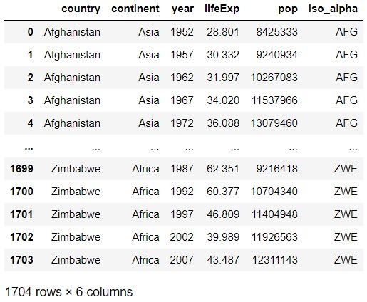
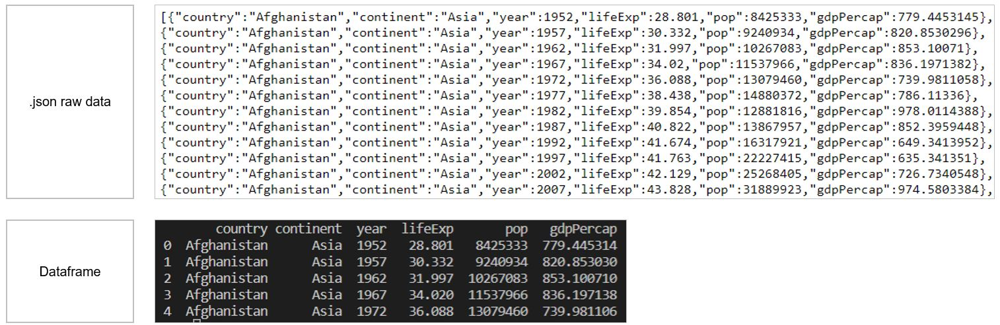
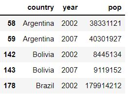

# Chapter 6 - Working with Data in Dash

## What you will learn
In this chapter we will introduce data into Dash apps. We will show how to:
- import data into the app
- create and populate Pandas dataframes
- review basic data wrangling techniques often used to prepare data for reporting.

By the end of the chapter, you'll be comfortable with incorporating your own data into a Dash app:
[Download the file](https://github.com/open-resources/dash_curriculum/blob/main/tutorial/part2/ch6_files/chapter6_fin_app.py)

---

## 6.1 Where to import data within Dash apps
The data which is imported into Dash apps will be used by multiple objects: Dash components, callbacks, tables, layout, etc.
For this reason, we recommend importing the data before initialising the app, right above this line of code:

```
# Data imported here
app = Dash(__name__, external_stylesheets=[dbc.themes.BOOTSTRAP])
```

In this way, the data will be globally available to all objects that are created in the code.

One of the easiest and most convenient methods to represent our data is through a Pandas dataframe.
An empty dataframe is created with the code below:
```
test_data = pd.DataFrame()
```

Some mock-up data can be added using a dictionary, in this way:
```
test_data = pd.DataFrame({'Country':['United States','Norway','Italy','Sweden','France'],
                         'Country Code':['US','NO','IT','SE','FR']})
```
(In the code above, the dictionary keys "Country" and "Country code" will be the column names of the Pandas dataframe).

## 6.2 Uploading data into an app
In case our data is available on files or on the internet, we will read the data from the source and convert it into a Pandas dataframe.
There are several ways of incorporating data into our app; we will focus on these methodologies:
- reading data from files (.xls, .csv, .json)
- reading data from a URL

```{note}
If you need some test dataset to play with or test your code, consider using the Plotly Express built-in data sets, such as Gapminder, which can be added to your App with these commands:

import plotly.express as px
df = px.data.gapminder()
```

### 6.2.1 Reading data from files on your computer

#### Excel files
Let's see an example of how to upload an Excel file - extracted from the Gapminder data - into a dataframe. 
The file we'll be using is available here [data_01](https://github.com/open-resources/dash_curriculum/blob/main/tutorial/part2/ch6_files/data_01.xlsx): follow the link click on "download"; locate the file in your download folder.

```
filepath = r'C:\Users\YourUser\Downloads\data_01.xlsx'
df1 = pd.read_excel(filepath, sheet_name='Sheet1')
print(df1)
```
- In this example, we have accessed data outside the app folder, and therefore specified a filepath. The path is here saved as a raw string (hence the "r" just before the string containing the path. This is done as VS code may trigger a warning when using a normal string).
If your file is located directly into your app folder (or within VS code working directory), the full path is not required; you may only specify the filename. The code will then become: ```filepath = 'data_01.xlsx' ```
```{note}
If you experience any difficulties in finding your filepath, please check [this screenshot](https://github.com/open-resources/dash_curriculum/blob/main/tutorial/part2/ch6_files/Helper01.JPG), showing how to find the filepath directly from WS code.
```
```{tip}
In production versions, when apps get deployed, the best practice is to have a "data" folder, where all files are stored and therefore accessed by the app code. This will be covered in [Chapter 14](https://open-resources.github.io/dash_curriculum/part4/chapter14.html).
```
- We uploaded one Excel tab (named "Sheet1") to a data frame called "df1".
- After the data uploads, the dataframe would look like the following:



#### CSV files
We will now upload the same data from above, but from a .csv file named [data_02](https://github.com/open-resources/dash_curriculum/blob/main/tutorial/part2/ch6_files/data_02.csv). Please follow the link and click on the "Copy raw contents" button, then paste the records into a new file on your laptop, saving it as "data_02.csv"

```
filepath = r'C:\Users\User1\Downloads\data_02.csv'
col_names = ['country','continent','year','pop']
df2 = pd.read_csv(filepath, sep='|', usecols=col_names)
df2.head() # you can also use: print(df2.head()) -- VS Code supports both
```

- Similarly to the previous example, we have accessed data outside the app folder, and therefore specified a filepath as a raw string.
- In most cases, you will see .csv files with comma column separators (hence the name, csv standing for "comma-separated values"). Here, we used a different separator: '|'. The "sep" argument allows to specify whatever characters should be considered field separators: Pandas will separate data into different columns any time it encounters these characters.
- We have also selected a subset of columns to be uploaded, listed in the "usecols" argument. The remaining columns that are present in the file will be ignored.
- After the data is uploaded, the dataframe looks like the following:


### 6.2.2 Reading data from a URL
We will now upload the same data from above, but from [this ULR](https://raw.githubusercontent.com/open-resources/dash_curriculum/main/tutorial/part2/ch6_files/data_03.txt).

```
url = 'https://raw.githubusercontent.com/open-resources/dash_curriculum/main/tutorial/part2/ch6_files/data_03.txt'
df3 = pd.read_table(url, sep=';')
df3.head()
```

```{note}
The above URL is a link to a .txt file that is online. The pd.read_table() function will work for other file formats too, such as: .txt, .csv
```

The code above, will generate a dataframe that looks like:


### 6.2.3 Reading data from a json file
We will now upload data stored in json format. You may encounter this file format when working with API or web services as it is mostly used to interchange data among applications. In our case, the json data we'll upload is available on [this URL](https://cdn.jsdelivr.net/gh/timruffles/gapminder-data-json@74aee1c2878e92608a6219c27986e7cd96154482/gapminder.min.json).

- Pandas includes a specific function to process json files: pd.read_json()

```
url = 'https://cdn.jsdelivr.net/gh/timruffles/gapminder-data-json@74aee1c2878e92608a6219c27986e7cd96154482/gapminder.min.json'
df4 = pd.read_json(url)
df4.head()
```



## 6.3 Data wrangling basics
Once we have our dataframe available, some transformations may be needed in order to use the data in our app.
There is a vast list of methods and functions that can be applied to Pandas dataframes (you may refer to [this documentation](https://pandas.pydata.org/docs/reference/api/pandas.DataFrame.html) for more info). In this section we'll cover a few wrangling techniques that are most commonly used when building Dash apps.

The below examples are based on the ["df3" dataframe](https://open-resources.github.io/dash_curriculum/part2/chapter6.html#read-data-from-a-url) that we created above by reading data from a URL.

#### Unique values
When exploring data, we may often need to identify the unique values in each column:

```
df3.continent.unique()
```
With the above command, an array containing the unique values in the column will be displayed.


#### Slicing
The .loc method can be used in Pandas dataframes to slice or filter the data based on boolean conditions (True, False). 
The ```.loc[(), ()]``` method will filter based on row conditions (to be specified in the first bracket ()) and on column conditions (to be specified in the second bracket ()).
Let's see two examples:

```
df3_Slice1 = df3.loc[(df3['continent']=='Americas'), :]

df3_Slice2 = df3.loc[(df3['continent']=='Americas') & (df3['year'].isin([2002,2007])), ['country','year','pop']]
df3_Slice2.head()
```
- The first command will filter the df3 dataframe picking rows that have 'Americas' as continent. The ':' indicates that we don't want to specify any column-filtering conditions, hence, all columns will be selected.
- The second command adds more row-filtering conditions: rows will be filtered based on American continent and also on 'year', which must be either 2002 or 2007. Additionally, only three columns will be saved into df3_Slice2, namely: country, year, pop. The second command results in:




As an alternative to the .loc method, this is another powerful way to access rows that match a certain condition. The first slicing criteria above, can also be obtained via:
```
df3[df3['continent']=='Americas']
```

#### Grouping
The `.groupby` method can be used on Pandas dataframes to aggregate data: data will be split according to the unique values in the grouped fields, allowing to perform computations on each group. 

As an example, let's calculate the yearly population by continent, summing up the populations from all countries within each continent:
```
df3.groupby(['continent','year'])['pop'].sum()
```
The result will look like:


## 6.4 Using data in the App
We will now show how to use the data we've uploaded with a couple of examples.

### Example 1
In the below app, we import the ["df3" dataframe](https://open-resources.github.io/dash_curriculum/part2/chapter6.html#read-data-from-a-url) that we created above, and use the list of unique continents to create the "options" of a Dropdown component. Using the callback, an output message is shown based on the selected dropdown value.

```
# Import packages
from dash import Dash, dcc, Input, Output, html
import dash_bootstrap_components as dbc
import pandas as pd

# Import data
url = 'https://raw.githubusercontent.com/open-resources/dash_curriculum/main/tutorial/part2/ch6_files/data_03.txt'
df3 = pd.read_table(url, sep=';')

# Initialise the App
app = Dash(__name__, external_stylesheets=[dbc.themes.BOOTSTRAP])

# Create app components
continent_dropdown = dcc.Dropdown(id='continent-dropdown', options=[c for c in df3.continent.unique()])
continent_output = html.Div(id='continent-output')

# App Layout
app.layout = dbc.Container(
    [
        dbc.Row([dbc.Col([continent_dropdown], width=8)]),
        dbc.Row([dbc.Col([continent_output], width=8)])
    ]
)

# Configure callback
@app.callback(
    Output(component_id='continent-output', component_property='children'),
    Input(component_id='continent-dropdown', component_property='value')
)
def dropdown_sel(value_dropdown):
    selection = ("You've selected: "+value_dropdown)
    return selection

# Run the App
if __name__ == '__main__':
    app.run_server()
```
The above code will generate the following App:


**Include gif to transition from code to App starting page, then selecting a continent and displaying the output**

### Example 2
We will now build upon the previous example, including a second dropdown, linked to the first one.
The second dropdown will show the list of countries from the continent selected in the first dropdown.
Based on the selected country, the total population will be displayed.
```{note}
This is often referred to as the chained callback. See [Dash documentation](https://dash.plotly.com/basic-callbacks#dash-app-with-chained-callbacks) for more examples.
```

```
# Import packages
from dash import Dash, dcc, Input, Output, html
import dash_bootstrap_components as dbc
import pandas as pd

# Import data
url = 'https://raw.githubusercontent.com/open-resources/dash_curriculum/main/tutorial/part2/ch6_files/data_03.txt'
df3 = pd.read_table(url, sep=';')
y=2007
df3 = df3.loc[(df3['year']==y), :]

# Initialise the app
app = Dash(__name__, external_stylesheets=[dbc.themes.BOOTSTRAP])

# Create app components
_header = html.H1(children = 'Population by country in 2007', style = {'textAlign' : 'center'})
continent_dropdown = dcc.Dropdown(id = 'continent-dropdown', placeholder = 'Select a continent', options = [c for c in df3.continent.unique()])
country_dropdown = dcc.Dropdown(id = 'country-dropdown', placeholder = 'Select a country')
_output = html.Div(id = 'final-output')

# app Layout
app.layout = dbc.Container(
    [
        dbc.Row([dbc.Col([_header], width=8)]),
        dbc.Row([dbc.Col([continent_dropdown], width=8)]),
        dbc.Row([dbc.Col([country_dropdown], width=6)]),
        dbc.Row([dbc.Col([_output], width=6)])
    ]
)


# Configure callbacks
@app.callback(
    Output(component_id='country-dropdown', component_property='options'),
    Input(component_id='continent-dropdown', component_property='value')
)
def country_list(continent_selection):
    country_options = [c for c in df3.loc[df3['continent']==continent_selection, 'country'].unique()]
    return country_options


@app.callback(
    Output(component_id='final-output', component_property='children'),
    Input(component_id='country-dropdown', component_property='value'),
prevent_initial_call=True
)
def pop_calculator(country_selection):
    pop_value = df3.loc[df3['country']==country_selection]
    pop_value = pop_value.loc[:, 'pop'].values[0]  # select only first value in pop column
    output = ('The population in '+country_selection+' was: '+pop_value.astype(str))
    return output

# Run the app
if __name__ == '__main__':
    app.run_server()
```

```{tip}
In the code above, you may notice that in the second callback we have added this prop: `prevent_initial_call=True`. This was necessary here, since the 'country-dropdown' component doesn't have any default option (the options are in fact depending on the first dropdown selection). By default, Dash calls every callback when initialising the app: we want to prevent this initial call as Dash wouldn't find any input value for this callback.
```

The above code will generate the following app:


**Include gif to transition from code to app starting page, then selecting a continent, a country and displaying the output**


## Summary
In this chapter, we have explored several options to upload data into a Pandas dataframe, that will be used inside a Dash app. We went through some basic data wrangling techniques that prepare our data for usage by Dash components.
In the next chapter we will dive into data visualisation, exploring several figures available in px (Plotly express).
