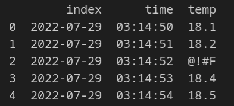
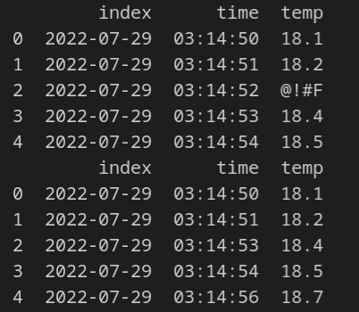
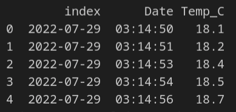

# Chapter 7: Wrangling data

## What you will learn
`Data wrangling` is the processing of `raw` data into a useable form. In this chapter we will explore data cleaning and filtering techniques to produce data useable in our dashbords.

## Exploring Data
Let's start by exploring the data.  We'll learn about several different `Pandas` functions to explore the data.
### Head
Commonly, after we  import the data we'll use the [head](https://pandas.pydata.org/docs/reference/api/pandas.DataFrame.head.html) command to see the top 5 rows of data:
```python
import pandas as pd

url = 'https://raw.githubusercontent.com/open-resources/dash_curriculum/main/tutorial/part2/ch7_files/temp_data.csv'
raw_data = pd.read_csv(url)

print(raw_data.head())
```


We see that this is `time-series` data which contains timestamped temperature readings.  

### Shape
Let's see how big the data is by using [shape](https://pandas.pydata.org/pandas-docs/version/0.23/generated/pandas.DataFrame.shape.html):

```python
import pandas as pd

url = 'https://raw.githubusercontent.com/open-resources/dash_curriculum/main/tutorial/part2/ch7_files/temp_data.csv'
raw_data = pd.read_csv(url)

print(raw_data.head())
print(raw_data.shape)
```


## Cleaning Data
We can see that one of the values in the `temp` column is invalid: `@!#F`.  We have a few options for this erroneous data:
- Keep the data as is
  - This leads to unusable dataframe columns
- Drop the row of data
  - Dropping rows has greater impact as the number of columns grows
- Insert some value for the erroneous data

In this example we are measuring temperature, which changes slowly, so it's probably safe to dropping all rows with corrupted data.  We'll start by dropping rows with no data using Pandas `dropna` method:

```python
import pandas as pd

url = 'https://raw.githubusercontent.com/open-resources/dash_curriculum/main/tutorial/part2/ch7_files/temp_data.csv'
raw_data = pd.read_csv(url)

print(raw_data.head())
raw_data.dropna(axis=0,inplace=True)
```

Now we'll use Pandas `iterrows()` function to go through the dataframe line by line to remove rows that don't contain numeric data in the `temp` column:

```python
import pandas as pd
import numpy as np

import pandas as pd

url = 'https://raw.githubusercontent.com/open-resources/dash_curriculum/main/tutorial/part2/ch7_files/temp_data.csv'
raw_data = pd.read_csv(url)

print(raw_data.head())
raw_data.dropna(axis=0,inplace=True)
    
for index, row in raw_data.iterrows():
    try:
        float(row[2]) # 'temp' column is index 2
    except:
        raw_data.drop(index, axis=0, inplace=True)

raw_data.reset_index(drop=True, inplace=True)

print(raw_data.head())
```
The code above uses Python's [try-expect](https://www.geeksforgeeks.org/python-try-except/) logic test if the row has valid numeric data.



We can also change the names of the columns:

```python
import pandas as pd
import numpy as np

import pandas as pd

url = 'https://raw.githubusercontent.com/open-resources/dash_curriculum/main/tutorial/part2/ch7_files/temp_data.csv'
raw_data = pd.read_csv(url)

print(raw_data.head())
raw_data.dropna(axis=0,inplace=True)
    
for index, row in raw_data.iterrows():
    try:
        float(row[2]) # 'temp' column is index 2
    except:
        raw_data.drop(index, axis=0, inplace=True)

raw_data.reset_index(drop=True, inplace=True)

print(raw_data.head())
raw_data.columns = ['index', 'Date', 'Temp_C']
print(raw_data.head())
```




## Basic Operations with Pandas

[Pandas](https://pandas.pydata.org/) is a data analysis and manipulation library

### Links to use for Pandas data wrangling
- https://towardsdatascience.com/data-wrangling-using-pandas-library-ae26f8bbbdd2
- https://towardsdatascience.com/7-must-know-data-wrangling-operations-with-python-pandas-849438a90d15
- https://realpython.com/python-data-cleaning-numpy-pandas/
- https://betterprogramming.pub/data-wrangling-with-pandas-57f7f72fe73c
- https://medium.com/database-laboratory/data-cleaning-with-pandas-f8f869f63404
```python
df.head() # shows top 5 rows of df
df.types() # shows data type of columns
df.describe() # computes various statistics for each column

# Dealing with missing values
df.isna().sum() # display how many **NA** entries in each row

```

## Processing data

Cleaning, processing, and wrangling data before use
