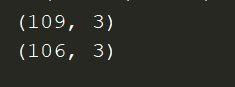
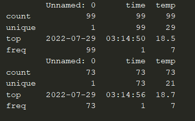
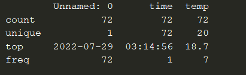

# Chapter 7: Wrangling Data

## What you will learn
`Data wrangling` is the processing of `raw` data into a useable form. In this chapter we will go over data cleaning and filtering techniques to prepare the data for use in our dashbords.

```{admonition} What you will learn

- common data exploration methods
- How to clean data
- How to filter data
- Additional learning resources

```

## 7.1 Exploring Data
One of the most effective ways of exploring a data set is by using the pandas library. Pandas is an open source data analysis and manipulation tool, written in Python. Before you start, remember to `pip install pandas` in the terminal if you haven't done so yet. Let's review a few common pandas functions for data exploration.

### Head
Commonly, after the data is imported, you would use the [head](https://pandas.pydata.org/docs/reference/api/pandas.DataFrame.head.html) command to see the top 5 rows of data:
```python
import pandas as pd

url = 'https://raw.githubusercontent.com/open-resources/dash_curriculum/main/tutorial/part2/ch7_files/temp_data.csv'
raw_data = pd.read_csv(url)

print(raw_data.head())
```


We see that this is `time-series` data which contains timestamped temperature readings. The first column is `Unnamed: 0` because the linked csv file does not have a column name for that column. 

### Shape
[shape](https://pandas.pydata.org/pandas-docs/version/0.23/generated/pandas.DataFrame.shape.html) is typically used to learn more about he dimensions of the data.

```python
import pandas as pd

url = 'https://raw.githubusercontent.com/open-resources/dash_curriculum/main/tutorial/part2/ch7_files/temp_data.csv'
raw_data = pd.read_csv(url)

print(raw_data.head())
print(raw_data.shape)
```


110 represents the number of rows, while 3 reflects the number of columns in the dataframe.

### Info
The Pandas `info` method will return information on the dataframe such as: 
- data types
- column names
- memory usage

```python
import pandas as pd

url = 'https://raw.githubusercontent.com/open-resources/dash_curriculum/main/tutorial/part2/ch7_files/temp_data.csv'
raw_data = pd.read_csv(url)

print(raw_data.info())
```


You see from the image above that the `temp` column has 106 non-null values, which means that 3 values are null. If you look carefully at the csv sheet, you would see that the data has 3 rows with no values in the `temp` column.

### Describe
The Pandas `describe` method will return statistics on the dataframe such as:
- min/max
- unique values
- count of non-null values in column

```python
import pandas as pd

url = 'https://raw.githubusercontent.com/open-resources/dash_curriculum/main/tutorial/part2/ch7_files/temp_data.csv'
raw_data = pd.read_csv(url)

print(raw_data.describe())
```


## 7.2 Cleaning Data

### Dropna
By exploring the datafarme in the section above, we saw that 3 of the values are `null`. Because there are only 3 values and because temperature values don't vary significantly, let's remove those rows with the missing values under the `temp` column. We'll use the `dropna` for this task.

```python
import pandas as pd

url = 'https://raw.githubusercontent.com/open-resources/dash_curriculum/main/tutorial/part2/ch7_files/temp_data.csv'
raw_data = pd.read_csv(url)

print(raw_data.shape)

raw_data.dropna(axis=0,inplace=True)

print(raw_data.shape)
```


There are now `3` fewer rows after droping the `null` value rows.

### Iterrows and Try-Except

There are several non-numeric values that we'd like to drop from the dataframe as well. First, we need to `iterate` through each row in the dataframe with `iterrows()`. Then we'll use Python's [try-expect](https://www.geeksforgeeks.org/python-try-except/) logic to test if the row has a valid `float` data type. If it does not have a valid `float` data type, we will use `dropna` to remove that row: 

```python
import pandas as pd

url = 'https://raw.githubusercontent.com/open-resources/dash_curriculum/main/tutorial/part2/ch7_files/temp_data.csv'
raw_data = pd.read_csv(url)

raw_data.dropna(axis=0, inplace=True)

for index, col in raw_data.iterrows():
    try:
        float(col[2])  # 'temp' column is index 2
    except:
        raw_data.drop(index, axis=0, inplace=True)

print(raw_data.head())
```


Notice from the image above that rows 2 and 5 were dropped. This is because neither of them had a float data type in the `temp` column.

### Reset Index
Given that we've dropped a few rows, we see that the `index` of the dataframe is off. We'll use the `reset_index` method to reset the index and drop the old index with `drop=True`:

```python
import pandas as pd

url = 'https://raw.githubusercontent.com/open-resources/dash_curriculum/main/tutorial/part2/ch7_files/temp_data.csv'
raw_data = pd.read_csv(url)

raw_data.dropna(axis=0, inplace=True)

for index, col in raw_data.iterrows():
    try:
        float(col[2])  # 'temp' column is index 2
    except:
        raw_data.drop(index, axis=0, inplace=True)

print(raw_data.head())
raw_data.reset_index(drop=True, inplace=True)
print(raw_data.head())
```


## 7.3 Filter Data
In the next step of the data wrangling process, we will start filtering the data.

### Filter by value & astype
Let's filter the data for temperatures over `18.5C`.  Notice that we need to use the pandas method [`astype()`](https://pandas.pydata.org/docs/reference/api/pandas.DataFrame.astype.html) to convert the `temp` column data to float type instead of the current string type. 

```python
import pandas as pd

url = 'https://raw.githubusercontent.com/open-resources/dash_curriculum/main/tutorial/part2/ch7_files/temp_data.csv'
raw_data = pd.read_csv(url)

raw_data.dropna(axis=0,inplace=True)

for index, col in raw_data.iterrows():
    try:
        float(col[2]) # 'temp' column is index 2
    except:
        raw_data.drop(index, axis=0, inplace=True)

raw_data.reset_index(drop=True, inplace=True)

print(raw_data.describe())
fltr_df = raw_data[raw_data['temp'].astype(float) > 18.5]
print(fltr_df.describe())
```



The result is a new dataframe (`fltr_df`) with 73 rows where the `temp` data is bigger than 18.5

### Multiple logical operators

You might have noticed that the `temp` column has one row with the value of 300.2. This must be a mistake because temperatures on earth do not reach that level. Therefore, we should remove this row so it doesn't contaminate the data. We can use logic operators, such as the `&` (AND) or the `|` (OR), to apply multiple conditions on the `temp` column.

```python
import pandas as pd

url = 'https://raw.githubusercontent.com/open-resources/dash_curriculum/main/tutorial/part2/ch7_files/temp_data.csv'
raw_data = pd.read_csv(url)

raw_data.dropna(axis=0,inplace=True)

for index, col in raw_data.iterrows():
    try:
        float(col[2]) # 'temp' column is index 2
    except:
        raw_data.drop(index, axis=0, inplace=True)

raw_data.reset_index(drop=True, inplace=True)

fltr_df = raw_data[(raw_data['temp'].astype(float) > 18.5) & (raw_data['temp'].astype(float) < 50)]
print(fltr_df.describe())
```



### iloc
The Pandas method [`iloc`](https://pandas.pydata.org/docs/reference/api/pandas.DataFrame.iloc.html) is used to filter data by index value. For example, if we wanted to limit the dataframe to the first 20 values, we could do the following:

```python
import pandas as pd

url = 'https://raw.githubusercontent.com/open-resources/dash_curriculum/main/tutorial/part2/ch7_files/temp_data.csv'
raw_data = pd.read_csv(url)

raw_data.dropna(axis=0,inplace=True)

for index, col in raw_data.iterrows():
    try:
        float(col[2]) # 'temp' column is index 2
    except:
        raw_data.drop(index, axis=0, inplace=True)

raw_data.reset_index(drop=True, inplace=True)

fltr_df = raw_data[(raw_data['temp'].astype(float) > 18.5) & (raw_data['temp'].astype(float) < 50)]

first_20 = fltr_df.iloc[:20]
print(first_20.shape)
```


## 7.4 Other Resources

The pandas features we chose to highlight in this chapter should be enough to help you start building Dash apps. Nonetheless, if you would like to explore the many other features pandas has to offer, we've added a few resources we found helpful.

- https://pandas.pydata.org/docs/user_guide/index.html
- https://towardsdatascience.com/7-must-know-data-wrangling-operations-with-python-pandas-849438a90d15
- https://realpython.com/python-data-cleaning-numpy-pandas/

## Summary
In this chapter we learned to explore, clean, and filter data to prepare it for use in Dash app. In the next chapter, we'll dive into data visualization with the Plotly Express library.
