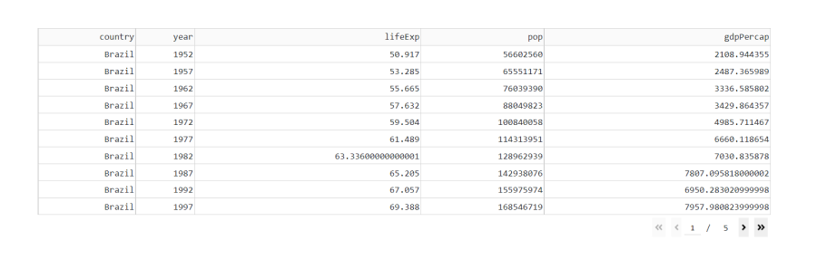
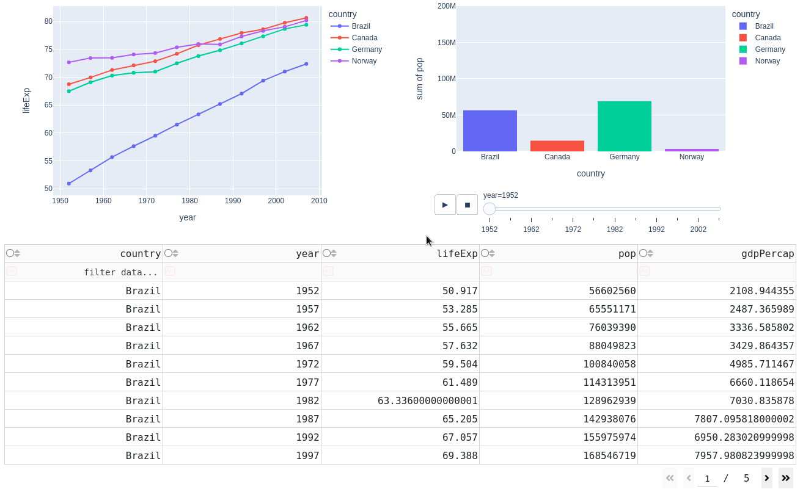

# Chapter 9: DataTables

## What You Will Learn
In this chapter you will learn about `Dash DataTables` and how to use them to explore and edit data.

## 9.1 Intro to DataTables
`Dash DataTable` is an interactive table designed for viewing, editing, and exploring large datasets similar to Microsoft Excel or Google Sheets.  To create a basic `DataTable` all we need to do is define the `data` property by assigning the dataframe to it.

```python
# Import libraries
from dash import Dash, dash_table
import dash_bootstrap_components as dbc
import pandas as pd
import plotly.express as px

# Import data into Pandas dataframe
df = px.data.gapminder()

# Create a Dash DataTable
data_table = dash_table.DataTable(id="dataTable1", data=df.to_dict('records'))

# Create the Dash application with Bootstrap CSS stylesheet
app = Dash(__name__, external_stylesheets=[dbc.themes.BOOTSTRAP])

# Create the app layout
app.layout = dbc.Container(
    dbc.Row([
        dbc.Col([
            data_table
        ])
    ])
)

# Launch the app server
if __name__ == '__main__':
    app.run_server()
```

````{dropdown} See Table
    :container: + shadow
    :title: bg-primary text-white font-weight-bold
  

````

If you run the code above, you'll see that this dataset is huge and the first page is very long. We can limit the amount of rows displayed per page, by using the `page_size` property. But that would create 171 pages of `DataTables`. To limit the size of the dataset, we'll filter it before building the DataTable to only look at a few countries and remove columns we're not interested in:

```python
# Import libraries
from dash import Dash, dash_table
import dash_bootstrap_components as dbc
import pandas as pd
import plotly.express as px

# Import data into Pandas dataframe
df = px.data.gapminder()

# Filter data with a list of countries we're interested in exploring
country_list = ['Canada', 'Brazil', 'Norway', 'Germany']
df = df[df['country'].isin(country_list)]

# Filter columns we want to use
df.drop(['continent', 'iso_alpha', 'iso_num'], axis=1, inplace=True)

# Create a Dash DataTable
data_table = dash_table.DataTable(id="dataTable1", data=df.to_dict('records'), page_size=10)

# Create the Dash application with Bootstrap CSS stylesheet
app = Dash(__name__, external_stylesheets=[dbc.themes.BOOTSTRAP])

# Create the app layout
app.layout = dbc.Container(
    dbc.Row([
        dbc.Col([
            data_table
        ])
    ])
)

# Launch the app server
if __name__ == '__main__':
    app.run_server()
```
````{dropdown} See Table
    :container: + shadow
    :title: bg-primary text-white font-weight-bold
  

````

## 9.2 Linking DataTable to a Graph

Now we will link the DataTable to a Graph and see that the graph changes as we interact with the DataTable.

### 9.2.1 Line Plot

When the `columns` property of the `DataTable` is not provided, columns are auto-generated based on the first row in data. However, in this example, we will define the `columns` property because we want to allow the user to select columns with `selectable:True`

We'll also restrict selection to only one column at a time with `column_selectable`, and we'll predefine the initial selected column with `selected_columns`. 

The Callback will connect the DataTable to the graph by being triggered whenever the user selects a column. 

```python
# Import libraries
from dash import Dash, dash_table, dcc, Input, Output, State
import dash_bootstrap_components as dbc
import pandas as pd
import plotly.express as px


# Import data into Pandas dataframe
df = px.data.gapminder()

# Filter data with a list of countries we're interested in exploring
country_list = ['Canada', 'Brazil', 'Norway', 'Germany']
df = df[df['country'].isin(country_list)]

# Filter columns we want to use
df.drop(['continent', 'iso_alpha', 'iso_num'], axis=1, inplace=True)

# Create a Dash DataTable
data_table = dash_table.DataTable(
        id='dataTable1', 
        data=df.to_dict('records'), 
        columns=[{'name': i, 'id': i,'selectable':True} for i in df.columns],
        page_size=10,
        column_selectable="single",
        selected_columns=['lifeExp']
)

# Create a line graph of life expectancy over time
fig = px.line(df, x='year', y='lifeExp', color='country', markers=True)
graph1 = dcc.Graph(id='figure1', figure=fig)

# Create the Dash application with Bootstrap CSS stylesheet
app = Dash(__name__, external_stylesheets=[dbc.themes.BOOTSTRAP])

# Create the app layout
app.layout = dbc.Container(
    dbc.Row([
        dbc.Col([
            graph1,
            data_table,
        ])
    ])
)


# Link DataTable edits to the plot with a callback function
@app.callback(
    Output('figure1', 'figure'),
    Input('dataTable1', 'selected_columns')
)
def display_output(sel_col):
    # Create a new figure to replace previous figure
    fig = px.line(df, x='year', y=sel_col[0], color='country', markers=True)

    return fig

# Launch the app server
if __name__ == '__main__':
    app.run_server()
```

````{dropdown} See Table
    :container: + shadow
    :title: bg-primary text-white font-weight-bold
  

````

### 9.2.2 Line Plot with Editable DataTable

Now let's allow the user to update the data inside the DataTable and have the graph update accordingly. To do that, we need to define the `editable` property as such: `editable=True`.

We also need to update the callabck decorator and body of the callback function. In the previous code above, the line chart always plotted the same global DataFrame, `df`, because the data never changed. In cases were the DataTable data can be edited, we need to create a new DataFrame inside the callback function to reflect the updated DataTable. Then, we use the udpated DataFrame to plot the graph. 

```python
# Import libraries
from dash import Dash, dash_table, dcc, Input, Output, State
import dash_bootstrap_components as dbc
import pandas as pd
import plotly.express as px


# Import data into Pandas dataframe
df = px.data.gapminder()

# Filter data with a list of countries we're interested in exploring
country_list = ['Canada', 'Brazil', 'Norway', 'Germany']
df = df[df['country'].isin(country_list)]

# Filter columns we want to use
df.drop(['continent', 'iso_alpha', 'iso_num'], axis=1, inplace=True)

# Create a Dash DataTable
data_table = dash_table.DataTable(
        id='dataTable1', 
        data=df.to_dict('records'), 
        columns=[{'name': i, 'id': i,'selectable':True} for i in df.columns],
        page_size=10,
        column_selectable="single",
        selected_columns=['lifeExp'],
        editable=True
)

# Create a line graph of life expectancy over time
fig = px.line(df, x='year', y='lifeExp', color='country', markers=True)
graph1 = dcc.Graph(id='figure1', figure=fig)

# Create the Dash application with Bootstrap CSS stylesheet
app = Dash(__name__, external_stylesheets=[dbc.themes.BOOTSTRAP])

# Create the app layout
app.layout = dbc.Container(
    dbc.Row([
        dbc.Col([
            graph1,
            data_table,
        ])
    ])
)


# Link DataTable edits to the plot with a callback function
@app.callback(
    Output('figure1', 'figure'),
    Input('dataTable1', 'data'),
    Input('dataTable1', 'columns'),
    Input('dataTable1', 'selected_columns')
)
def display_output(rows, columns, sel_col):
    # Create data frame from data table 
    df = pd.DataFrame(rows, columns=[c['name'] for c in columns])
    # Create a new figure to replace previous figure
    fig = px.line(df, x='year', y=sel_col[0], color='country', markers=True)

    return fig

# Launch the app server
if __name__ == '__main__':
    app.run_server()
```

````{dropdown} See Table
    :container: + shadow
    :title: bg-primary text-white font-weight-bold
  

````

**Update gif in dropdown**

### 9.2.3 Histogram

Let's explore the data further using a `Histogram` that we'll animate to show population change over time:


```python
# Import libraries
from dash import Dash, dash_table, dcc, Input, Output, State
import dash_bootstrap_components as dbc
import pandas as pd
import plotly.express as px


# Import data into Pandas dataframe
df = px.data.gapminder()

# Filter data with a list of countries we're interested in exploring
country_list = ['Canada', 'Brazil', 'Norway', 'Germany']
df = df[df['country'].isin(country_list)]

# Filter columns we want to use
df.drop(['continent', 'iso_alpha', 'iso_num'], axis=1, inplace=True)

# Create a Dash DataTable
data_table = dash_table.DataTable(
        id='dataTable1', 
        data=df.to_dict('records'), 
        columns=[{'name': i, 'id': i, 'selectable':True} for i in df.columns],
        page_size=10,
        column_selectable="single",
)

# Create a line graph of life expectancy over time
fig1 = px.line(df, x='year', y='lifeExp', color='country', markers=True)
graph1 = dcc.Graph(id='figure1', figure=fig1)

# Create an animated histogram of population growth
fig_bar = px.histogram(df, x="country", y="pop", color="country",
                 animation_frame="year", animation_group="country", 
                 range_y=[0,200000000],
)
graph2 = dcc.Graph(id='figure2', figure=fig_bar)


# Create the Dash application with Bootstrap CSS stylesheet
app = Dash(__name__, external_stylesheets=[dbc.themes.BOOTSTRAP])

# Create the app layout
app.layout = dbc.Container([
    dbc.Row([
        dbc.Col([
            graph1,
        ]),
        dbc.Col([
            graph2,
        ]),
    ]),
    dbc.Row([
        dbc.Col([
            data_table,
        ]),
    ]),  
])


# Link DataTable edits to the plot with a callback function
@app.callback(
    Output('figure1', 'figure'),
    Input('dataTable1', 'data'),
    Input('dataTable1', 'columns'),
    Input('dataTable1', 'selected_columns')
)
def display_output(rows, columns, sel_col):
    # Create data frame from data table 
    df = pd.DataFrame(rows, columns=[c['name'] for c in columns])
    # Create a new figure to replace previous figure
    fig = px.line(df, x='year', y=sel_col[0], color='country', markers=True)

    return fig


# Link DataTable edits to the plot with a callback function
@app.callback(
    Output('figure2', 'figure'),
    Input('dataTable1', 'data'),
    Input('dataTable1', 'columns'),
    Input('dataTable1', 'selected_columns')
)
def display_output(rows, columns, sel_col):
    # Create data frame from data table 
    df = pd.DataFrame(rows, columns=[c['name'] for c in columns])
    # Create a new figure to replace previous figure
    # Create an animated histogram of population growth
    fig = px.histogram(df, x="country", y="pop", color="country",
                    animation_frame="year", animation_group="country", 
                    range_y=[0,200000000],
    )

    return fig
# Launch the app server
if __name__ == '__main__':
    app.run_server()
```


## 9.3 Other Important DataTable properties

Let's take a look at some useful `DataTable` properties:

### 9.3.1 Sorting
First let's add `sorting`:


```python
# Create a Dash DataTable
data_table = dash_table.DataTable(
        id='dataTable1', 
        data=df.to_dict('records'), 
        columns=[{'name': i, 'id': i, 'selectable':True} for i in df.columns],
        page_size=10,
        column_selectable="single",
        sort_action='native',
)
```

### 9.3.2 Filtering
We can also add the option to filter the columns of data.  In this example we will only use **>** or **<**:



```python
# Import libraries
from dash import Dash, dash_table, dcc, Input, Output, State
import dash_bootstrap_components as dbc
import pandas as pd
import plotly.express as px


# Import data into Pandas dataframe
df = px.data.gapminder()

# Filter data with a list of countries we're interested in exploring
country_list = ['Canada', 'Brazil', 'Norway', 'Germany']
df = df[df['country'].isin(country_list)]

# Filter columns we want to use
df.drop(['continent', 'iso_alpha', 'iso_num'], axis=1, inplace=True)

# Create a Dash DataTable
data_table = dash_table.DataTable(
        id='dataTable1', 
        data=df.to_dict('records'), 
        columns=[{'name': i, 'id': i, 'selectable':True} for i in df.columns],
        page_size=10,
        column_selectable="single",
        sort_action='native',
        filter_action='native',
)

# Create a line graph of life expectancy over time
fig1 = px.line(df, x='year', y='lifeExp', color='country', markers=True)
graph1 = dcc.Graph(id='figure1', figure=fig1)

# Create an animated histogram of population growth
fig_bar = px.histogram(df, x="country", y="pop", color="country",
                 animation_frame="year", animation_group="country", 
                 range_y=[0,200000000],
)
graph2 = dcc.Graph(id='figure2', figure=fig_bar)


# Create the Dash application with Bootstrap CSS stylesheet
app = Dash(__name__, external_stylesheets=[dbc.themes.BOOTSTRAP])

# Create the app layout
app.layout = dbc.Container([
    dbc.Row([
        dbc.Col([
            graph1,
        ]),
        dbc.Col([
            graph2,
        ]),
    ]),
    dbc.Row([
        dbc.Col([
            data_table,
        ]),
    ]),  
])

# Take a filter string and apply it to a dataframe. Return a Plotly figure
def parse_filter(filter, df):
    # Parse the string to get the filter and target column
    lst = filter.split("s")
    col_name = lst[0][1:-2]
    op = lst[1].split(" ")
    # perform > or < filter of df column
    if op[0] == ">":
        df = df[df[col_name]> float(op[1])] 
    elif op[0] == "<":
        df = df[df[col_name]< float(op[1])] 
        
    # Create a new figure to replace previous figure
    fig = px.line(df, x='year', y=col_name, color='country', markers=True)

    return fig


# Link DataTable edits to the plot with a callback function
@app.callback(
    Output('figure1', 'figure'),
    Input('dataTable1', 'data'),
    Input('dataTable1', 'columns'),
    Input('dataTable1', 'selected_columns'),
    Input('dataTable1', "filter_query")
)
def display_output(rows, columns, sel_col, flter):

    # Create data frame from data table 
    df = pd.DataFrame(rows, columns=[c['name'] for c in columns])

    # Apply the filter if selected
    if flter:
        fig = parse_filter(flter,df)
        return fig
    # Use the selected column if the user chose one
    elif sel_col:
        # Create a new figure to replace previous figure
        fig = px.line(df, x='year', y=sel_col[0], color='country', markers=True)
        return fig
    else:
        # Create a new figure to replace previous figure
        fig = px.line(df, x='year', y='lifeExp', color='country', markers=True) 
        return fig


# Link DataTable edits to the plot with a callback function
@app.callback(
    Output('figure2', 'figure'),
    Input('dataTable1', 'data'),
    Input('dataTable1', 'columns'),
    Input('dataTable1', 'selected_columns')
)
def display_output(rows, columns, sel_col):
    # Create data frame from data table 
    df = pd.DataFrame(rows, columns=[c['name'] for c in columns])
    # Create a new figure to replace previous figure
    # Create an animated histogram of population growth
    fig = px.histogram(df, x="country", y="pop", color="country",
                    animation_frame="year", animation_group="country", 
                    range_y=[0,200000000],
    )

    return fig
# Launch the app server
if __name__ == '__main__':
    app.run_server()
```


### 9.3.3 Delete Columns
Datasets will often contain much more data than we care about.  Let's allow the user to delete columns in the `DataTable` that they are not interested in:
```python
# Create a Dash DataTable
data_table = dash_table.DataTable(
        id='dataTable1', 
        data=df.to_dict('records'), 
        columns=[{'name': i, 'id': i, 'selectable':True, 'deletable':True} for i in df.columns],
        page_size=10,
        column_selectable="single",
        sort_action='native',
        filter_action='native',
)
```


### 9.3.4 Delete Rows
Sometimes we'd like to remove a datapoint from our plot.  Let's allow the user to delete rows in the `DataTable`:

```python
data_table = dash_table.DataTable(
        id='dataTable1', 
        data=df.to_dict('records'), 
        columns=[{'name': i, 'id': i, 'selectable':True, 'deletable':True} for i in df.columns],
        page_size=10,
        column_selectable="single",
        sort_action='native',
        filter_action='native',
        row_deletable=True,

)
```


## Summary
In this chapter we learned about `Dash DataTables`.  In the next chapter we will learn about **Advanced Callbacks**.
