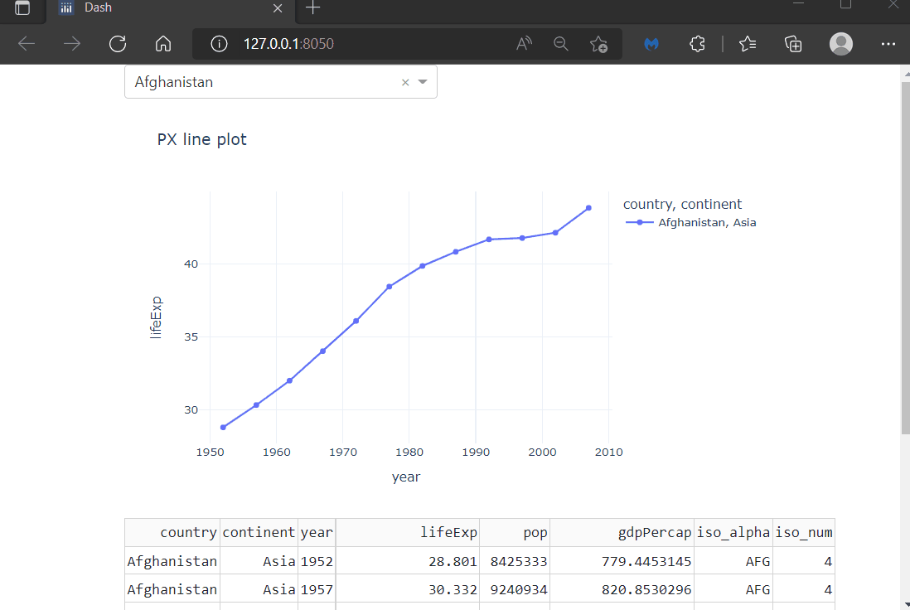
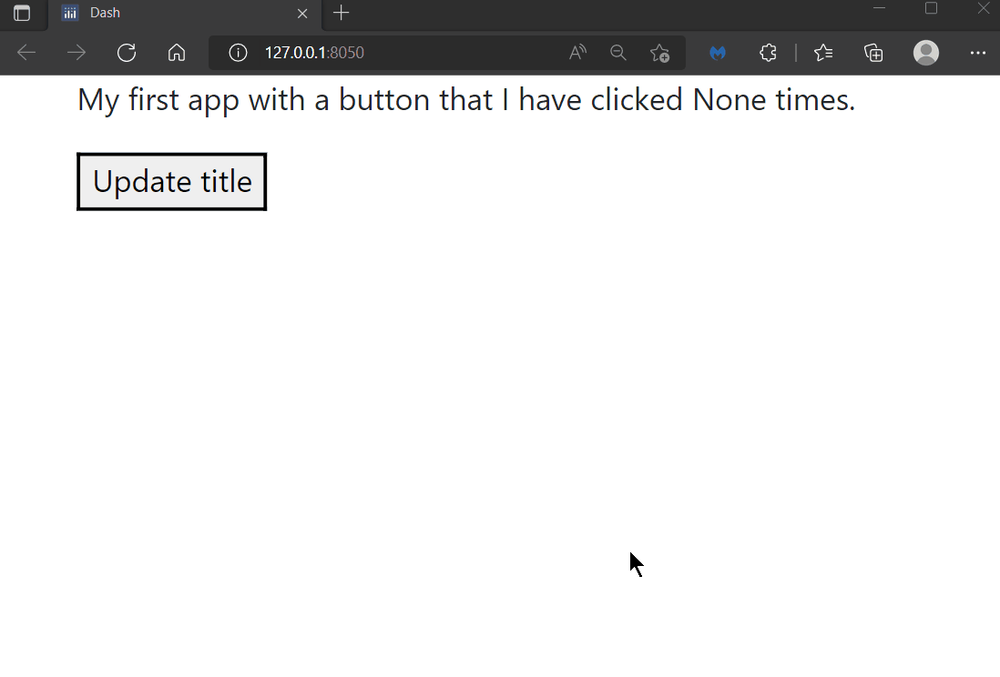
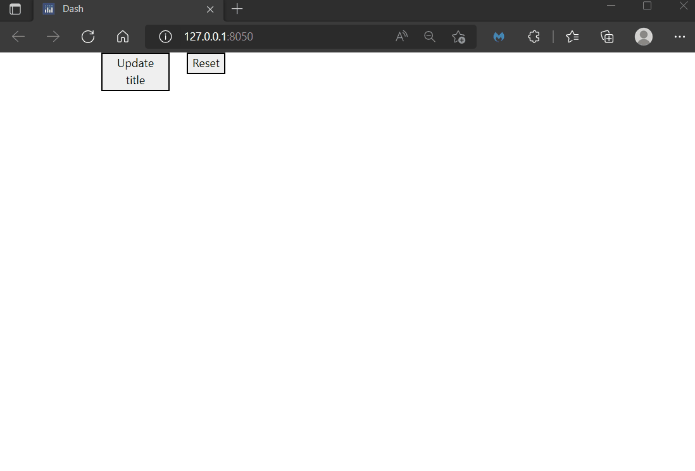

# Chapter 10: Advanced Callbacks

## What you will learn

You have already learned about callbacks in chapter 4. Now, it is time to enhance our skill set and deal with more advanced callbacks. You will learn how to circumvent different components to trigger a callback action immediately as well as how to handle multiple outputs and inputs in one callback. Furthermore, we will see how to operate with buttons within a callback.

```{admonition} Learning Intentions
- Multiple outputs and inputs
- Buttons in callbacks
- States
```

## 10.1 Multiple Outputs and Inputs

You might want to have a graph that is linked to more than one component that update different dimensions of your graph (multiple Inputs). If you think the other way around, you might want to have several graphs that are updated by the same component (multiple Outputs). Here is where multiple outputs and inputs come into play.

Let us see **multiple inputs** in action first. Let's build an app that has a dropdown and radio buttons, both of which will modify the graph. The dropdown will be used to select a single country out of all the countries covered in the gapminder data set. The radio buttons will be used to build either a line chart or a scatter plot.

Now, since we are using 2 Inputs in the callback decorator, we have 2 component properties. Each components property must be represented as callback function arguments (in this example `value_dropdown` and `value_radio`). Also, make sure that the order in which you write the component properties reflects the order of the function arguments: first Input component property is tied to the first function argument (top to bottom, left to right).

```
# Import packages
from dash import Dash, dcc, Input, Output
import dash_bootstrap_components as dbc
import plotly.express as px

# Setup data
df = px.data.gapminder()
dropdown_list = df['country'].unique()

# Initialise the App
app = Dash(__name__, external_stylesheets=[dbc.themes.BOOTSTRAP])

# Create app components
dropdown = dcc.Dropdown(id='our-dropdown', options=dropdown_list, value=dropdown_list[0])
radio = dcc.RadioItems(id='our-radio', options=['line', 'scatter'], value='line')

# App Layout
app.layout = dbc.Container(
    [
        dbc.Row(
            [
                dbc.Col(dropdown, width=3),
                dbc.Col(radio, width=1)
            ]
        ),
        dbc.Row(dbc.Col(dcc.Graph(id='our-figure'))),
    ]
)


# Configure callbacks
@app.callback(
    Output(component_id='our-figure', component_property='figure'),
    Input(component_id='our-dropdown', component_property='value'),
    Input(component_id='our-radio', component_property='value'),
)
def update_graph(value_dropdown, value_radio):
    df_sub = df[df['country'].isin([value_dropdown])]

    if value_radio == 'scatter':
        fig = px.scatter(
            df_sub,
            x='year',
            y='lifeExp',
            color='country',
            symbol='continent',
            title='PX {} plot'.format(value_radio),
            template='plotly_white'
        )
    else:
        fig = px.line(
            df_sub,
            x='year',
            y='lifeExp',
            color='country',
            symbol='continent',
            title='PX {} plot'.format(value_radio),
            template='plotly_white'
        )

    return fig


# Run the App
if __name__ == '__main__':
    app.run_server()
```


Similarly, we are able to define **multiple outputs** in one callback. For this, let us take another example, where we want to trigger a graph and a table at the same time through one dropdown. Again, we want to be able to select one specific country of interest to us, whose data then get displayed within the graph and the table.

Because we are using multiple outputs we need to add them as component properties in the callback decorator as well as return the same number of variables in the callback function (in this example `fig` and `data` separated by a comma). Also, make sure that the order you enter the variables reflects the order of the component properties: first component property is tied to the first returned variable. 

```
# Import packages
from dash import Dash, dash_table, dcc, Input, Output
import dash_bootstrap_components as dbc
import plotly.express as px

# Setup data
df = px.data.gapminder()
dropdown_list = df['country'].unique()

# Initialise the App
app = Dash(__name__, external_stylesheets=[dbc.themes.BOOTSTRAP])

# Create app components
dropdown = dcc.Dropdown(id='our-dropdown', options=dropdown_list, value=dropdown_list[0])
data_table = dash_table.DataTable(id='our-data-table', page_size=10)
graph = dcc.Graph(id='our-figure')

# App Layout
app.layout = dbc.Container(
    [
        dbc.Row(dbc.Col(dropdown, width=6)),
        dbc.Row(dbc.Col(graph)),
        dbc.Row(dbc.Col(data_table)),
    ]
)


# Configure callbacks
@app.callback(
    Output(component_id='our-figure', component_property='figure'),
    Output(component_id='our-data-table', component_property='data'),
    Input(component_id='our-dropdown', component_property='value'),
)
def update_graph(value_dropdown):
    df_sub = df[df['country'].isin([value_dropdown])]

    fig = px.line(
        df_sub,
        x='year',
        y='lifeExp',
        color='country',
        symbol='continent',
        title='PX line plot',
        template='plotly_white'
    )

    data = df_sub.to_dict('records')
    return fig, data


# Run the App
if __name__ == '__main__':
    app.run_server()
```


## 10.2 Buttons within a callback

Now, that you know how to implement multiple inputs and outputs it's worth taking a closer look at buttons and how to approach them within callbacks. Besides the `children` and `id` properties, buttons come with a property called `n_clicks`, which represents the number of times that the button has been clicked on. The `n_clicks` property therefore always is a non-negative integer. You would typically use this property to trigger the callback and return output components whenever the button is clicked. In the example below, we change the title of our app depending on if, and how often, the button has been clicked.

```
# Import packages
from dash import Dash, dcc, html, Input, Output
import dash_bootstrap_components as dbc

# Initialise the App
app = Dash(__name__, external_stylesheets=[dbc.themes.BOOTSTRAP])

# Create app components
markdown = dcc.Markdown(id='our-markdown')
button = html.Button(id='our-button', children='Update title')

# App Layout
app.layout = dbc.Container(
    [
        dbc.Row(dbc.Col(markdown)),
        dbc.Row(dbc.Col(button))
    ]
)


# Configure callbacks
@app.callback(
    Output(component_id='our-markdown', component_property='children'),
    Input(component_id='our-button', component_property='n_clicks'),
)
def update_title(n_clicks):
    if n_clicks == 0:
        title = 'My first app. The button has not been clicked yet.'
    else:
        title = 'My first app with a button that I have clicked {} times.'.format(n_clicks)
    return title


# Run the App
if __name__ == '__main__':
    app.run_server()
```



To give you some more flexibility on programming your future apps, let us see how to reset the `n_clicks` component property of one button through another button. For this, we adjust the above example by adding a second button. Whenever the second button is clicked, the component property `n_clicks` of the first button will be reset to 0.

```
# Import packages
from dash import Dash, dcc, html, Input, Output
import dash_bootstrap_components as dbc

# Initialise the App
app = Dash(__name__, external_stylesheets=[dbc.themes.BOOTSTRAP])

# Create app components
markdown = dcc.Markdown(id='our-markdown')
button = html.Button(id='our-button', children='Update title')
button_reset = html.Button(id='reset-button', children='Reset')

# App Layout
app.layout = dbc.Container(
    [
        dbc.Row(dbc.Col(markdown)),
        dbc.Row(
            [
                dbc.Col(button, width=2),
                dbc.Col(button_reset, width=2)
            ]
        )
    ]
)


# Configure callbacks
@app.callback(
    Output(component_id='our-markdown', component_property='children'),
    Input(component_id='our-button', component_property='n_clicks'),
)
def update_title(n_clicks):
    if n_clicks == 0:
        title = 'My first app. The button has not been clicked yet.'
    else:
        title = 'My first app with a button, that I have clicked {} times.'.format(n_clicks)
    return title


@app.callback(
    Output(component_id='our-button', component_property='n_clicks'),
    Input(component_id='reset-button', component_property='n_clicks'),
)
def update_title(n_clicks):
    if n_clicks >= 0:
        clicks = 0
    return clicks


# Run the App
if __name__ == '__main__':
    app.run_server()
```


## 10.3 Callback Context

In the previous example each button belonged to a separate callback. However, you might want to create apps where multiple buttons exist in the same callback as two Inputs. One button would update  

# Consider deleting this section

To conclude this second part of the chapter, let us see how to implement a binary functionality of your button. This means you are triggering different outputs with clicking the button, depending if you have clicked it an even or an odd number of times. This can be easily handled with the modulo operator `%`.

```{tip}
For a comprehensive overview of the modulo operator and how to use it in Python, have a look at [Real Python](https://realpython.com/python-modulo-operator/).
```

```
# Import packages
from dash import Dash, dcc, html, Input, Output
import dash_bootstrap_components as dbc

# Initialise the App
app = Dash(__name__, external_stylesheets=[dbc.themes.BOOTSTRAP])

# Create app components
markdown = dcc.Markdown(id='our-markdown', children='My first app')
button = html.Button(id='our-button', children='Update title')

# App Layout
app.layout = dbc.Container(
    [
        dbc.Row(dbc.Col(markdown)),
        dbc.Row(dbc.Col(button))
    ]
)


# Configure callbacks
@app.callback(
    Output(component_id='our-markdown', component_property='children'),
    Input(component_id='our-button', component_property='n_clicks'),
)
def update_title(n_clicks):
    if n_clicks % 2 == 0:
        title = 'My first app'
    else:
        title = 'My first app, but with a changed title.'
    return title


# Run the App
if __name__ == '__main__':
    app.run_server()
```
##### [ADD GIF, SHOWING THE ABOVE CODE IN ACTION]

## 10.4 States

So far, we had linked components of your app together which immediately affected each other. In a more advanced setup it might be useful though to circumvent this direct relationship. You might first want to have all of the input arguments together before your outpout is triggered. This could be helpful for any kind of forms. For this purpose there is a third argument that can be used within the callback decorator, the state. Formally, the state argument is used in the same way as the input argument.

Let us bring everything together in one final example. We will implement an app with a dropdown, some radio items and a button which will trigger two output components, a graph and a table. However, we only want to trigger the output components when the button is clicked. This can be done with the state argument. Herefore, we declare all arguments that should not directly trigger the output components as state arguments instead of input arguments in the callback decorator.

```{attention}
Note that you need to import the state argument the same way we are importing the input and output arguments at the beginning of your code.
```

```
# Import packages
from dash import Dash, dash_table, dcc, html, Input, Output, State
import dash_bootstrap_components as dbc
import plotly.express as px

# Setup data
df = px.data.gapminder()
dropdown_list = df['country'].unique()

# Initialise the App
app = Dash(__name__, external_stylesheets=[dbc.themes.BOOTSTRAP])

# Create app components
markdown = dcc.Markdown(id='our-markdown', children='My first app')
dropdown = dcc.Dropdown(id='our-dropdown', options=dropdown_list, value=dropdown_list[0])
radio = dcc.RadioItems(id='our-radio', options=['line', 'scatter'], value='line')
button = html.Button(id='our-button', children='Update data', n_clicks=0)
data_table = dash_table.DataTable(id='our-data-table', page_size=10)

# App Layout
app.layout = dbc.Container(
    [
        dbc.Row(dbc.Col(markdown)),
        dbc.Row(
            [
                dbc.Col(dropdown, width=3),
                dbc.Col(radio, width=1),
                dbc.Col(button, width=3)
            ]
        ),
        dbc.Row(dbc.Col(dcc.Graph(id='our-figure'))),
        dbc.Row(dbc.Col(data_table))
    ]
)


# Configure callbacks
@app.callback(
    Output(component_id='our-figure', component_property='figure'),
    Output(component_id='our-data-table', component_property='data'),
    Input(component_id='our-button', component_property='n_clicks'),
    State(component_id='our-dropdown', component_property='value'),
    State(component_id='our-radio', component_property='value'),
)
def update_graph(n_clicks, value_dropdown, value_radio):
    if n_clicks >= 0:
        df_sub = df[df['country'].isin([value_dropdown])]
        data = df_sub.to_dict('records')

        if value_radio == 'scatter':
            fig = px.scatter(
                df_sub,
                x='year',
                y='lifeExp',
                color='country',
                symbol='continent',
                title='PX {} plot'.format(value_radio),
                template='plotly_white'
            )
        else:
            fig = px.line(
                df_sub,
                x='year',
                y='lifeExp',
                color='country',
                symbol='continent',
                title='PX {} plot'.format(value_radio),
                template='plotly_white'
            )

    return fig, data


# Run the App
if __name__ == '__main__':
    app.run_server()
```
##### [ADD GIF, SHOWING THE ABOVE CODE IN ACTION]

## Summary

We have learned about how to link multiple input components with multiple output components. Furthermore, you know how to trigger certain inputs running after using the state argument in a callback. With the third learning on how to deal with buttons within callbacks you are now well equipped to build even more complex, fully interactive apps.
