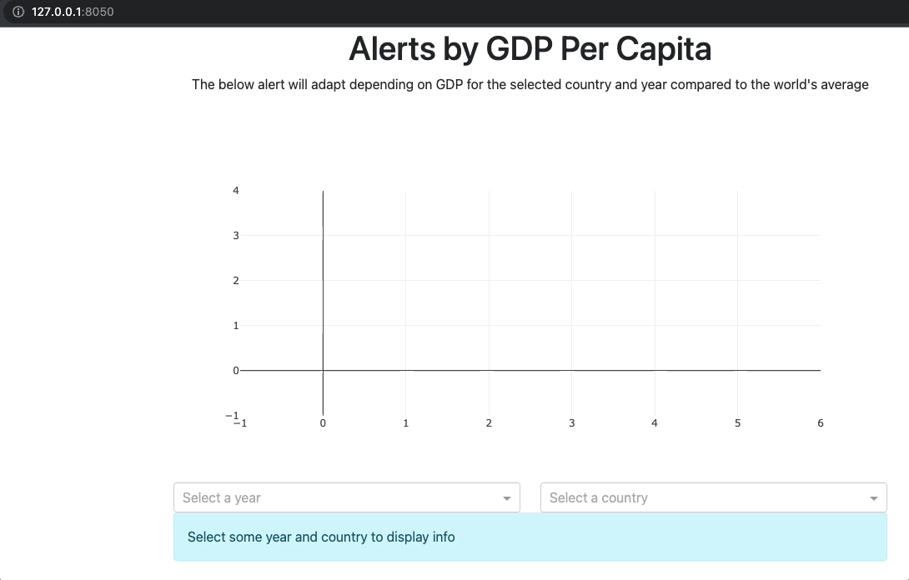

# Chapter 11: Additional Components

## What you will learn
In this chapter we will introduce several advanced components that go beyond what we have seen so far, but that are necessary for advanced apps.

```{admonition} Learning Intentions
- How to look for additional components
- Familiarize with some of the most common advanced components
```

## 11.1 Introducing advanced components
Dash libraries include a lot of components that serves multiple purposes. It may be a bit overwhelming to navigate through all components, in search for the one that works for our needs. In this chapter we will provide some structure around the components you may include in your app.

We will broke down components into categories, grouping together components that serve the same purpose. For each category, we will present some of the most common components in detail.

All advanced components that will be presented come from these very common libraries. By clicking on the links, you'll be able to access to each library documentation:
- dcc : [Dash core components](https://dash.plotly.com/dash-core-components)
- dbc : [Dash boostrap components](https://dash-bootstrap-components.opensource.faculty.ai/docs/components/)

In the links above, it is possible to search for keywords and find the components we need. Once we've identified the components that we want to include in our app, [this cheatsheet](https://dashcheatsheet.pythonanywhere.com/) is another powerful tool that helps us understanding how components can be customised.


## 11.2 Data Display Components

### 11.2.1 Upload
The `Upload` component allows us to upload a file to the dashboard.  For this example we will upload a [CSV file](https://www.howtogeek.com/348960/what-is-a-csv-file-and-how-do-i-open-it/) and plot the data.  Download [this](ch11_files/rotation_angle.csv) CSV file and run the follwing code to try it out:

```{attention}
Note that the `update_fig()` callback is design for a specific type of data.  Different data wrangling will be required based on the type of data you are importing.
```

```python
from dash import Dash, dcc, html
import dash_bootstrap_components as dbc
from dash.dependencies import Input, Output, State
import pandas as pd
import plotly.graph_objects as go
import base64
import io
from dash.dash import no_update


app = Dash(__name__, external_stylesheets=[dbc.themes.BOOTSTRAP])

upload = dcc.Upload(
                    id='upload-data',
                    children=html.Div([
                        'Drag & Drop or Click to Select CSV file'
                    ]),
                    style={
                        'width': '100%',
                        'height': '10%',
                        'lineHeight': '60px',
                        'borderStyle': 'dashed',
                        'textAlign': 'center',
                    }
                )
graph = dcc.Graph(id='graph1')


# App Layout
app.layout = dbc.Container(
    [
        dbc.Row(dbc.Col(upload)),
        dbc.Row(dbc.Col(graph))
    ]
)

@app.callback(Output('graph1', 'figure'),
            Input('upload-data', 'contents'))
def update_fig(contents):
    if contents is not None:
        content_type, content_data = contents.split(',')
        # Check if data is CSV
        if 'csv' in content_type:
            decoded_data = base64.b64decode(content_data)
            df = pd.read_csv(io.StringIO(decoded_data.decode('utf-8')))
            fig = go.Figure()
            # Go through each column in the dataframe and make a trace for it
            for col in df.columns:
                fig.add_trace(go.Scattergl(y=df[col], mode='lines+markers', name=col))
            return fig
    return no_update


# Launch the app server
if __name__ == '__main__':
    app.run_server()
```


### 11.2.2 Card
The `Card` component provides a container in which we can place content.

```python
from dash import Dash
import dash_bootstrap_components as dbc
from dash import html

app = Dash(__name__, external_stylesheets=[dbc.themes.BOOTSTRAP])

card = dbc.Card(
    [
        dbc.CardBody(
            [
                html.H4("DBC card", className="card-title"),
                html.P(
                    "We can add some text here",
                    className="card-text",
                )
            ]
        ),
    ],
    style={"width": "18rem"},
)

# App Layout
app.layout = dbc.Container(
    [
        dbc.Row(dbc.Col(card)),
    ]
)

# Launch the app server
if __name__ == '__main__':
    app.run_server()
```


## 11.3 Feedback Components

### 11.3.1 Modal
`Modals` are pop-up boxes that allow for user notification, input, or other content to be displayed.

```python
from dash import Dash, Input, Output, State, html
import dash_bootstrap_components as dbc
from dash import html

app = Dash(__name__, external_stylesheets=[dbc.themes.BOOTSTRAP])

open_button = dbc.Button("Open", id="open_modal")
close_button = dbc.Button("Close", id="close_modal")


modal = dbc.Modal(
            [
                dbc.ModalHeader(dbc.ModalTitle("Title")),
                dbc.ModalBody("This is the content of the modal"),
                dbc.ModalFooter(close_button),
            ],
            id="modal",
            is_open=False,
        )

# App Layout
app.layout = dbc.Container(
    [
        dbc.Row(dbc.Col(open_button)),
        dbc.Row(dbc.Col(modal)),
    ]
)

@app.callback(
    Output("modal", "is_open"),
    [Input("open_modal", "n_clicks"), Input("close_modal", "n_clicks")],
    [State("modal", "is_open")],
)
def toggle_modal(n1, n2, is_open):
    if n1 or n2:
        return not is_open
    return is_open

# Launch the app server
if __name__ == '__main__':
    app.run_server()
```


### 11.3.2 Alert
`Alerts` are boxes that provide messages according to the user interaction with the app.
Via callbacks it is possible to change several props of this component (full list [here](https://dash-bootstrap-components.opensource.faculty.ai/docs/components/alert/)), such as: color, fading animation, duration of appearence.

In the example below, we have created alerts depending on the GTP Per Capita trend of a user-selected country and year:
- If the trend is positive, meaning the GTP per Capita of the selected year is above the average GTP of the previous 10 years, the alert message will have a green background
- If the trend is stable, the alert message will turn yellow color
- Otherwise the message will become red
The message content summarises the results (i.e. GTP per Capita) obtained via the user selection.

```python
# Import packages
from dash import Dash, dcc, Input, Output, html
import dash_bootstrap_components as dbc
import pandas as pd
import plotly.express as px
import numpy as np

# Import data
df = px.data.gapminder()

# Initialise the App
app = Dash(__name__, external_stylesheets=[dbc.themes.BOOTSTRAP])

# Create app components
_header = html.H1(children='Alerts by GDP Per Capita', style = {'textAlign' : 'center'})
_text1 = html.P(children='The below alert will adapt depending on GDP 10y trend for the selected country and year', style = {'textAlign' : 'center'})
year_sel = dcc.Dropdown(id='year-dropdown', placeholder = 'Select a year', options= [c for c in df.year.unique()])
country_sel = dcc.Dropdown(id='country-dropdown', placeholder = 'Select a country', options = [c for c in df.country.unique()])
gpd_line = px.line(df, x='year', y='gdpPercap', color='country', template='plotly_white', range_y = [0, 50000])
alert_msg = dbc.Alert(id='alert-gdp', children="Select some year and country to display info", color="info")

# App Layout
app.layout = dbc.Container(
    [
        dbc.Row([dbc.Col([_header], width=8)]),
        dbc.Row([dbc.Col([_text1], width=8)]),        
        dbc.Row([dbc.Col([dcc.Graph(figure=gpd_line)], width=8)]),
        dbc.Row([
            dbc.Col([year_sel], width=4),
            dbc.Col([country_sel], width=4)
        ]),
        dbc.Row([dbc.Col([alert_msg], width=8)])
    ]
)

# Configure callback
@app.callback(
    Output("alert-gdp", "color"),
    Output("alert-gdp", "children"),
    Input("year-dropdown", "value"),
    Input("country-dropdown", "value"),
    prevent_initial_call=True
)
def update_alert(y, c):
    threshold = .05; previous_y = 10
    gdp_sel = df.loc[(df['country']==c) & (df['year']==y), 'gdpPercap'] #Filter for selection
    gdp_avg = df.loc[(df['country']==c) & (df['year']<y) & (df['year']>=y-previous_y), 'gdpPercap'] #Slice previous years gdpPercap

    if (gdp_sel.values.size > 0) & (gdp_avg.values.size > 0):
        gdp_sel_v = round(gdp_sel.values[0],2)
        gdp_avg_v = round(np.mean(gdp_avg.values),2)
        new_children = ['The GDP per Capita in '+c+' in '+str(y)+' was: '+gdp_sel_v.astype(str)+
                        '; The average GDP from previous '+str(previous_y)+' years was: '+gdp_avg_v.astype(str)]
        if np.abs((gdp_sel_v/gdp_avg_v)-1) < threshold:
            new_color = 'warning' 
        elif (gdp_sel_v/gdp_avg_v) < 1:
            new_color = 'danger'
        else:
            new_color = 'success'
    else:
        new_color = "dark"
        new_children = 'Insufficient Data. Try new selection'

    return new_color, new_children

# Run the App
if __name__ == '__main__':
    app.run_server()
```


## 11.4 Filtering & Input Components

### 11.4.1 DatePicker
The DatePicker component allows the user of the app to select a date, that can then be used in our callbacks.
There are two types of date pickers, both part of the DCC library:
- ```DatePickerSingle``` consists of one single date selection that the user can input. By clicking on the object a calendar will pop-up, allowing the user to pick a date
- ```DatePickerRange``` is similar to the previous component, but includes two date selections, which should be read as "start" and "end" dates.

The two components have very similar properties - the complete list is available [here](https://dash.plotly.com/dash-core-components/datepickerrange); the main ones are:
- min_date_allowed : minimum date the user can choose from
- max_date_allowed : maximum date the user can choose from
- start_date : default start date, before the user makes any selection
- end_date : default end date, before the user makes any selection

Let's see an example of this component in action. In the following app a DatePickerRange is used as a filter for a line chart.
Based on the user selection, a dataframe will be filtered and the chart updated.
As min_date_allowed and max_date_allowed, the min and max dates from the dataframe have been selected.

```{note}
In the following app, instead of using the gapminder dataset, we have used a dataset based on stock prices, as it includes a datetime field.
```

```python
# Import packages
from dash import Dash, dcc, Input, Output, html
import dash_bootstrap_components as dbc
import pandas as pd
from datetime import date
import plotly.express as px

# Import data
df = px.data.stocks()
df['date'] = pd.to_datetime(df['date'], format='%Y-%m-%d')

# Initialise the App
app = Dash(__name__, external_stylesheets=[dbc.themes.BOOTSTRAP])

# Create app components
date_range = dcc.DatePickerRange(id='date-range',
    start_date_placeholder_text='start date',
    end_date_placeholder_text='end date',
    min_date_allowed=df.date.min(),
    max_date_allowed=df.date.max(),
    display_format='DD-MMM-YYYY',
    first_day_of_week = 1)

# App Layout
app.layout = dbc.Container(
    [
        dbc.Row([dbc.Col([date_range], width=8)]),
        dbc.Row(dbc.Col([dcc.Graph(id='stock-line')], width=8))
    ]
)

# Configure callback
@app.callback(
    Output(component_id='stock-line', component_property='figure'),
    Input(component_id='date-range', component_property='start_date'),
    Input(component_id='date-range', component_property='end_date')
)
def plot_dt(start_date, end_date):
    df_plot = df
    if start_date is not None:
        df_plot = df_plot.loc[(df_plot['date']>=start_date), :]
    if end_date is not None:
        df_plot = df_plot.loc[(df_plot['date']<=end_date), :]
    fig = px.line(df_plot, x='date', y=['GOOG','AAPL','AMZN','FB','NFLX','MSFT'], template='plotly_white')

    return fig

# Run the App
if __name__ == '__main__':
    app.run_server()
```


## 11.5 Navigation Components

### 11.5.1 Tabs
`Tabs` allow for easy navigation between different pages of our app.

```python
from dash import Dash
import dash_bootstrap_components as dbc
from dash import html

app = Dash(__name__, external_stylesheets=[dbc.themes.BOOTSTRAP])

tab1_content = dbc.Card(
    dbc.CardBody(
        [
            html.P("This is tab 1", className="card-text"),
            dbc.Button("Click here", color="success"),
        ]
    ),
)

tab2_content = dbc.Card(
    dbc.CardBody(
        [
            html.P("This is tab 2", className="card-text"),
            dbc.Button("Don't click here", color="danger"),
        ]
    ),
)

tab3_content = dbc.Card(
    dbc.CardBody(
        [
            html.P("This is tab 3", className="card-text"),
            dbc.Button("Maybe click here", color="warning"),
        ]
    ),
)


tabs = dbc.Tabs(
    [
        dbc.Tab(tab1_content, label="Tab 1"),
        dbc.Tab(tab2_content, label="Tab 2"),
        dbc.Tab(tab3_content, label="Tab 3"),
    ]
)

# App Layout
app.layout = dbc.Container(
    [
        dbc.Row(dbc.Col(tabs)),
    ]
)

# Launch the app server
if __name__ == '__main__':
    app.run_server()
```


## 11.6 Layout Components

## 11.7 Additional Content
In addition to all the components present in the libraries introduces above, it is possible to find additional components by exploring third party libraries.
An example is the Mantine library, whose components can be found [here](https://dash-mantine-components.herokuapp.com/).

---
---
---
## Previous Notes (To be removed)

## Topics to cover
- Components to unveil additional content
- Components for filtering (e.g. date picker)
- Components for navigation
- Components for media content (carousel…)

## Individual components we're thinking to add
### DCC components
- RangeSlider (required)
- Datepicker (required)
- Interval (required)
- Store (required)
- Upload
### DBC components
- Drop down
- Modal
- Offcanvas too?
- Navbar
- Tabs
- Carousel

### DMC components
[Mantine](https://www.dash-mantine-components.com/)
