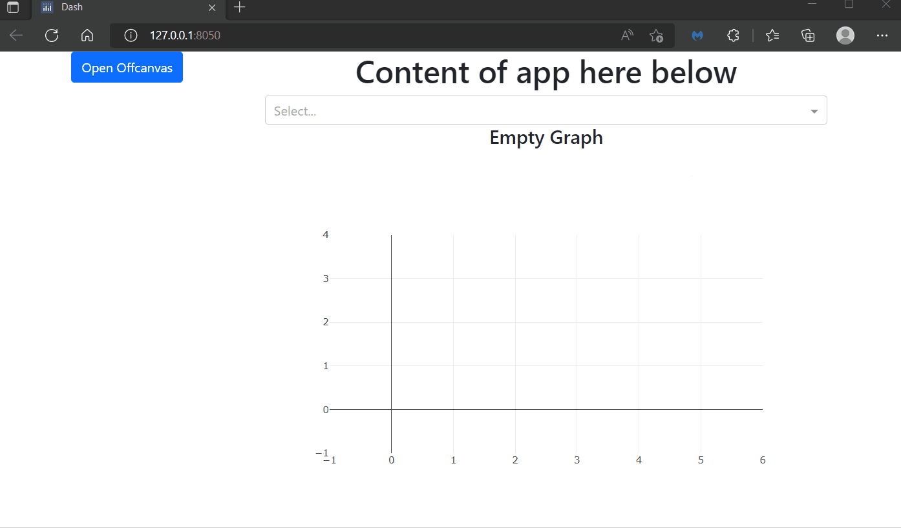
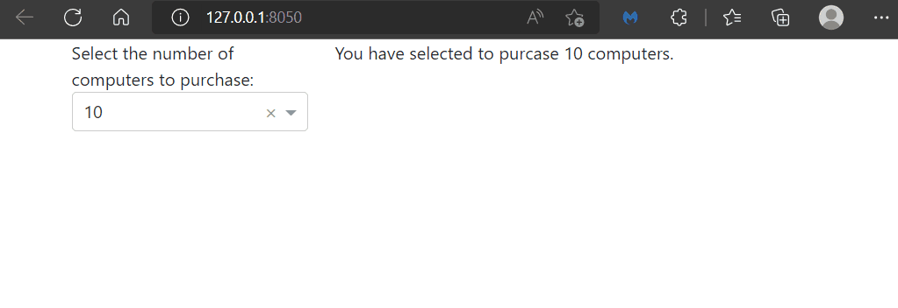
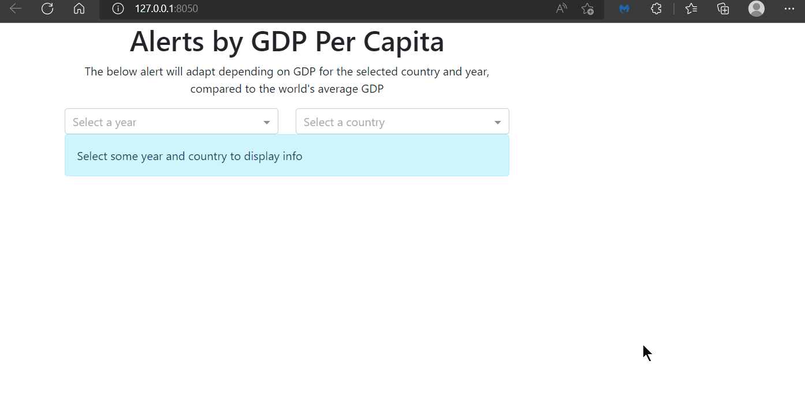
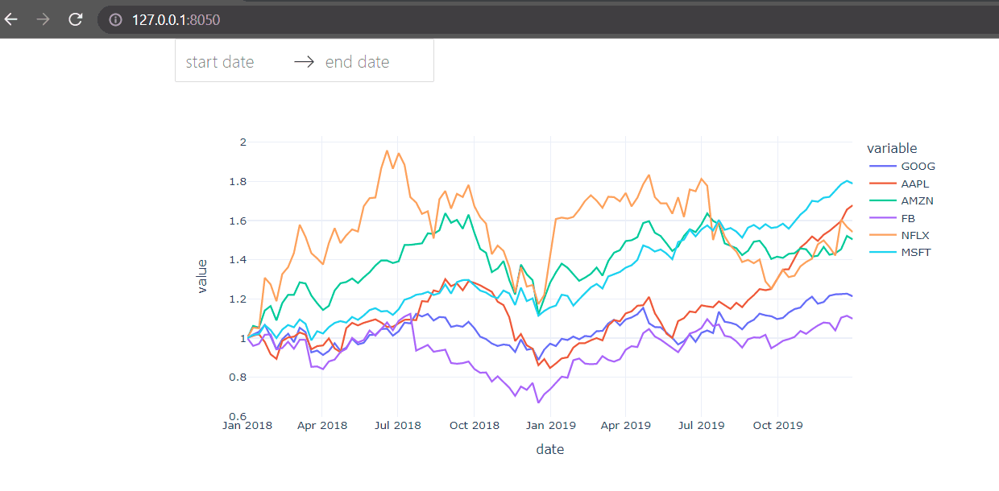
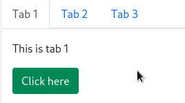
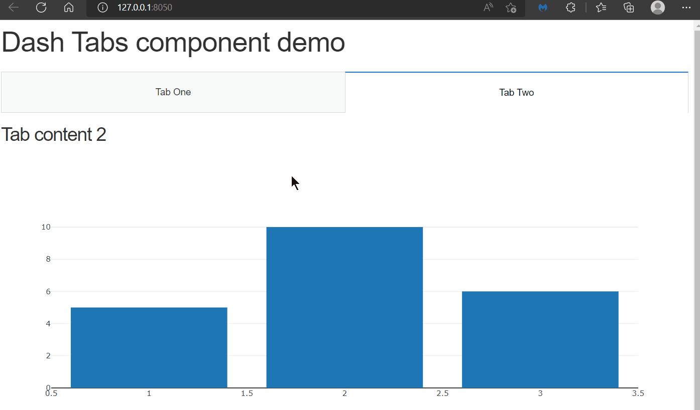
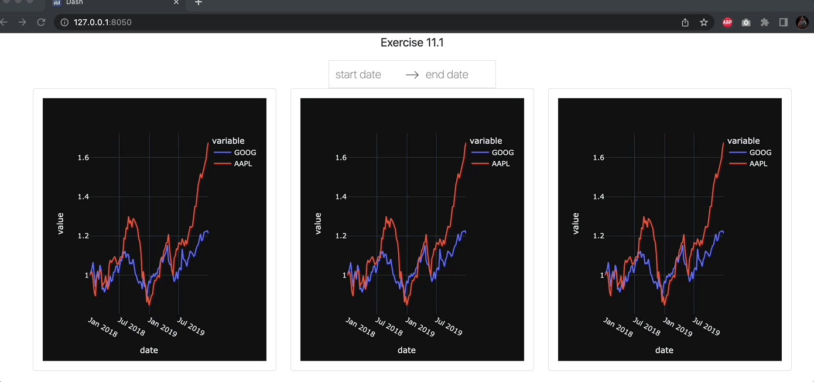

# Chapter 11: Advanced Components

## What you will learn
Dash libraries include many components that serve multiple purposes. It may be a bit overwhelming to navigate through all the components in search for the one that meets your needs. Therefore, in this chapter we will provide an overview of several components that are commonly used and that you may find useful to include in your app.

We will break down the components into categories, grouping together components that serve the same purpose. For each category, we will present some of the most common components in detail.

All components in this chapter come from these libraries:
- [Dash core components](https://dash.plotly.com/dash-core-components) (dcc)
- [Dash boostrap components](https://dash-bootstrap-components.opensource.faculty.ai/docs/components/) (dbc)


```{admonition} Learning Intentions
- Upload, Card, Modal, Alert components
- Store data, Datepicker and Interval component
- Tabs and Offcanvas components
```

By the end of this chapter you will know how to build this app:



````{dropdown} See the code
    :container: + shadow
    :title: bg-primary text-white font-weight-bold
  
```
# Import packages
from dash import Dash, Input, Output, State, html
import dash_core_components as dcc
import dash_bootstrap_components as dbc
import base64


# Initialise the App
app = Dash(__name__, external_stylesheets=[dbc.themes.BOOTSTRAP])

image_filename = 'plotly.png' # replace with your own image
encoded_image = base64.b64encode(open(image_filename, 'rb').read())
img = html.Img(src='data:image/png;base64,{}'.format(encoded_image.decode()))
offcanvas_doc = dcc.Link("Off-Canvas documentation", id='oc_doc', target='_blank',href='https://dash-bootstrap-components.opensource.faculty.ai/docs/components/offcanvas/')
link_doc = dcc.Link("Link documentation", id='link_doc', target='_blank',href='https://dash.plotly.com/dash-core-components/link')


offcanvas_layout = dbc.Container(
    [
        dbc.Row([dbc.Col(img)]),
        dbc.Row([dbc.Col(offcanvas_doc)]),
        dbc.Row([dbc.Col(link_doc)]),
    ]
)
offcanvas = html.Div(
    [
        dbc.Button("Open Offcanvas", id="open-offcanvas", n_clicks=0),
        dbc.Offcanvas(
            [offcanvas_layout],
            id="offcanvas",
            title="Off-Canvas",
            is_open=False,
        ),
    ]
)

# App Layout
app.layout = dbc.Container(
    [
        dbc.Row([dbc.Col(offcanvas)])
    ]
)


@app.callback(
    Output("offcanvas", "is_open"),
    Input("open-offcanvas", "n_clicks"),
)
def toggle_offcanvas(n1):
    if n1:
        return True
    


# Run the App
if __name__ == '__main__':
    app.run_server()
```

````

[Click to download the complete code file for this chapter](https://raw.githubusercontent.com/open-resources/dash_curriculum/main/tutorial/part3/ch11_files/chapter11_fin_app.py)

## 11.1 Data Display Components

### 11.1.1 Upload
The `Upload` component allows us to upload a file to the dashboard. For this example we will upload a [CSV file](https://www.howtogeek.com/348960/what-is-a-csv-file-and-how-do-i-open-it/) and plot the data on a line chart. [Download this CSV file](https://raw.githubusercontent.com/open-resources/dash_curriculum/main/tutorial/part3/ch11_files/rotation_angle.csv), save it as `rotation_angle.csv`, run the follwing code, and try uploading the file into the drag and drop section of the app.

```{attention}
Note that the `update_fig()` callback function below is designed for CSV files exclusively. Different data wrangling inside the function would be required if you choose to work with other data files.
```

```python
from dash import Dash, dcc, html, Input, Output, State
import dash_bootstrap_components as dbc
import pandas as pd
import plotly.express as px
import base64
import io
from dash.dash import no_update


app = Dash(__name__, external_stylesheets=[dbc.themes.BOOTSTRAP])

upload = dcc.Upload(
                    id='upload-data',
                    children=html.Div([
                        'Drag & Drop or Click to Select CSV file'
                    ]),
                    style={
                        'width': '100%',
                        'height': '10%',
                        'lineHeight': '60px',
                        'borderStyle': 'dashed',
                        'textAlign': 'center',
                    }
                )
graph = dcc.Graph(id='graph1')


# App Layout
app.layout = dbc.Container(
    [
        dbc.Row(dbc.Col(upload)),
        dbc.Row(dbc.Col(graph))
    ]
)

@app.callback(Output('graph1', 'figure'),
            Input('upload-data', 'contents'))
def update_fig(contents):
    if contents is not None:
        content_type, content_data = contents.split(',')
        # Check if data is CSV
        if 'csv' in content_type:
            decoded_data = base64.b64decode(content_data)
            df = pd.read_csv(io.StringIO(decoded_data.decode('utf-8')))
            fig = px.line(df, y='angle')
            return fig
    return no_update


# Launch the app server
if __name__ == '__main__':
    app.run_server()
```


[This Dash Docs page has additional `Upload` examples](https://dash.plotly.com/dash-core-components/upload). 


### 11.1.2 Card
The `Card` component provides a container in which we can place content neatly such as: titles, main body text, images, graphs, buttons, and links. It often leads to a more appealing layout design. All you need to do is build the card body inside the `dbc.Card`

```python
from dash import Dash, html
import dash_bootstrap_components as dbc

app = Dash(__name__, external_stylesheets=[dbc.themes.BOOTSTRAP])

card = dbc.Card(
    [
        dbc.CardBody(
            [
                html.H4("Card title", className="card-title"),
                html.P(
                    "Some quick example text to build on the card title and make up the bulk of the card's content.",
                    className="card-text",
                )
            ]
        ),
    ],
    style={"width": "18rem"},
)

app.layout = dbc.Container(
    [
        dbc.Row(dbc.Col([card])),
    ]
)

# Launch the app server
if __name__ == '__main__':
    app.run_server()
```


Now let's create a card with a graph and a dropdown.

```python
from dash import Dash, html, dcc, Output, Input
import dash_bootstrap_components as dbc
import plotly.express as px

df = px.data.gapminder()

app = Dash(__name__, external_stylesheets=[dbc.themes.BOOTSTRAP])

card = dbc.Card(
    [
        dbc.CardBody(
            [
                html.H4("population by country", className="card-title"),
                dcc.Dropdown(df.country.unique(),
                             multi=True,
                             value=[df.country[0],df.country[20]],
                             id='my-dropdown'),
                dcc.Graph(id='my-graph')
            ]
        ),
    ],
    style={"width": "50rem"},
)

app.layout = dbc.Container(
    [
        dbc.Row(dbc.Col([card])),
    ]
)

@app.callback(
    Output('my-graph','figure'),
    Input('my-dropdown','value')
)
def update_graph_card(value):
    dff = df[df.country.isin(value)]
    fig = px.histogram(dff, 'country', y='pop')
    return fig


if __name__ == '__main__':
    app.run_server()
```

[This Dash Bootstrap Components page has additional `Card` examples](https://dash-bootstrap-components.opensource.faculty.ai/docs/components/card/). 


### 11.1.3 Modal
`Modals` are pop-up boxes that allow for user notification, input, or other content to be displayed. A modal is often incorporated to draw the user's attention to a specific section of the page. In the example below, the body of the modal solely contains text. However, just like the card, the modal bobdy can contain many others elements within its children: dropdowns, graphs, input fields, images, links, etc.

```python
from dash import Dash, Input, Output, State, html
import dash_bootstrap_components as dbc

app = Dash(__name__, external_stylesheets=[dbc.themes.BOOTSTRAP])

open_button = dbc.Button("Open", id="open_modal")
close_button = dbc.Button("Close", id="close_modal")


modal = dbc.Modal(
            [
                dbc.ModalHeader(dbc.ModalTitle("Title")),
                dbc.ModalBody("This is the content of the modal"),
                dbc.ModalFooter(close_button),
            ],
            id="modal",
            is_open=False,
        )

# App Layout
app.layout = dbc.Container(
    [
        dbc.Row(dbc.Col([open_button])),
        dbc.Row(dbc.Col([modal]))
    ]
)

@app.callback(
    Output("modal", "is_open"),
    Input("open_modal", "n_clicks"), Input("close_modal", "n_clicks"),
    State("modal", "is_open")
)
def toggle_modal(n1, n2, is_open):
    if n1 or n2:
        return not is_open
    return is_open

# Launch the app server
if __name__ == '__main__':
    app.run_server()
```


[This Dash Bootstrap Components page has additional `Modal` examples](https://dash-bootstrap-components.opensource.faculty.ai/docs/components/modal/). 

### 11.1.4 Alert
`Alerts` are boxes that provide messages depending on the user interaction with the app.
Using the callback, you can update many of the component's properties such as: color, fading animation, duration of appearence.

In the example below, an alert pops up if the user chooses a quantity over 100.

```python
# Import packages
from dash import Dash, dcc, html, Input, Output
import dash_bootstrap_components as dbc

# Initialise the App
app = Dash(__name__, external_stylesheets=[dbc.themes.BOOTSTRAP])

# App Layout
app.layout = dbc.Container(
    [
        dbc.Row([
            dbc.Col([
                html.Label("Select the number of computers to purchase:"),
                dcc.Dropdown([10, 44, 103], value=10, id='my-dropdown')
            ], width=4),
            dbc.Col([
                html.Div(id='content')
            ], width=6)
       ])
    ]
)


@app.callback(
    Output("content", "children"),
    Input("my-dropdown", "value"),
)
def toggle_offcanvas(value):
    if value < 100:
        return f"You have selected to purchase {value} computers."
    if value > 100:
        return dbc.Alert(children="We don't have so many computers in stock. Please select fewer computers",
                         color="danger")


# Launch the app server
if __name__ == '__main__':
    app.run_server()
```




Let's see a more sophisticated example. Below, we have created alerts depending on the GDP Per Capita of a selected country and year, compared to the global average:
- If the country's GDP Per Capita is greater than the world's average, the alert message will have a green background
- Otherwise the message will become red

```python
from dash import Dash, dcc, Input, Output, html
import dash_bootstrap_components as dbc
import plotly.graph_objects as go
import pandas as pd
import plotly.express as px
import numpy as np

# Import data
df = px.data.gapminder()

# Initialise the App
app = Dash(__name__, external_stylesheets=[dbc.themes.BOOTSTRAP])

# Create app components
_header = html.H1(children='Alerts by GDP Per Capita', style={'textAlign' : 'center'})
_text1 = html.P(children='The below alert will adapt depending on GDP for the selected country and year, compared to the world\'s average GDP', style={'textAlign' : 'center'})
year_sel = dcc.Dropdown(id='year-dropdown', placeholder='Select a year', options=df.year.unique())
country_sel = dcc.Dropdown(id='country-dropdown', placeholder='Select a country', options=df.country.unique())
alert_msg = dbc.Alert(id='alert-gdp', children="Select a year and country to trigger alert", color="info")

# App Layout
app.layout = dbc.Container(
    [
        dbc.Row([dbc.Col([_header], width=8)]),
        dbc.Row([dbc.Col([_text1], width=8)]),
        dbc.Row([
            dbc.Col([year_sel], width=4),
            dbc.Col([country_sel], width=4)
        ]),
        dbc.Row([dbc.Col([alert_msg], width=8)])
    ]
)

@app.callback(
    Output("alert-gdp", "color"),
    Output("alert-gdp", "children"),
    Input("year-dropdown", "value"),
    Input("country-dropdown", "value"),
    prevent_initial_call=True
)
def update_alert(y, c):
    gdp_sel = df.loc[(df['country']==c) & (df['year']==y), 'gdpPercap'] #Filter for selection
    gdp_global_avg = df.loc[(df['year']==y), 'gdpPercap'] #Calculate world avg for the same yeara

    if (gdp_sel.values.size > 0) & (gdp_global_avg.values.size > 0):
        gdp_sel_v = round(gdp_sel.values[0],2)
        gdp_avg_v = round(np.mean(gdp_global_avg.values),2)

        new_children = ['The GDP per Capita in '+c+' in '+str(y)+' was: '+gdp_sel_v.astype(str)+
                        '; The world average was: '+gdp_avg_v.astype(str)]

        if gdp_sel_v < gdp_avg_v:
            new_color = 'danger'
        else:
            new_color = 'success'
    else:
        new_color = "dark"
        new_children = 'Insufficient Data. Try another selection'

    return new_color, new_children


# Launch the app server
if __name__ == '__main__':
    app.run_server()
```



[See additional properties and examples of the `Alert` component](https://dash-bootstrap-components.opensource.faculty.ai/docs/components/alert/). 


## 11.2 Date Filtering & Input Components

### 11.2.1 DatePicker
The DatePicker components allow the user to select a single date or a date range.
There are two types of date pickers, both are part of the Dash Core Components library:
- ```DatePickerSingle``` consists of one single date selection: by clicking on the object a calendar will pop-up, allowing the user to pick a date
- ```DatePickerRange``` is similar to the previous component, but includes two date selections, which should be read as "start" and "end" dates.

The two components have very similar properties - the main ones are:
- min_date_allowed : minimum date the user can choose from
- max_date_allowed : maximum date the user can choose from
- start_date : default start date selected, when app page initially loads
- end_date : default end date selected, when app page initially loads

In the following app, a DatePickerRange is used as a filter for a line chart. Based on the user selection, a dataframe will be filtered inside the callback function and the chart will be updated.

```{note}
In the following app, instead of using the gapminder dataset, we have used a dataset based on stock prices, as it includes a full date field.
```

```python
# Import packages
from dash import Dash, dcc, Input, Output, html
import dash_bootstrap_components as dbc
import pandas as pd
from datetime import date
import plotly.express as px

# Import data
df = px.data.stocks()
df['date'] = pd.to_datetime(df['date'], format='%Y-%m-%d')

# Initialise the App
app = Dash(__name__, external_stylesheets=[dbc.themes.BOOTSTRAP])

# Create app components
date_range = dcc.DatePickerRange(id='date-range',
    start_date_placeholder_text='start date',
    end_date_placeholder_text='end date',
    min_date_allowed=df.date.min(),
    max_date_allowed=df.date.max(),
    display_format='DD-MMM-YYYY',
    first_day_of_week = 1)

# App Layout
app.layout = dbc.Container(
    [
        dbc.Row([dbc.Col([date_range], width=8)]),
        dbc.Row(dbc.Col([dcc.Graph(id='stock-line')], width=8))
    ]
)

# Configure callback
@app.callback(
    Output(component_id='stock-line', component_property='figure'),
    Input(component_id='date-range', component_property='start_date'),
    Input(component_id='date-range', component_property='end_date')
)
def plot_dt(start_date, end_date):
    df_plot = df
    if start_date is not None:
        df_plot = df_plot.loc[(df_plot['date']>=start_date), :]
    if end_date is not None:
        df_plot = df_plot.loc[(df_plot['date']<=end_date), :]
    fig = px.line(df_plot, x='date', y=['GOOG','AAPL','AMZN','FB','NFLX','MSFT'], template='plotly_white')

    return fig

# Run the App
if __name__ == '__main__':
    app.run_server()
```


[See additional properties and examples of the `DatePickerRange` component](https://dash.plotly.com/dash-core-components/datepickerrange). 


### 11.2.2 Store
```Store``` component allows to use the browser memory in order to store app data. A typical use case for this component is to store data in memory and use it in a different tab.
When using this component, it is important to pay attention to the following:
- this component can only store data in the following formats: json, list, dictionary data types. With the ```data``` property, we can access to the content stored in the memory.
- how long the data is going to be stored is a customizable property called ```storage_type```. We can use three different types of memory, which are cleared by three different events. ```memory```: the data will be cleared when we refresh the browser page; ```session```: the data will be cleared when we close the browser; ```local```: the data will be cleared when we clean the browser cookies.
- this is an invisible component: although it won't affect app layout, the component must be included in the ```app.layout``` in order to work properly.
- it's generally safe to store up to 2MB in most environments, and 5~10MB in most desktop-only applications.

In the following example, a dropdown selection is stored in memory. We've generated three different store components, one for each storage type. This should clarify the difference among the three memory types. In the app, the three graphs will plot life expectancy for the countries that are in the corresponding memory.

Try to run the app on your computer. Then, test the storage types by refreshing the page; then closing the browser and reopening it; and then clearing cookies.

```{note}
Don't worry about understanding the code below. This was written for the purpose of demonstrating the different `storage_type`s.
```

```python
# Import packages
from dash import Dash, dcc, Input, Output, html
from dash.exceptions import PreventUpdate
import dash_bootstrap_components as dbc
import plotly.express as px
import pandas as pd

# Import data
df = px.data.gapminder()

# Initialise the App
app = Dash(__name__, external_stylesheets=[dbc.themes.BOOTSTRAP])

# Create app components
_header = html.H1(children='Store App', style = {'textAlign' : 'center'})
_text1 = html.P(children='The selected countries below will be stored in memory', style = {'textAlign' : 'center'})
country_sel = dcc.Dropdown(id='country-dropdown', placeholder = 'Select countries', options = [c for c in df.country.unique()], multi=True)
mstorage = dcc.Store(id='memory', data=[], storage_type='memory')
sstorage = dcc.Store(id='session', data=[], storage_type='session')
lstorage = dcc.Store(id='local', data=[], storage_type='local')
_subheader41 = html.H4(children='Memory Store based chart', style = {'textAlign' : 'center'})
_subheader42 = html.H4(children='Session Store based chart', style = {'textAlign' : 'center'})
_subheader43 = html.H4(children='Local Store based chart', style = {'textAlign' : 'center'})
_subheader51 = html.H5(children='Memory Store content:', style = {'textAlign' : 'center'})
_subheader52 = html.H5(children='Session Store content:', style = {'textAlign' : 'center'})
_subheader53 = html.H5(children='Local Store content:', style = {'textAlign' : 'center'})

# App Layout
app.layout = dbc.Container(
    [
        dbc.Row([dbc.Col([_header], width=12)]),
        dbc.Row([dbc.Col([_text1], width=12)]),
        dbc.Row([dbc.Col([country_sel], width=12)]),
        dbc.Row([
            dbc.Col([_subheader41], width=4), dbc.Col([_subheader42], width=4), dbc.Col([_subheader43], width=4)
        ]),
        dbc.Row([
            dbc.Col([dcc.Graph(id='memory-life-exp-line')], width=4),
            dbc.Col([dcc.Graph(id='session-life-exp-line')], width=4),
            dbc.Col([dcc.Graph(id='local-life-exp-line')], width=4)
        ]),
        dbc.Row([
            dbc.Col([_subheader51], width=2),
            dbc.Col([html.P(id='memory-output',)], width=2),
            dbc.Col([_subheader52], width=2),
            dbc.Col([html.P(id='session-output',)], width=2),
            dbc.Col([_subheader53], width=2),
            dbc.Col([html.P(id='local-output',)], width=2)
        ]),
        mstorage, lstorage, sstorage
    ]
)

# Configure callbacks

## Generate callbacks, one per memory type
for store_type in ['memory', 'session', 'local']:

    chart_type = store_type+"-life-exp-line"
    output_type = store_type+"-output"

    # Write in memory
    @app.callback(Output(store_type, "data"),
                    Input("country-dropdown", "value"),
                    Input(store_type, "data"))
    def write_memo(new_sel, memo):
        if new_sel is None:
            raise PreventUpdate # We avoid update the store if there is no selection or if a different memory was selected
        else:
            for c in new_sel:
                if c not in memo:
                    memo.append(c)
        return memo

    ## Update graphs
    @app.callback(Output(chart_type, 'figure'),
                Input(store_type, 'data'))
    def plot_gen(memory_sel):
        fig = px.line()
        if memory_sel is not None:
            df_plot = df.loc[(df['country'].isin(memory_sel)), :]
        fig = px.line(df_plot, x='year', y='lifeExp', color='country', template='plotly_white')
        return fig

    ## Output memory content
    @app.callback(Output(output_type, "children"),
                Input(store_type, "data"))
    def print_memo(current_memory):
        if current_memory is None:
            output = ""
        else:
            output = ", ".join(current_memory)
        return output

# Run the App
if __name__ == '__main__':
    app.run_server()
```


Here is a real life example of how to use `dcc.Store` in your app. In this example, we store the gapminder data session chosen in one tab to use it in another tab:

```
# Import packages
from dash import Dash, dcc, Input, Output, html, dash_table
from dash.exceptions import PreventUpdate
import dash_bootstrap_components as dbc
import plotly.express as px
import pandas as pd

# Initialise the App
app = Dash(__name__, external_stylesheets=[dbc.themes.BOOTSTRAP])

# App Layout
app.layout = html.Div([
    html.H1('Store App with Data', style = {'textAlign' : 'center'}),
    dcc.Store(id='memo', data=[], storage_type='session'),
    dcc.Tabs(id='store-example-data', value='tab-1-data-input', children=[
        dcc.Tab(label='Tab One', value='tab-1-data-input'),
        dcc.Tab(label='Tab Two', value='tab-2-data-store'),
    ]),
    html.Div(id='tabs-content')
])

# Display tab content, based on the tab selected
@app.callback(Output('tabs-content', 'children'),
              Input('store-example-data', 'value'))
def render_content(tab):
    if tab == 'tab-1-data-input':
        df = px.data.gapminder() # Data imported in tab 1
        return html.Div([
            html.H3('Select gapminder data to store in memory'),
            dcc.Dropdown(id='country-dropdown', placeholder = 'Select a country', options = [c for c in df.country.unique()])
        ])
    elif tab == 'tab-2-data-store':
        return html.Div([
            html.H3('Selected data from previous Tab'),
            html.Div(id='data-table')
        ])

# save the filtered dataframe in dcc.Store once user selects dropdown option
@app.callback(Output('memo', 'data'),
              Input('country-dropdown', 'value'))
def sel_records(c): # Write in memory
    if c is None:
      raise PreventUpdate
    else:
        df = px.data.gapminder() # Data imported in tab 1
        recs =  df.loc[(df['country']==c), :]
    return recs.to_dict('records')


# retrieve the stored data to populate the DataTable shown in tab 2
@app.callback(Output('data-table', 'children'),
              Input('memo', 'data'))
def show_records(data_): # Read from memory
    data_df = pd.DataFrame(data_)
    my_table = dash_table.DataTable(
        columns=[{"name": i, "id": i} for i in data_df.columns],
        data=data_df.to_dict('records')
    )
    return my_table

if __name__ == '__main__':
    app.run_server()
```


[See additional properties and examples of the `Store` component](https://dash.plotly.com/dash-core-components/store). 


### 11.2.3 Interval
`Interval` enables automatic recurrent updates of the app, by triggering callbacks periodically.
One example where this component is typically used is when the app is connected to an API to download data that is repeatedly updated (e.g. stock market data). By adjusting property, it is possible to configure the following:
- `interval` is a property that determines the refresh rate. This is measured in milliseconds and every time this interval expires, a counter is increased.
- `max_intervals` can be configured to set a cap to the number of times the refresh happens. By default, this property is set to -1, meaning that refreshes will never stop.
- `n_intervals` represent the counter, i.e. the number of times the interval has passed. This property is used to trigger the callback function.

This is an invisible component: although it won't affect app layout, the component must be included in the ```app.layout``` in order to work properly.

In the following example, the current time in New York is refreshed every 2 seconds.
```
# Import packages
from dash import Dash, dcc, Input, Output, html
import dash_bootstrap_components as dbc
from dash.exceptions import PreventUpdate
from datetime import datetime
import pytz

app = Dash(__name__, external_stylesheets=[dbc.themes.BOOTSTRAP])

_header1 = html.H1(children='Current Time', style={'textAlign': 'center'})
_header4 = html.H4(
    children='The New York time below is refreshed whenever the interval component triggers the callback.',
    style={'textAlign': 'center'})
_p = html.P(children='', id='livet',
            style={'textAlign': 'center', 'font-family': 'Courier New',
                   'font-size': '250%'})
_interval = dcc.Interval(id='int1', disabled=False, interval=2000)

# App Layout
app.layout = dbc.Container(
    [
        _interval,
        dbc.Row([dbc.Col([_header1], width=12)]),
        dbc.Row([dbc.Col([_header4], width=12)]),
        dbc.Row([dbc.Col([_p], width=12)])
    ]
)


# Configure callback
@app.callback(
    Output("livet", "children"),
    Input("int1", "n_intervals")
)
def refresh_time(i):
    if i == 0:
        raise PreventUpdate  # Prevent the callback from updating when the app first loads (n_intervals==0)
    else:
        tz = pytz.timezone('America/New_York')
        now = datetime.now(tz).strftime('%Y-%m-%d %H:%M:%S.%f')[:-3]

    return now


# Launch the app server
if __name__ == '__main__':
    app.run_server()
```


[See additional information on the `Interval` component](https://dash.plotly.com/dash-core-components/interval). 


## 11.3 Navigation Components

### 11.3.1 Tabs
`Tabs` allow for easy navigation between different sections of an app. It is often used when you have a lot of information on one single page and you would like to improve user expriece by dividing the information into separate sections, each within a separate tab.

The `dcc.Tabs` and `dcc.Tab` components can be used to create tabbed sections in your app. The `dcc.Tab` component controls the style and value of the individual tab and the `dcc.Tabs` component hold a collection of `dcc.Tab` components.

In the example below, the content for each tab is housed within the children of a `dbc.Card`. 

```python
from dash import Dash, html, dcc
import dash_bootstrap_components as dbc
import plotly.express as px

app = Dash(__name__, external_stylesheets=[dbc.themes.BOOTSTRAP])


df = px.data.gapminder()

df_2007 = df[df.year ==2007]

fig1 = px.scatter(df_2007, x='gdpPercap', y='lifeExp', color='continent', size='pop', size_max=60)
graph1 = dcc.Graph(id='figure1', figure=fig1)

fig2 = px.scatter(df, x='gdpPercap', y='lifeExp', color='continent', size='pop', size_max=40,
                hover_name='country', log_x=True, animation_frame='year',
                 animation_group='country', range_x=[100, 100000], range_y=[25,90])
graph2 = dcc.Graph(id='figure2', figure=fig2)

fig3 = px.choropleth(df, locations='iso_alpha', color='lifeExp', hover_name='country',
                    animation_frame='year', color_continuous_scale=px.colors.sequential.Plasma, projection='natural earth')
graph3 = dcc.Graph(id='figure3', figure=fig3)

tab1_content = dbc.Card(
    dbc.CardBody(
        [
            graph1
        ]
    ),
)

tab2_content = dbc.Card(
    dbc.CardBody(
        [
            graph2
        ]
    ),
)

tab3_content = dbc.Card(
    dbc.CardBody(
        [
            graph3
        ]
    ),
)

tabs = dbc.Tabs(
    [
        dbc.Tab(children=tab1_content, label="Tab 1"),
        dbc.Tab(children=tab2_content, label="Tab 2"),
        dbc.Tab(children=tab3_content, label="Tab 3"),
    ]
)

# App Layout
app.layout = dbc.Container(
    [
        dbc.Row(dbc.Col([tabs])),
    ]
)

# Launch the app server
if __name__ == '__main__':
    app.run_server(debug=True)
```


Although the above is a nice and short app, housing the content in the children of each tab has a drawback. It requires the app to compute the children property for each individual tab upfront and send all of the tab's content over the network at once, which could slow the app down. 

Another way to display the content of each tab is through the callback method, which allows you to compute the tab's content on the fly, only when the tab is clicked. Here's an example.

```python
from dash import Dash, dcc, html, Input, Output

external_stylesheets = ['https://codepen.io/chriddyp/pen/bWLwgP.css']

app = Dash(__name__, external_stylesheets=external_stylesheets)

app.layout = html.Div([
    html.H1('Dash Tabs component demo'),
    dcc.Tabs(id="tabs-example-graph", value='tab-1-example-graph', children=[
        dcc.Tab(label='Tab One', value='tab-1-example-graph'),
        dcc.Tab(label='Tab Two', value='tab-2-example-graph'),
    ]),
    html.Div(id='tabs-content-example-graph')
])

@app.callback(Output('tabs-content-example-graph', 'children'),
              Input('tabs-example-graph', 'value'))
def render_content(tab):
    if tab == 'tab-1-example-graph':
        return html.Div([
            html.H3('Tab content 1'),
            dcc.Graph(
                figure={
                    'data': [{
                        'x': [1, 2, 3],
                        'y': [3, 1, 2],
                        'type': 'bar'
                    }]
                }
            )
        ])
    elif tab == 'tab-2-example-graph':
        return html.Div([
            html.H3('Tab content 2'),
            dcc.Graph(
                id='graph-2-tabs-dcc',
                figure={
                    'data': [{
                        'x': [1, 2, 3],
                        'y': [5, 10, 6],
                        'type': 'bar'
                    }]
                }
            )
        ])

if __name__ == '__main__':
    app.run_server()

```




[See additional information on the `Tabs` component](https://dash.plotly.com/dash-core-components/tabs). 


### 11.3.2 OffCanvas

The `Offcanvas` component allows us to display a sidebar overlay on the app. It is often used when there are elements of the app that you would like to show your visitors in a non-invasive, user-friendly way. In the example below, the Offcanvas will contain our logo and two links to external resources the users might be interested in.

```python# Import packages
from dash import Dash, html, dcc, Input, Output, State
import dash_bootstrap_components as dbc
import base64

# Initialise the App
app = Dash(__name__, external_stylesheets=[dbc.themes.BOOTSTRAP])

image_file = 'https://raw.githubusercontent.com/open-resources/dash_curriculum/main/tutorial/part3/ch11_files/img/plotly.png'
img = html.Img(src=image_file, width=300)
offcanvas_doc = dcc.Link("Off-Canvas documentation", id='oc_doc',
                         target='_blank',
                         href='https://dash-bootstrap-components.opensource.faculty.ai/docs/components/offcanvas/')
link_doc = dcc.Link("Link documentation", id='link_doc', target='_blank',
                    href='https://dash.plotly.com/dash-core-components/link')

offcanvas_layout = dbc.Container(
    [
        dbc.Row([dbc.Col(img)]),
        dbc.Row([dbc.Col(offcanvas_doc)]),
        dbc.Row([dbc.Col(link_doc)]),
    ]
)
offcanvas = html.Div(
    [
        dbc.Button("Open Offcanvas", id="open-offcanvas", n_clicks=0),
        dbc.Offcanvas(
            [offcanvas_layout],
            id="offcanvas",
            title="Off-Canvas",
            is_open=False,
        ),
    ]
)

# App Layout
app.layout = dbc.Container(
    [
        dbc.Row([
            dbc.Col([offcanvas], width=3),
            dbc.Col([html.H1("Content of app here below", style={'textAlign':'center'}),
                     dcc.Dropdown(["A","B","C"]),
                     html.H4("Empty Graph", style={'textAlign':'center'}),
                     dcc.Graph()], width=9)
        ])
    ]
)


@app.callback(
    Output("offcanvas", "is_open"),
    Input("open-offcanvas", "n_clicks"),
    State("offcanvas", "is_open")
)
def toggle_offcanvas(n1, is_open):
    if n1:
        return not is_open
    return is_open

# Run the App
if __name__ == '__main__':
    app.run_server()
```


[See additional examples and properties of the `Offcanvas` component](https://dash-bootstrap-components.opensource.faculty.ai/docs/components/offcanvas/). 

## Exercises
(1) Build an app composed by a title, a `DatePickerRange` component and 3 `Card` components.
Using the `px.data.stocks()` data, build the same graph in each of the 3 cards, i.e. a line chart with date on the x-axis and the stock price on the y-axis for stocks `GOOG` and `AAPL` (which are columns of the stock dataset).
Based on the date range set in the `DatePickerRange` component, the central card graph should show the records which fall in the date range; the left card should show any data prior to the start date; and the right card should show any data after the end date.
````{dropdown} See Solution
    :container: + shadow
    :title: bg-primary text-white font-weight-bold
  
```
# Import packages
from dash import Dash, dcc, Input, Output, html
import dash_bootstrap_components as dbc
import pandas as pd
from datetime import date
import plotly.express as px

# Import data
df = px.data.stocks()
df['date'] = pd.to_datetime(df['date'], format='%Y-%m-%d')

# Initialise the App
app = Dash(__name__, external_stylesheets=[dbc.themes.BOOTSTRAP])

# Create app components
title_ = dcc.Markdown(children='Exercise 11.1', style={'textAlign': 'center','fontSize': 20})
date_range_ = dcc.DatePickerRange(id='date-range',
    start_date_placeholder_text='start date',
    end_date_placeholder_text='end date',
    min_date_allowed=df.date.min(),
    max_date_allowed=df.date.max(),
    display_format='DD-MMM-YYYY',
    first_day_of_week = 1)
card_L = dbc.Card(
            dbc.CardBody([
                dcc.Graph(id='my-graph-left'),
        ]),
    )
card_C = dbc.Card(
            dbc.CardBody([
                dcc.Graph(id='my-graph-center'),
        ]),
    )
card_R = dbc.Card(
            dbc.CardBody([
                dcc.Graph(id='my-graph-right'),
        ]),
    )

# App layout
app.layout = dbc.Container(
    [
        dbc.Row(dbc.Col([title_], width = 12)),
        dbc.Row(dbc.Col([date_range_], width = 12, style={'textAlign': 'center'})),
        dbc.Row([
            dbc.Col([card_L], width = 4),
            dbc.Col([card_C], width = 4),
            dbc.Col([card_R], width = 4)
        ]),
    ]
)

# Callbacks
@app.callback(
    Output('my-graph-left','figure'),
    Output('my-graph-center','figure'),
    Output('my-graph-right','figure'),
    Input(component_id='date-range', component_property='start_date'),
    Input(component_id='date-range', component_property='end_date')
)
def plot_dt(start_date, end_date):
    figL = px.line(df, x='date', y=['GOOG','AAPL'], template = 'plotly_dark')
    figC = figL
    figR = figC
    if start_date is not None:
        figL = px.line(df.loc[df['date']<start_date, :], x='date', y=['GOOG','AAPL'], template = 'plotly_dark')
        if end_date is not None:
            figC = px.line(df.loc[(df['date']>=start_date) & (df['date']<=end_date), :], x='date', y=['GOOG','AAPL'], template = 'plotly_dark')
    if end_date is not None:
        figR = px.line(df.loc[df['date']>end_date, :], x='date', y=['GOOG','AAPL'], template = 'plotly_dark')

    return figL, figC, figR

# Run the App
if __name__== '__main__':
    app.run_server()
```

````
(2) Build a new up with a title and 2 Tabs. Display the content of the following tabs through a callback:
- The first tab should contain the app developed in the exercise 1 of this chapter
- While the second tab should contain the app we built in the [exercise 2 from chapter 8](https://open-resources.github.io/dash_curriculum/part2/chapter8.html#exercises)
You can omit the title of each app inside the tabs. Since we will need callbacks that use content defined in other callbacks, instantiate your app in the following way to avoid warning messages: `app = Dash(__name__, external_stylesheets=[dbc.themes.BOOTSTRAP], suppress_callback_exceptions=True)`.
````{dropdown} See Solution
    :container: + shadow
    :title: bg-primary text-white font-weight-bold
  
```
# Import packages
from dash import Dash, dcc, Input, Output, html
import dash_bootstrap_components as dbc
import pandas as pd
from datetime import date
import plotly.express as px

# Import data
dfS = px.data.stocks()
dfS['date'] = pd.to_datetime(dfS['date'], format='%Y-%m-%d')

dfG = px.data.gapminder()
dfG = dfG.groupby(['year','continent']).agg({'pop':'sum', 'gdpPercap':'mean','lifeExp':'mean'}).reset_index()

# Initialise the App
app = Dash(__name__, external_stylesheets=[dbc.themes.BOOTSTRAP], suppress_callback_exceptions=True)

# Create app components
title_ = dcc.Markdown(children='Exercise 11.2', style={'textAlign': 'center','fontSize': 20})
tabs_ = dcc.Tabs(
            id='tabs-app',
            children=[
                dcc.Tab(label='App One', value='tab-app-1'),
                dcc.Tab(label='App Two', value='tab-app-2')],
            value='tab-app-1'
        )
tabs_content_ = dbc.Container(id='tabs-content')
# Specific for App 1
date_range_ = dcc.DatePickerRange(id='date-range',
    start_date_placeholder_text='start date',
    end_date_placeholder_text='end date',
    min_date_allowed=dfS.date.min(),
    max_date_allowed=dfS.date.max(),
    display_format='DD-MMM-YYYY',
    first_day_of_week = 1)
card_L = dbc.Card(
            dbc.CardBody([
                dcc.Graph(id='my-graph-left'),
        ]),
    )
card_C = dbc.Card(
            dbc.CardBody([
                dcc.Graph(id='my-graph-center'),
        ]),
    )
card_R = dbc.Card(
            dbc.CardBody([
                dcc.Graph(id='my-graph-right'),
        ]),
    )
# Specific for App 2
dropdown_ = dcc.Dropdown(id='metric-dropdown', placeholder = 'Select a metric',
                        options= [{'label': 'Population', 'value': 'pop'},
                                {'label': 'GDP per capita', 'value': 'gdpPercap'},
                                {'label': 'Life Expectancy', 'value': 'lifeExp'}])
graph_ = dcc.Graph(id='figure1')

# App layout
app.layout = dbc.Container(
    [
        dbc.Row(dbc.Col([title_], width = 12)),
        dbc.Row(
            dbc.Col([
                    tabs_,
                    tabs_content_
            ],
            width = 12)
        )
    ]
)

# Callbacks
@app.callback(
    Output('tabs-content', 'children'),
    Input('tabs-app', 'value'),
    suppress_callback_exceptions=True)
def render_content(tab):
    if tab == 'tab-app-1':
        app1_layout = dbc.Container(
            [
                dbc.Row(dbc.Col([date_range_], width = 12, style={'textAlign': 'center'})),
                dbc.Row([
                    dbc.Col([card_L], width = 4),
                    dbc.Col([card_C], width = 4),
                    dbc.Col([card_R], width = 4)
                ]),
            ]
        )
        return app1_layout

    elif tab == 'tab-app-2':
        # App 2 layout
        app2_layout = dbc.Container(
            [
                dbc.Row(
                    [
                        dbc.Col([dropdown_], width=2),
                        dbc.Col([graph_], width=10),
                    ]
                )
            ]
        )
        return app2_layout

# Callback for App1
@app.callback(
    Output('my-graph-left','figure'),
    Output('my-graph-center','figure'),
    Output('my-graph-right','figure'),
    Input(component_id='date-range', component_property='start_date'),
    Input(component_id='date-range', component_property='end_date')
)
def plot_dt(start_date, end_date):
    figL = px.line(dfS, x='date', y=['GOOG','AAPL'], template = 'plotly_dark')
    figC = figL
    figR = figC
    if start_date is not None:
        figL = px.line(dfS.loc[dfS['date']<start_date, :], x='date', y=['GOOG','AAPL'], template = 'plotly_dark')
        if end_date is not None:
            figC = px.line(dfS.loc[(dfS['date']>=start_date) & (dfS['date']<=end_date), :], x='date', y=['GOOG','AAPL'], template = 'plotly_dark')
    if end_date is not None:
        figR = px.line(dfS.loc[dfS['date']>end_date, :], x='date', y=['GOOG','AAPL'], template = 'plotly_dark')

    return figL, figC, figR

# Callback for App2
@app.callback(
    Output('figure1','figure'),
    Input('metric-dropdown', 'value'),
    prevent_initial_call=True
)
def update_markdown(metric_):
    fig = px.bar(dfG, x='year', y=metric_, color='continent', template='plotly_dark')
    return fig

# Run the App
if __name__== '__main__':
    app.run_server()
```

````
## Summary
In this chapter, we have gone through several components that can add functionalities to your app. There are additional components and examples that can be found in the [Dash Documentation](https://dash.plotly.com/dash-core-components). In addition, there are third-party libraries that have nice components such as [Dash Mantine Components](https://dash-mantine-components.herokuapp.com/); however, keep in mind that these are not maintained by Dash.

This is the end of the section on Advanced Dash. In the next part, we will focus on polishing our Dash app through enhanced styling and improved app performance.
