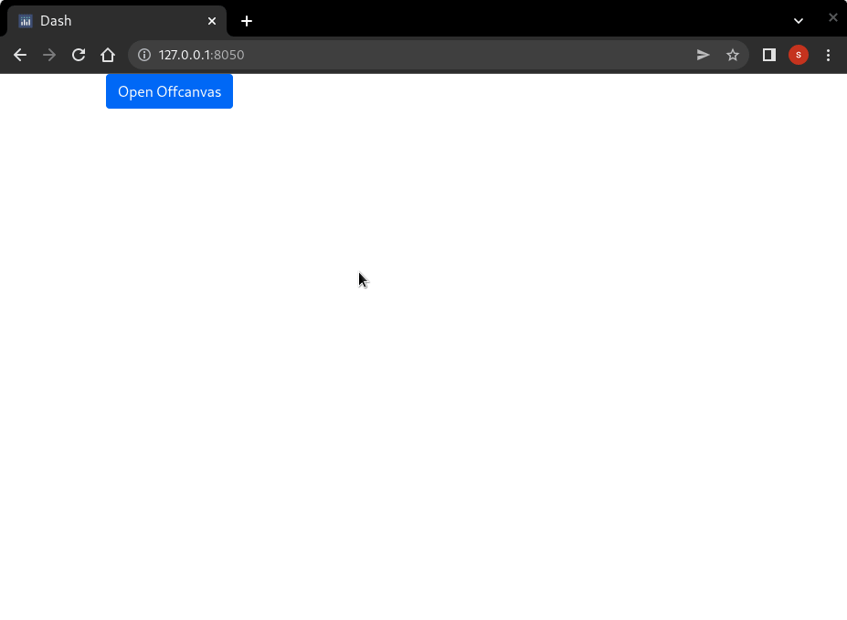
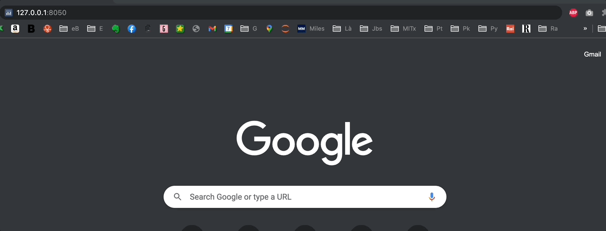

# Chapter 11: Additional Components

## What you will learn
In this chapter we will introduce several additional components, which are necessary to further customise apps.
```{admonition} Learning Intentions
- How to look for additional components
- Familiarize with some of the most common additional components
```

By the end of this chapter you will know how to build this app:



````{dropdown} See the code
    :container: + shadow
    :title: bg-primary text-white font-weight-bold
  
```
# Import packages
from dash import Dash, Input, Output, State, html
import dash_core_components as dcc
import dash_bootstrap_components as dbc
import base64


# Initialise the App
app = Dash(__name__, external_stylesheets=[dbc.themes.BOOTSTRAP])

image_filename = 'plotly.png' # replace with your own image
encoded_image = base64.b64encode(open(image_filename, 'rb').read())
img = html.Img(src='data:image/png;base64,{}'.format(encoded_image.decode()))
offcanvas_doc = dcc.Link("Off-Canvas documentation", id='oc_doc', target='_blank',href='https://dash-bootstrap-components.opensource.faculty.ai/docs/components/offcanvas/')
link_doc = dcc.Link("Link documentation", id='link_doc', target='_blank',href='https://dash.plotly.com/dash-core-components/link')


offcanvas_layout = dbc.Container(
    [
        dbc.Row([dbc.Col(img)]),
        dbc.Row([dbc.Col(offcanvas_doc)]),
        dbc.Row([dbc.Col(link_doc)]),
    ]
)
offcanvas = html.Div(
    [
        dbc.Button("Open Offcanvas", id="open-offcanvas", n_clicks=0),
        dbc.Offcanvas(
            [offcanvas_layout],
            id="offcanvas",
            title="Off-Canvas",
            is_open=False,
        ),
    ]
)

# App Layout
app.layout = dbc.Container(
    [
        dbc.Row([dbc.Col(offcanvas)])
    ]
)


@app.callback(
    Output("offcanvas", "is_open"),
    Input("open-offcanvas", "n_clicks"),
)
def toggle_offcanvas(n1):
    if n1:
        return True
    


# Run the App
if __name__ == '__main__':
    app.run_server()
```

````

[Click to download the complete code file for this chapter](https://raw.githubusercontent.com/open-resources/dash_curriculum/main/tutorial/part3/ch11_files/chapter11_fin_app.py)

## 11.1 Introducing additional components
Dash libraries include a lot of components that serve multiple purposes. It may be a bit overwhelming to navigate through all the components in search for the one that meets your needs. Therefore, in this chapter we will provide an overview of several components that are commonly used and that you may find useful to include in your app.

We will break down the components into categories, grouping together components that serve the same purpose. For each category, we will present some of the most common components in detail.

All components in this chapter come from these libraries:
- [Dash core components](https://dash.plotly.com/dash-core-components) (dcc)
- [Dash boostrap components](https://dash-bootstrap-components.opensource.faculty.ai/docs/components/) (dbc)


## 11.2 Data Display Components

### 11.2.1 Upload
The `Upload` component allows us to upload a file to the dashboard. For this example we will upload a [CSV file](https://www.howtogeek.com/348960/what-is-a-csv-file-and-how-do-i-open-it/) and plot the data. [Download this CSV file](https://raw.githubusercontent.com/open-resources/dash_curriculum/main/tutorial/part3/ch11_files/rotation_angle.csv), save it as `rotation_angle.csv`, run the follwing code, and try uploading the file into the drag and drop section of the app.

```{attention}
Note that the `update_fig()` callback function is designed for a specific type of data.  Different data wrangling inside the function would be required based on the type of data files you will work with. In this example, the function is built for CSV files exclusively.
```

```python
from dash import Dash, dcc, html, Input, Output, State
import dash_bootstrap_components as dbc
import pandas as pd
import plotly.graph_objects as go
import base64
import io
from dash.dash import no_update


app = Dash(__name__, external_stylesheets=[dbc.themes.BOOTSTRAP])

upload = dcc.Upload(
                    id='upload-data',
                    children=html.Div([
                        'Drag & Drop or Click to Select CSV file'
                    ]),
                    style={
                        'width': '100%',
                        'height': '10%',
                        'lineHeight': '60px',
                        'borderStyle': 'dashed',
                        'textAlign': 'center',
                    }
                )
graph = dcc.Graph(id='graph1')


# App Layout
app.layout = dbc.Container(
    [
        dbc.Row(dbc.Col(upload)),
        dbc.Row(dbc.Col(graph))
    ]
)

@app.callback(Output('graph1', 'figure'),
            Input('upload-data', 'contents'))
def update_fig(contents):
    if contents is not None:
        content_type, content_data = contents.split(',')
        # Check if data is CSV
        if 'csv' in content_type:
            decoded_data = base64.b64decode(content_data)
            df = pd.read_csv(io.StringIO(decoded_data.decode('utf-8')))
            fig = go.Figure()
            # Go through each column in the dataframe and make a trace for it
            for col in df.columns:
                fig.add_trace(go.Scattergl(y=df[col], mode='lines+markers', name=col))
            return fig
    return no_update


# Launch the app server
if __name__ == '__main__':
    app.run_server()
```


[This Dash Docs page has additional `Upload` examples](https://dash.plotly.com/dash-core-components/upload). 


### 11.2.2 Card
The `Card` component provides a container in which we can place content neatly such as: titles, main body text, images, buttons, and links. It often leads to a more appealing layout design.

```python
from dash import Dash, html
import dash_bootstrap_components as dbc

app = Dash(__name__, external_stylesheets=[dbc.themes.BOOTSTRAP])

card = dbc.Card(
    [
        dbc.CardBody(
            [
                html.H4("Card title", className="card-title"),
                html.P(
                    "Some quick example text to build on the card title and make up the bulk of the card's content.",
                    className="card-text",
                )
            ]
        ),
    ],
    style={"width": "18rem"},
)

# App Layout
app.layout = dbc.Container(
    [
        dbc.Row(dbc.Col(card)),
    ]
)

# Launch the app server
if __name__ == '__main__':
    app.run_server()
```


[This Dash Bootstrap Components page has additional `Card` examples](https://dash-bootstrap-components.opensource.faculty.ai/docs/components/card/). 

## 11.3 Feedback Components

### 11.3.1 Modal
`Modals` are pop-up boxes that allow for user notification, input, or other content to be displayed. It is often incorporated to draw the user's attention to a specific section of the page.

```python
from dash import Dash, Input, Output, State, html
import dash_bootstrap_components as dbc

app = Dash(__name__, external_stylesheets=[dbc.themes.BOOTSTRAP])

open_button = dbc.Button("Open", id="open_modal")
close_button = dbc.Button("Close", id="close_modal")


modal = dbc.Modal(
            [
                dbc.ModalHeader(dbc.ModalTitle("Title")),
                dbc.ModalBody("This is the content of the modal"),
                dbc.ModalFooter(close_button),
            ],
            id="modal",
            is_open=False,
        )

# App Layout
app.layout = dbc.Container(
    [
        dbc.Row(dbc.Col(open_button)),
        dbc.Row(dbc.Col(modal)),
    ]
)

@app.callback(
    Output("modal", "is_open"),
    [Input("open_modal", "n_clicks"), Input("close_modal", "n_clicks")],
    [State("modal", "is_open")],
)
def toggle_modal(n1, n2, is_open):
    if n1 or n2:
        return not is_open
    return is_open

# Launch the app server
if __name__ == '__main__':
    app.run_server()
```


[This Dash Bootstrap Components page has additional `Modal` examples](https://dash-bootstrap-components.opensource.faculty.ai/docs/components/modal/). 

### 11.3.2 Alert
`Alerts` are boxes that provide messages depending on the user interaction with the app.
Using the callback, you can update many of the component's properties such as: color, fading animation, duration of appearence.

In the example below, we have created alerts depending on the GTP Per Capita of a user-selected country and year compared to the world's average:
- If the country's GTP Per Capita is greater than the world's average, the alert message will have a green background
- If the value is the same as the world's average, the alert message will turn yellow
- Otherwise the message will become red

```python
from dash import Dash, dcc, Input, Output, html
import dash_bootstrap_components as dbc
import plotly.graph_objects as go
import pandas as pd
import plotly.express as px
import numpy as np

# Import data
df = px.data.gapminder()

# Initialise the App
app = Dash(__name__, external_stylesheets=[dbc.themes.BOOTSTRAP])

# Create app components
_header = html.H1(children='Alerts by GDP Per Capita', style = {'textAlign' : 'center'})
_text1 = html.P(children='The below alert will adapt depending on GDP for the selected country and year compared to the world\'s average', style = {'textAlign' : 'center'})
year_sel = dcc.Dropdown(id='year-dropdown', placeholder = 'Select a year', options= [c for c in df.year.unique()])
country_sel = dcc.Dropdown(id='country-dropdown', placeholder = 'Select a country', options = [c for c in df.country.unique()])
alert_msg = dbc.Alert(id='alert-gdp', children="Select some year and country to display info", color="info")

# App Layout
app.layout = dbc.Container(
    [
        dbc.Row([dbc.Col([_header], width=8)]),
        dbc.Row([dbc.Col([_text1], width=8)]),        
        dbc.Row([dbc.Col([dcc.Graph(id='gdpc-line')], width=8)]),
        dbc.Row([
            dbc.Col([year_sel], width=4),
            dbc.Col([country_sel], width=4)
        ]),
        dbc.Row([dbc.Col([alert_msg], width=8)])
    ]
)

# Configure callback
@app.callback(
    Output("alert-gdp", "color"),
    Output("alert-gdp", "children"),
    Input("year-dropdown", "value"),
    Input("country-dropdown", "value"),
    prevent_initial_call=True
)
def update_alert(y, c):
    gdp_sel = df.loc[(df['country']==c) & (df['year']==y), 'gdpPercap'] #Filter for selection
    gdp_avg = df.loc[(df['year']==y), 'gdpPercap'] #Calculate world avg for the same yeara

    if (gdp_sel.values.size > 0) & (gdp_avg.values.size > 0):
        gdp_sel_v = round(gdp_sel.values[0],2)
        gdp_avg_v = round(np.mean(gdp_avg.values),2)
        new_children = ['The GDP per Capita in '+c+' in '+str(y)+' was: '+gdp_sel_v.astype(str)+
                        '; The world average was: '+gdp_avg_v.astype(str)]
        if gdp_sel_v == gdp_avg_v:
            new_color = 'warning' 
        elif gdp_sel_v < gdp_avg_v:
            new_color = 'danger'
        else:
            new_color = 'success'
    else:
        new_color = "dark"
        new_children = 'Insufficient Data. Try new selection'

    return new_color, new_children

@app.callback(
    Output("gdpc-line", "figure"),
    Input("country-dropdown", "value"),
    prevent_initial_call=True
)
def update_graph(country_sel):
    fig = px.line()
    if country_sel is not None:
        df_plot = df.loc[(df['country']==country_sel), :]
        df_avg = df.groupby(['year']).agg({'gdpPercap':'mean'}).reset_index()
        fig = px.line(df_plot, x='year', y='gdpPercap', color='country', template='plotly_white')
        fig.add_trace(go.Scatter(x=df_avg['year'], y=df_avg['gdpPercap'], line = {'color':'firebrick', 'width':4, 'dash':'dot'}, name = 'Wold Average'))
    return fig

# Run the App
if __name__ == '__main__':
    app.run_server()
```


[See additional properties and examples of the `Alert` component](https://dash-bootstrap-components.opensource.faculty.ai/docs/components/alert/). 


## 11.4 Filtering & Input Components

### 11.4.1 DatePicker
The DatePicker components allow the user to select a single date or a date range.
There are two types of date pickers, both are part of the Dash Core Components library:
- ```DatePickerSingle``` consists of one single date selection: by clicking on the object a calendar will pop-up, allowing the user to pick a date
- ```DatePickerRange``` is similar to the previous component, but includes two date selections, which should be read as "start" and "end" dates.

The two components have very similar properties - the main ones are:
- min_date_allowed : minimum date the user can choose from
- max_date_allowed : maximum date the user can choose from
- start_date : default start date, when app page initially loads
- end_date : default end date, when app page initially loads

In the following app a DatePickerRange is used as a filter for a line chart. Based on the user selection, a dataframe will be filtered inside the callback function and the chart will be updated.

```{note}
In the following app, instead of using the gapminder dataset, we have used a dataset based on stock prices, as it includes a full date field.
```

```python
# Import packages
from dash import Dash, dcc, Input, Output, html
import dash_bootstrap_components as dbc
import pandas as pd
from datetime import date
import plotly.express as px

# Import data
df = px.data.stocks()
df['date'] = pd.to_datetime(df['date'], format='%Y-%m-%d')

# Initialise the App
app = Dash(__name__, external_stylesheets=[dbc.themes.BOOTSTRAP])

# Create app components
date_range = dcc.DatePickerRange(id='date-range',
    start_date_placeholder_text='start date',
    end_date_placeholder_text='end date',
    min_date_allowed=df.date.min(),
    max_date_allowed=df.date.max(),
    display_format='DD-MMM-YYYY',
    first_day_of_week = 1)

# App Layout
app.layout = dbc.Container(
    [
        dbc.Row([dbc.Col([date_range], width=8)]),
        dbc.Row(dbc.Col([dcc.Graph(id='stock-line')], width=8))
    ]
)

# Configure callback
@app.callback(
    Output(component_id='stock-line', component_property='figure'),
    Input(component_id='date-range', component_property='start_date'),
    Input(component_id='date-range', component_property='end_date')
)
def plot_dt(start_date, end_date):
    df_plot = df
    if start_date is not None:
        df_plot = df_plot.loc[(df_plot['date']>=start_date), :]
    if end_date is not None:
        df_plot = df_plot.loc[(df_plot['date']<=end_date), :]
    fig = px.line(df_plot, x='date', y=['GOOG','AAPL','AMZN','FB','NFLX','MSFT'], template='plotly_white')

    return fig

# Run the App
if __name__ == '__main__':
    app.run_server()
```


[See additional properties and examples of the `DatePickerRange` component](https://dash.plotly.com/dash-core-components/datepickerrange). 


### 11.4.2 Store
```Store``` component allows to use the browser memory in order to store app data. A typical use case for this component is to store data in memory and use it in a different tab.
When using this component, it is important to pay attention to the following:
- this component can only store data in the following formats: json, list, dictionary data types. With the ```data``` property, we can access to the content stored in the memory.
- how long the data is going to be stored is a customizable property called ```storage_type```. We can use three different types of memory and they are cleared by three different events. ```memory```: in this case the memory will be cleared when we refresh the browser page; ```session```: in this case the memory will be cleared when we close the browser; ```local```: in this case the memory will be cleared when we clean the browser cookies.
- this is an invisible component: although it won't affect app layout, the component must be included in the ```app.layout``` in order to work properly.

In the following example, a dropdown selection is stored in memory. We've generated three different store components, one for each storage type. This should clarify the difference among the three memory tupes. In the app, the three graphs will plot life expectancy for the countries that are in the corresponding memory.
```python
# Import packages
from dash import Dash, dcc, Input, Output, html
from dash.exceptions import PreventUpdate
import dash_bootstrap_components as dbc
import plotly.express as px
import pandas as pd

# Import data
df = px.data.gapminder()

# Initialise the App
app = Dash(__name__, external_stylesheets=[dbc.themes.BOOTSTRAP])

# Create app components
_header = html.H1(children='Store App', style = {'textAlign' : 'center'})
_text1 = html.P(children='The selected countries below will be stored in memory', style = {'textAlign' : 'center'})
country_sel = dcc.Dropdown(id='country-dropdown', placeholder = 'Select countries', options = [c for c in df.country.unique()], multi=True)
mstorage = dcc.Store(id='memory', data=[], storage_type='memory')
sstorage = dcc.Store(id='session', data=[], storage_type='session')
lstorage = dcc.Store(id='local', data=[], storage_type='local')
_subheader41 = html.H4(children='Memory Store based chart', style = {'textAlign' : 'center'})
_subheader42 = html.H4(children='Session Store based chart', style = {'textAlign' : 'center'})
_subheader43 = html.H4(children='Local Store based chart', style = {'textAlign' : 'center'})
_subheader51 = html.H5(children='Memory Store content:', style = {'textAlign' : 'center'})
_subheader52 = html.H5(children='Session Store content:', style = {'textAlign' : 'center'})
_subheader53 = html.H5(children='Local Store content:', style = {'textAlign' : 'center'})

# App Layout
app.layout = dbc.Container(
    [
        dbc.Row([dbc.Col([_header], width=12)]),
        dbc.Row([dbc.Col([_text1], width=12)]),
        dbc.Row([dbc.Col([country_sel], width=12)]),
        dbc.Row([
            dbc.Col([_subheader41], width=4), dbc.Col([_subheader42], width=4), dbc.Col([_subheader43], width=4)
        ]),
        dbc.Row([
            dbc.Col([dcc.Graph(id='memory-life-exp-line')], width=4),
            dbc.Col([dcc.Graph(id='session-life-exp-line')], width=4),
            dbc.Col([dcc.Graph(id='local-life-exp-line')], width=4)
        ]),
        dbc.Row([
            dbc.Col([_subheader51], width=2),
            dbc.Col([html.P(id='memory-output',)], width=2),
            dbc.Col([_subheader52], width=2),
            dbc.Col([html.P(id='session-output',)], width=2),
            dbc.Col([_subheader53], width=2),
            dbc.Col([html.P(id='local-output',)], width=2)
        ]),
        mstorage, lstorage, sstorage
    ]
)

# Configure callbacks

## Generate callbacks, one per memory type
for store_type in ['memory', 'session', 'local']:

    chart_type = store_type+"-life-exp-line"
    output_type = store_type+"-output"

    # Write in memory
    @app.callback(Output(store_type, "data"),
                    Input("country-dropdown", "value"),
                    Input(store_type, "data"))
    def write_memo(new_sel, memo):
        if new_sel is None:
            raise PreventUpdate # We avoid update the store if there is no selection or if a different memory was selected
        else:
            for c in new_sel:
                if c not in memo:
                    memo.append(c)
        return memo

    ## Update graphs
    @app.callback(Output(chart_type, 'figure'),
                Input(store_type, 'data'))
    def plot_gen(memory_sel):
        fig = px.line()
        if memory_sel is not None:
            df_plot = df.loc[(df['country'].isin(memory_sel)), :]
        fig = px.line(df_plot, x='year', y='lifeExp', color='country', template='plotly_white')
        return fig

    ## Output memory content
    @app.callback(Output(output_type, "children"),
                Input(store_type, "data"))
    def print_memo(current_memory):
        if current_memory is None:
            output = ""
        else:
            output = ", ".join(current_memory)
        return output

# Run the App
if __name__ == '__main__':
    app.run_server(port=8055)
```


### 11.4.3 Interval
`Interval` enables automatic recurrent updates of the app, by triggering callbacks periodically.
This component is usually used when the app is connected to an API to download data that is recurrently updated (e.g. stock market data). By adjusting property, it is possible to configure the following:
- `interval` is a property that determine the refresh rate. This is measured in millisecond and every time this interval expires, a counter is increased
- `max_intervals` can be configured to set a cap to the number of times the refresh happen. By default, this property is set to -1, meaning that refreshes will never stop
- `n_intervals` represent the counter, i.e. the number of times the interval has passed.

This is an invisible component: although it won't affect app layout, the component must be included in the ```app.layout``` in order to work properly.

In the following example, the current time in New York keeps being refreshed.
```
# Import packages
from dash import Dash, dcc, Input, Output, html
import dash_bootstrap_components as dbc
from dash.exceptions import PreventUpdate
from datetime import datetime
import pytz

app = Dash(__name__, external_stylesheets=[dbc.themes.BOOTSTRAP])

_header1 = html.H1(children='Current Time', style = {'textAlign' : 'center'})
_header4 = html.H4(children='The New York time below is refreshed based on an interval component', style = {'textAlign' : 'center'})
_p = html.P(children='', id='livet', style = {'textAlign' : 'center', 'font-family' : 'Courier New', 'font-size' : '250%'})
_interval = dcc.Interval(id = 'int1', disabled = False, interval = 5)

# App Layout
app.layout = dbc.Container(
    [
        _interval,
        dbc.Row([dbc.Col([_header1], width=12)]),
        dbc.Row([dbc.Col([_header4], width=12)]),
        dbc.Row([dbc.Col([_p], width=12)])
    ]
)

# Configure callback
@app.callback(
    Output("livet", "children"),
    Output("int1", "n_intervals"),
    Input("int1", "n_intervals")
)
def refresh_time(i):
    if i == 0:
        raise PreventUpdate # Condition to stop the interval to refresh
    else:
        tz = pytz.timezone('America/New_York')
        now = datetime.now(tz).strftime('%Y-%m-%d %H:%M:%S.%f')[:-3]
    
    return now, i

# Launch the app server
if __name__ == '__main__':
    app.run_server()
```


## 11.5 Navigation Components

### 11.5.1 Tabs
`Tabs` allow for easy navigation between different pages of our app.

```python
from dash import Dash
import dash_bootstrap_components as dbc
import dash_core_components as dcc
from dash import html
import plotly_express as px

app = Dash(__name__, external_stylesheets=[dbc.themes.BOOTSTRAP])


df = px.data.gapminder()

df_2007 = df[df.year ==2007]

fig1 = px.scatter(df_2007, x='gdpPercap', y='lifeExp', color='continent', size='pop', size_max=60)
graph1 = dcc.Graph(id='figure1', figure=fig1)

fig2 = px.scatter(df, x='gdpPercap', y='lifeExp', color='continent', size='pop', size_max=40, 
                hover_name='country', log_x=True, animation_frame='year',
                 animation_group='country', range_x=[100, 100000], range_y=[25,90])
graph2 = dcc.Graph(id='figure2', figure=fig2)

fig3 = px.choropleth(df, locations='iso_alpha', color='lifeExp', hover_name='country', 
                    animation_frame='year', color_continuous_scale=px.colors.sequential.Plasma, projection='natural earth')
graph3 = dcc.Graph(id='figure3', figure=fig3)

tab1_content = dbc.Card(
    dbc.CardBody(
        [
            graph1
        ]
    ),
)

tab2_content = dbc.Card(
    dbc.CardBody(
        [
            graph2
        ]
    ),
)

tab3_content = dbc.Card(
    dbc.CardBody(
        [
            graph3
        ]
    ),
)

tabs = dbc.Tabs(
    [
        dbc.Tab(tab1_content, label="Tab 1"),
        dbc.Tab(tab2_content, label="Tab 2"),
        dbc.Tab(tab3_content, label="Tab 3"),
    ]
)

# App Layout
app.layout = dbc.Container(
    [
        dbc.Row(dbc.Col(tabs)),
    ]
)

# Launch the app server
if __name__ == '__main__':
    app.run_server(debug=True)
```


### 11.5.2 OffCanvas
The `Offcanvas` component allows us to display a sidebar overlay on the app.

```python
# Import packages
from dash import Dash, Input, Output, State, html
import dash_core_components as dcc
import dash_bootstrap_components as dbc
import base64


# Initialise the App
app = Dash(__name__, external_stylesheets=[dbc.themes.BOOTSTRAP])

image_filename = 'plotly.png' # replace with your own image
encoded_image = base64.b64encode(open(image_filename, 'rb').read())
img = html.Img(src='data:image/png;base64,{}'.format(encoded_image.decode()))
offcanvas_doc = dcc.Link("Off-Canvas documentation", id='oc_doc', target='_blank',href='https://dash-bootstrap-components.opensource.faculty.ai/docs/components/offcanvas/')
link_doc = dcc.Link("Link documentation", id='link_doc', target='_blank',href='https://dash.plotly.com/dash-core-components/link')


offcanvas_layout = dbc.Container(
    [
        dbc.Row([dbc.Col(img)]),
        dbc.Row([dbc.Col(offcanvas_doc)]),
        dbc.Row([dbc.Col(link_doc)]),
    ]
)
offcanvas = html.Div(
    [
        dbc.Button("Open Offcanvas", id="open-offcanvas", n_clicks=0),
        dbc.Offcanvas(
            [offcanvas_layout],
            id="offcanvas",
            title="Off-Canvas",
            is_open=False,
        ),
    ]
)

# App Layout
app.layout = dbc.Container(
    [
        dbc.Row([dbc.Col(offcanvas)])
    ]
)


@app.callback(
    Output("offcanvas", "is_open"),
    Input("open-offcanvas", "n_clicks"),
)
def toggle_offcanvas(n1):
    if n1:
        return True
    


# Run the App
if __name__ == '__main__':
    app.run_server()
```


## Summary
In this chapter, we have gone through several components that can add functionalities to our app. As a closing remark, there are more existing components that can be found exploring the mentioned libraries as well as third party libraries (an example is the Mantine library, whose components can be found [here](https://dash-mantine-components.herokuapp.com/).

This is the end of part 3. In the next part, we will focus on polishing our app: enhancing style, performance and the app structure with multiple pages.
