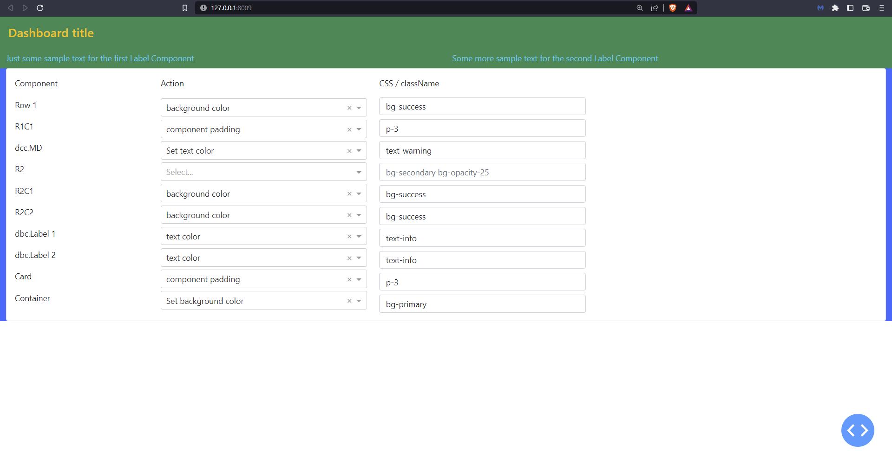
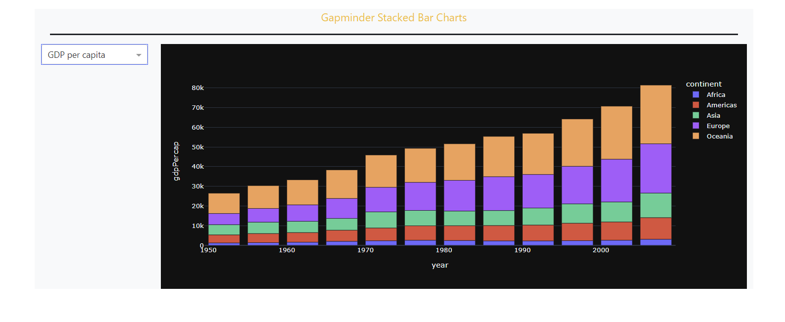

# Chapter 12  Advanced Styling and Layout

```{admonition} What you will learn
- How to set a theme with a CSS stylesheet
- How elements of a theme are styled
- A variety of classnames
  - text color `text-primary`
  - background color `bg-primary`
  - margin  `m-1`
  - padding `p-1`
  - rounded edges `rounded`
  - opacity `opacity-25`
- How to reference multiple features in the same className
- Special layout attributes for the `dbc.Row()`
- Special layout attributes for the `dbc.Container()`
- How to modify the layout with `style`
```

## 12.1 The theme of a Dash app

Let's start by learning how to set a theme with `external_stylesheets=[dbc.themes.<theme>]` where `'<theme>'` can be one of:

- `bootstrap`, `cosmo`, `cyborg`, `darkly`, `flatly`, `grid`, `slate`

Your choice of theme will determine the look and feel of a variety of elements in your dashboard, ranging from the color of the background to the opacity of Bootstrap cards.

Here's how some elements will look like with the `bootstrap` theme:

[![enter image description here][1]][1]

And here's how the same elements will look like with the `slate` theme:

[![enter image description here][2]][2]

You can check out more themes and components in [dash-bootstrap-components theme explorer](https://dash-bootstrap-components.opensource.faculty.ai/docs/themes/explorer/).
 

## 12.2 Theme and Cascading Style Sheet (CSS)

To set up your Dash app theme you would select a theme like this:

```python
app = Dash(__name__, external_stylesheets=[dbc.themes.SLATE])
```

What hides behind `dbc.themes.SLATE` is the [following link](https://cdn.jsdelivr.net/npm/bootswatch@5.1.3/dist/slate/bootstrap.min.css) which points to a certain cascading stylesheet or, `CSS`. A `CSS` file defines how Dash components appear in the layout. One such component is the `dcc.Markdown()` that you can use to insert a title to your app. If, instead of `SLATE`, you use the `BOOTSTRAP` theme, `external_stylesheets=[dbc.themes.BOOTSTRAP]`, the default font color of the title will be of a dark grey type with the RGB code `(33, 37, 47)` and look like this:

[![enter image description here][4]][4]


This particular color is mapped to `text-body` in the `CSS` file. 
And if you do a little digging inside [the css file](https://cdn.jsdelivr.net/npm/bootstrap@5.1.3/dist/css/bootstrap.min.css), you'll find one occurence of `text-body` in the `CSS` file:
- `.text-body{--bs-text-opacity:1;color:rgba(var(--bs-body-color-rgb),var(--bs-text-opacity))`

This is called a class. All classes are preceded with a period sign. And within the curly brackets we have multiple `property-value` pairs with a colon separating the `property` and `value`, and a semicolon between each pair. 
One such `property` is `color` with the corresponding value `var(--bs-body-color-rgb)`.
     
This points to a setting at the start of the document that reveals the `rgb()` code used by `text-body`:
- `bs-body-color-rgb:33,37,43`


## 12.3 Use className to reference a class

Almost all Dash components have an attribute `className` that lets you reference the name of a class in a `CSS` file. We will use this `className` to update the font color of a Dash app.

Some alternatives to `text-body` are:

- `className="text-primary"`
- `className="text-secondary"`
- `className="text-success"`
- `className="text-danger"`
- `className="text-info"`

The below snippet builds on elements and principles of former chapters, and produces a markdown component that you can use as a header for your dashboards.

````{dropdown} See Code
    :container: + shadow
    :title: bg-primary text-white font-weight-bold

```python
from dash import Dash, html, dcc
import dash_bootstrap_components as dbc

app = Dash(__name__, external_stylesheets=[dbc.themes.BOOTSTRAP])
app.layout = dbc.Container(
    [
        dbc.Row(
            [
                dbc.Col(
                    [dcc.Markdown("# Dashboard title")],
                    width=10,
                )
            ]
        )
    ]
)

if __name__=='__main__':
    app.run_server(debug=True)
```
````

[![enter image description here][8]][8]

Above is the output with `Dashboard title` displayed as a heading in the colorcode we demonstrated earlier. Recall that this color corresponds to the color associated with `text-body` in the `CSS` file. In order to change the color just include, for example, `className = "text-info"` in your `dcc.Markdwon()` function call.


````{dropdown} See Code
    :container: + shadow
    :title: bg-primary text-white font-weight-bold
```python
from dash import Dash, html, dcc
import dash_bootstrap_components as dbc

app = Dash(__name__, external_stylesheets=[dbc.themes.BOOTSTRAP])

app.layout = dbc.Container(
    [
        dbc.Row(
            [
                dbc.Col(
                    [dcc.Markdown("# Dashboard title", className="text-info")], width=10
                )
            ]
        )
    ]
)
if __name__=='__main__':
    app.run_server(debug=True)
```
````

[![enter image description here][9]][9]


### 12.3.1 Change background color

Recall that the alternatives to `text-body` like `text-primary` and `text-secondary` aren't actual colors, but rather pointers to different colors set by the `CSS` file. So you can think of these options as different possible categories of the information you'd like to display. The same thing goes for other features of our `dcc.Markdown()` example like background color. 

The following snippet changes the white background of the `BOOTSTRAP` theme to a rich blue color. Notice in the snippet below that all you have to do to change the background color is to include `bg-primary` in `className` because `bg` stands for background. 

````{dropdown} See Code
    :container: + shadow
    :title: bg-primary text-white font-weight-bold
```python
from dash import Dash, html, dcc
import dash_bootstrap_components as dbc

app = Dash(__name__, external_stylesheets=[dbc.themes.BOOTSTRAP])
app.layout = dbc.Container(
    [
        dbc.Row(
            [
                dbc.Col(
                    [dcc.Markdown("# Dashboard title", className="bg-primary")],
                    width=10,
                )
            ]
        )
    ]
)
if __name__=='__main__':
    app.run_server(debug=True)
```
````

[![enter image description here][10]][10]

Above, we've only changed the background color, and let the text color remain `text-body`. The following sections will demonstrate how to edit multiple features at the same time.

```{warning}

Misspellings in classes assigned to `className` do *not* raise any errors; they are merely ignored if they cannot be interpreted.

```

### 12.3.2 Using multiple classes

In order to change text color and background color at the same time, just include both `text-info` and `bg-primary` separated by `space` inside `className`:

````{dropdown} See Code
    :container: + shadow
    :title: bg-primary text-white font-weight-bold
```python
from dash import Dash, html, dcc
import dash_bootstrap_components as dbc

app = Dash(__name__, external_stylesheets=[dbc.themes.BOOTSTRAP])
app.layout = dbc.Container(
    [
        dbc.Row(
            [
                dbc.Col(
                    [
                        dcc.Markdown(
                            "# Dashboard title", className="text-info bg-primary"
                        )
                    ],
                    width=10,
                )
            ]
        )
    ]
)
if __name__=='__main__':
    app.run_server(debug=True) 
```
````

[![enter image description here][11]][11]


### 12.3.3 Spacing, margins and padding

When building the app layout, the default margins and padding is equal to zero. To add space around components or their text, you can use `m` for `margin` and `p` for `padding`. Then, you would need to declare what side you would like to modify:

- `t` - `top` for classes that set margin-top or padding-top
- `b` - `bottom` for classes that set margin-bottom or padding-bottom
- `s` - `start` for classes that set margin-left or padding-left
- `e` - `end` for classes that set margin-right or padding-right
- `x` - for classes that set both *-left and *-right
- `y` - for classes that set both *-top and *-bottom
- *`blank`* - for classes that set a margin or padding on all 4 sides of the element

Finally, you would need to state the size of margin or padding that you would like to add. `size` can be one of `0`, `1`, `2`, `3`, `4`, `5` where `0` eliminates the margin or padding.

Let's see an example where we add 2 units of margin around the highlighted text and its parent Div.

````{dropdown} See Code
    :container: + shadow
    :title: bg-primary text-white font-weight-bold
```python
from dash import Dash, html, dcc
import dash_bootstrap_components as dbc

app = Dash(__name__, external_stylesheets=[dbc.themes.BOOTSTRAP])
app.layout = dbc.Container(
    [
        dbc.Row(
            [
                dbc.Col(
                    [
                        dcc.Markdown(
                            "# Dashboard title", className="text-info bg-primary m-2"
                        )
                    ]
                )
            ],
            className="bg-secondary",
        )
    ]
)

if __name__=='__main__':
    app.run_server(debug=True)
```
````

[![enter image description here][14]][14]

### 12.3.4 Component placement

You should expect that different components from different libraries such as `dcc`, `dbc` and `html` come with different default settings with regards to margins, paddings and other features such as text alignment. This section will demonstrate how to handle different settings and make sure your layout turns out the way you want it to. 

So lets take the setup that we've already got, and add a row with a `dbc.Label` component. We won't define any margins or padding, but we'll add some background color to discern the different elements.

````{dropdown} See Code
    :container: + shadow
    :title: bg-primary text-white font-weight-bold
```python
from dash import Dash, html, dcc
import dash_bootstrap_components as dbc

app = Dash(__name__, external_stylesheets=[dbc.themes.BOOTSTRAP])
app.layout = dbc.Container(
    [
        dbc.Row(
            [
                dbc.Col(
                    [
                        dcc.Markdown(
                            "#### Dashboard title", className="text-info bg-primary"
                        )
                    ]
                )
            ],
            className="bg-secondary",
        ),
        dbc.Row(
            [dbc.Col([dbc.Label("Label 1", className="bg-warning")])],
            className="bg-secondary",
        ),
    ]
)
if __name__=='__main__':
    app.run_server(debug=True)
```
````

[![enter image description here][15]][15]

As it now stands, the dashboard isn't exactly very pleasing to the eye. The two rows have got the same widths, but the background color of each one spans a different width. In addition, the paddings for "Dashboard title" and "Label 1" look very different; this is because `dcc` and `dbc` come with different default settings with regards to margins, paddings and other styling features.


The first thing we'll do is add `p-1` in `className="text-info bg-primary p-1"` for the `dcc.Markdown` component and `p-2` in `className = "bg-warning p-2"` for the `dbc.Label` component. This will generate the same spacing around the texts `Dashboard title` and `Label 1`.

[![enter image description here][16]][16]

Another consequence is that the markdown and label components' backgrounds no longer have a gap between them. If you'd like to keep the gap, you can choose to include it through either component. The image below shows the effect of including `mt-2` in `className="bg-warning p-2 mt-2"` for the `dbc.Label` component:

[![enter image description here][17]][17]

````{dropdown} See Code
    :container: + shadow
    :title: bg-primary text-white font-weight-bold
```python
from dash import Dash, html, dcc
import dash_bootstrap_components as dbc

app = Dash(__name__, external_stylesheets=[dbc.themes.BOOTSTRAP])
app.layout = dbc.Container(
    [
        dbc.Row(
            [
                dbc.Col(
                    [
                        dcc.Markdown(
                            "#### Dashboard title", className="text-info bg-primary p-1"
                        )
                    ]
                )
            ],
            className="bg-secondary",
        ),
        dbc.Row(
            [dbc.Col([dbc.Label("Label 1", className="bg-warning p-2 mt-2")])],
            className="bg-secondary",
        ),
    ]
)
if __name__=='__main__':
    app.run_server(debug=True)
```
````

### 12.3.5 Set width with style prop

With the `style` prop, you can set the components widths to fill any percentage of the parent component, or to a certain amount of pixels. For the latter you'll use `style = {'width':'100px'}`, and for the former you can use either `style={'width':'100%}` or `style={'width':'100pc}`. Let's add the `style={'width':'75%}` to both components:

````{dropdown} See Code
    :container: + shadow
    :title: bg-primary text-white font-weight-bold

```python
from dash import Dash, html, dcc
import dash_bootstrap_components as dbc

app = Dash(__name__, external_stylesheets=[dbc.themes.BOOTSTRAP])
app.layout = dbc.Container(
    [
        dbc.Row(
            [
                dbc.Col(
                    [
                        dcc.Markdown(
                            "#### Dashboard title",
                            className="text-info bg-primary m-0",
                            style={"width": "75%"},
                        )
                    ]
                )
            ],
            className="bg-secondary ",
        ),
        dbc.Row(
            [
                dbc.Col(
                    [
                        dbc.Label(
                            "Label 1", className="bg-warning", style={"width": "75%"}
                        )
                    ]
                )
            ],
            className="bg-secondary",
        ),
    ]
)
if __name__=='__main__':
    app.run_server(debug=True)
```
````

[![enter image description here][18]][18]


```{note}

What you can do with `className` you can, for the most part, also do with `style` and vice versa. However, the attributes of your components are often referenced differently. One example is `"fw-bold"` for `className` and `"font-weight":"bold"` for `style`. The result will be the same, namely a bold font type for the object in question.
```

## 12.4 More components and attributes

In this section you'll learn how to build on the previous examples and approach something that looks more like a complete dashboard by adding a `dbc.Button()` and a `dbc.Card()` component. The Card is often used to split a dashboard in different parts, and it serves as a container for more components. You'll also learn how to edit the appearance of your components with effects such as rounded edges and shadows.

### 12.4.1 Button and card

We'll add a `dbc.Button` in a new `dbc.Col` component next to the already existing `dbc.Label`. In addition, we'll include a `dbc.Card` in a `dbc.Col` component within a new `dbc.Row`.

````{dropdown} See Code
    :container: + shadow
    :title: bg-primary text-white font-weight-bold
```python
from dash import Dash, html, dcc
import dash_bootstrap_components as dbc

app = Dash(__name__, external_stylesheets=[dbc.themes.BOOTSTRAP])
app.layout = dbc.Container(
    [
        dbc.Row(
            [
                dbc.Col(
                    [
                        dcc.Markdown(
                            "#### Dashboard title",
                            className="text-info bg-primary",
                            style={"width": "100%"},
                        )
                    ]
                )
            ],
            className="text-info bg-secondary m-0",
        ),
        dbc.Row(
            [
                dbc.Col(
                    [
                        dbc.Label(
                            "Label 1",
                            className="bg-warning m-0",
                            style={"width": "100%"},
                        )
                    ],
                    width=4,
                ),
                dbc.Col(
                    dbc.Button(
                        "Click me",
                        className="",
                    ),
                    width=4,
                ),
            ],
            className="bg-secondary m-0",
        ),
        dbc.Row(
            dbc.Col(
                dbc.Card(
                    "Put your content here",
                    className="",
                ),
                width=12,
            )
        ),
    ],
    className="",
)
if __name__=='__main__':
    app.run_server(debug=True)
```
````

[![enter image description here][20]][20]

### 12.4.2 Justify row components
In the previous code snippet, we've used `width = 4` for both the `label` and the `button`, which by default are placed at the start of the parent `row` component. To change this, you can include `justify='<option>'` in the `row` component, where your options are:

- `start`, `center`, `end`, `around`, `between`, `evenly`

The image below shows the result for `justify='evenly'`. In addition, we've included some margins and padding to make the title, label and button look a little nicer.

````{dropdown} See Code
    :container: + shadow
    :title: bg-primary text-white font-weight-bold
```python
from dash import Dash, html, dcc
import dash_bootstrap_components as dbc

app = Dash(__name__, external_stylesheets=[dbc.themes.BOOTSTRAP])
app.layout = dbc.Container(
    [
        dbc.Row(
            [
                dbc.Col(
                    [
                        dcc.Markdown(
                            "#### Dashboard title",
                            className="text-info bg-primary p-2",
                            style={"width": "100%"},
                        )
                    ],
                    className="mt-2",
                )
            ],
            className="text-info bg-secondary m-0",
        ),
        dbc.Row(
            [
                dbc.Col(
                    [
                        dbc.Label(
                            "Label 1",
                            className="bg-warning mt-2 p-2",
                            style={"width": "100%", "height": "65%"},
                        )
                    ],
                    width=4,
                ),
                dbc.Col(
                    dbc.Button(
                        "Click me",
                        className="m-2",
                    ),
                    width=4,
                ),
            ],
            className="bg-secondary m-0",
            justify="evenly",
        ),
        dbc.Row(
            dbc.Col(
                dbc.Card(
                    "Put your card content here",
                    className="",
                ),
                width=12,
            )
        ),
    ],
    className="mt-2",
)
if __name__=='__main__':
    app.run_server(debug=True)
```
````

[![enter image description here][21]][21]

### 12.4.3 Set height with `style`

Notice how we've cheated a bit in the snippet above by adding `'height':'65%'` for the `label` component style to make it align better to the `button`. Before you're ready to fill your `card` with more components, it's often a good idea to increase the height of the card to give a better impression of how it will all look when your dashboard is nearing completion. In the snippet below, we've included `'height':'200px'` for the `label` style attribute.

````{dropdown} See Code
    :container: + shadow
    :title: bg-primary text-white font-weight-bold
```python
from dash import Dash, html, dcc
import dash_bootstrap_components as dbc

app = Dash(__name__, external_stylesheets=[dbc.themes.BOOTSTRAP])
app.layout = dbc.Container(
    [
        dbc.Row(
            [
                dbc.Col(
                    [
                        dcc.Markdown(
                            "#### Dashboard title",
                            className="text-info bg-primary p-2",
                            style={"width": "100%"},
                        )
                    ],
                    className="mt-2",
                )
            ],
            className="text-info bg-secondary m-0",
        ),
        dbc.Row(
            [
                dbc.Col(
                    [
                        dbc.Label(
                            "Label 1",
                            className="bg-warning mt-2 p-2",
                            style={"width": "100%", "height": "65%"},
                        )
                    ],
                    width=4,
                ),
                dbc.Col(
                    dbc.Button(
                        "Click me",
                        className="m-2",
                    ),
                    width=4,
                ),
            ],
            className="bg-secondary m-0",
            justify="evenly",
        ),
        dbc.Row(
            dbc.Col(
                dbc.Card(
                    "Put your card content here",
                    className=" mt-2",
                    style={"height": "200px"},
                ),
                width=12,
            )
        ),
    ],
    className="bg-mt-2",
)
if __name__=='__main__':
    app.run_server(debug=True)
```
````

[![enter image description here][22]][22]


### 12.4.4 Rounded edges

If you look closely at the edges of the `card`, you'll see that they are rounded by default. In order to apply rounded edges to other components, simply include `"rounded"` in `className`. You can adjust the "weight" of the rounding by setting `rounded-{size}` where size can range from `0` to `3`. You can also specify which corners to round through `rounded-{corner}`, where `corner` can be:

- `top`, `bottom`, `start`, `end`, `circle`, `pill`


The last two options will change not only the corners but the complete structure of the whole card to become circle or pill shaped.

In the snippet below, we've rounded off the bottom of the card only, and set the weight to `3`.

````{dropdown} See Code
    :container: + shadow
    :title: bg-primary text-white font-weight-bold
```python
from dash import Dash, html, dcc
import dash_bootstrap_components as dbc

app = Dash(__name__, external_stylesheets=[dbc.themes.BOOTSTRAP])
app.layout = dbc.Container(
    [
        dbc.Row(
            [
                dbc.Col(
                    [
                        dcc.Markdown(
                            "#### Dashboard title",
                            className="text-info bg-primary p-2",
                            style={"width": "100%"},
                        )
                    ],
                    className="mt-2",
                )
            ],
            className="text-info bg-secondary m-0",
        ),
        dbc.Row(
            [
                dbc.Col(
                    [
                        dbc.Label(
                            "Label 1",
                            className="bg-warning mt-2 p-2",
                            style={"width": "100%", "height": "65%"},
                        )
                    ],
                    width=4,
                ),
                dbc.Col(
                    dbc.Button(
                        "Click me",
                        className="m-2",
                    ),
                    width=4,
                ),
            ],
            className="bg-secondary m-0",
            justify="evenly",
        ),
        dbc.Row(
            dbc.Col(
                dbc.Card(
                    "Put your card content here",
                    className="mt-2 border rounded-0 rounded-bottom",
                    style={"height": "200px"},
                ),
                width=12,
            )
        ),
    ],
    className="mt-1",
)
if __name__=='__main__':
    app.run_server(debug=True)
```
````

[![enter image description here][23]][23]

### 12.4.5 Borders

So far, the background colors of the row and column components have served a purpose of visually discerning the various components rather than improving the aesthetics of the dashboard. So let's drop the background color, and rather separate the title from the components with a border. 
You can set the size of the border line with `border-{size}` where `size` can range from `1` to `5`. As with `rounded`, you can set the position of the border with `border-{direction}` where `direction` can be:

- `top`, `end`, `bottom`, `start`

In the snippet below we've added a thick grey border line below the title by adding `className="border-top border-white border-3"` to the second `dbc.Row` component. 
We've also dropped the background colors for some of the components, and rather added a background color and some margins and padding to the `dbc.Container` itself with `className='bg-secondary mt-1 p-3'`


````{dropdown} See Code
    :container: + shadow
    :title: bg-primary text-white font-weight-bold
```python
from dash import Dash, html, dcc
import dash_bootstrap_components as dbc

app = Dash(__name__, external_stylesheets=[dbc.themes.BOOTSTRAP])
app.layout = dbc.Container(
    [
        dbc.Row(
            [
                dbc.Col(
                    [
                        dcc.Markdown(
                            "#### Dashboard title",
                            className="text-info p-2",
                            style={"width": "100%"},
                        )
                    ],
                    className="mt-2",
                )
            ],
            className="text-info bg-secondary m-0",
        ),
        dbc.Row(
            [
                dbc.Col(
                    [
                        dbc.Label(
                            "Label 1",
                            className="bg-warning mt-2 p-2",
                            style={"width": "100%", "height": "65%"},
                        )
                    ],
                    width=4,
                ),
                dbc.Col(
                    dbc.Button(
                        "Click me",
                        className="m-2",
                    ),
                    width=4,
                ),
            ],
            className="border-top border-white border-3 m-0",
            justify="evenly",
        ),
        dbc.Row(
            dbc.Col(
                dbc.Card(
                    "Put your card content here",
                    className=" mt-2 rounded-0 rounded-bottom rounded-4",
                    style={"height": "200px"},
                ),
                width=12,
            )
        ),
    ],
    className="bg-secondary mt-1 p-3",
)
if __name__=='__main__':
    app.run_server(debug=True)
```
````

[![enter image description here][24]][24]


### 12.4.6 Opacity

If you find that `bg-secondary` for the `db.Container` comes off as a bit too dominating, you can adjust the opacity of the background color with `opacity-{number}` where `number` can be `25`, `50` or `75`. Below we've used `bg-opacity-75` and also rounded off the `dbc.Container` corners with `className='bg-secondary bg-opacity-75 rounded-3 mt-1 p-3'`.

````{dropdown} See Code
    :container: + shadow
    :title: bg-primary text-white font-weight-bold
```python
from dash import Dash, html, dcc
import dash_bootstrap_components as dbc

app = Dash(__name__, external_stylesheets=[dbc.themes.BOOTSTRAP])
app.layout = dbc.Container(
    [
        dbc.Row(
            [
                dbc.Col(
                    [
                        dcc.Markdown(
                            "#### Dashboard title",
                            className="text-info p-2",
                            style={"width": "100%"},
                        )
                    ],
                    className="mt-2",
                )
            ],
            className="text-info m-0",
        ),
        dbc.Row(
            [
                dbc.Col(
                    [
                        dbc.Label(
                            "Label 1",
                            className="bg-warning mt-2 p-2",
                            style={"width": "100%", "height": "65%"},
                        )
                    ],
                    width=4,
                ),
                dbc.Col(
                    dbc.Button(
                        "Click me",
                        className="m-2",
                    ),
                    width=4,
                ),
            ],
            className="border-top border-white border-3 m-0",
            justify="evenly",
        ),
        dbc.Row(
            dbc.Col(
                dbc.Card(
                    "Put your card content here",
                    className=" mt-2 rounded-0 rounded-bottom rounded-4",
                    style={"height": "200px"},
                ),
                width=12,
            )
        ),
    ],
    className="bg-secondary bg-opacity-75 rounded-3 mt-1 p-3",
)
if __name__=='__main__':
    app.run_server(debug=True)
```
````

[![enter image description here][25]][25]


### 12.4.7 Shadow

You can add a bit of depth to your dashboard by adding a shadow to your components with `shadow-{size}` where `size` can be left out all together, or set to:

- `none`, `sm`, `lg`

The last two options stand for `small` and `large`. Below we've included `shadow-lg` for the `dbc.Container` component.

````{dropdown} See Code
    :container: + shadow
    :title: bg-primary text-white font-weight-bold
```python
from dash import Dash, html, dcc
import dash_bootstrap_components as dbc

app = Dash(__name__, external_stylesheets=[dbc.themes.BOOTSTRAP])
app.layout = dbc.Container(
    [
        dbc.Row(
            [
                dbc.Col(
                    [
                        dcc.Markdown(
                            "#### Dashboard title",
                            className="text-info p-2",
                            style={"width": "100%"},
                        )
                    ],
                    className="mt-2",
                )
            ],
            className="text-info m-0",
        ),
        dbc.Row(
            [
                dbc.Col(
                    [
                        dbc.Label(
                            "Label 1",
                            className="bg-warning mt-2 p-2",
                            style={"width": "100%", "height": "65%"},
                        )
                    ],
                    width=4,
                ),
                dbc.Col(
                    dbc.Button(
                        "Click me",
                        className="m-2",
                    ),
                    width=4,
                ),
            ],
            className="border-top border-white border-3 m-0",
            justify="evenly",
        ),
        dbc.Row(
            dbc.Col(
                dbc.Card(
                    "Put your card content here",
                    className=" mt-2 rounded-0 rounded-bottom rounded-4",
                    style={"height": "200px"},
                ),
                width=12,
            )
        ),
    ],
    className="bg-secondary bg-opacity-75 rounded-3 shadow-lg mt-1 p-3",
)
if __name__=='__main__':
    app.run_server(debug=True)
```
````

[![enter image description here][26]][26]

### 12.4.8 Gradient

Including `bg-gradient` will add additional depth to the background of your app through a smooth transition between two colors. In order to add more flexibility to the gradient effect of the background color, you'll have to resort to the `style` prop. As an example, you can set a background color that transitions from white to grey from the left to the right with:

- `style={"background": "linear-gradient(90deg, white, grey"}`

`linear` in `linear-gradient` sets the gradient method. Other alternatives are `radial` and `conic`. `90` in `90deg` sets the direction through the degrees of the angle of the transition direction.

````{dropdown} See Code
    :container: + shadow
    :title: bg-primary text-white font-weight-bold
```python
from dash import Dash, html, dcc
import dash_bootstrap_components as dbc

app = Dash(__name__, external_stylesheets=[dbc.themes.BOOTSTRAP])
app.layout = dbc.Container(
    [
        dbc.Row(
            [
                dbc.Col(
                    [
                        dcc.Markdown(
                            "#### Dashboard title",
                            className="text-info p-2",
                            style={"width": "100%"},
                        )
                    ],
                    className="mt-2",
                )
            ],
            className="text-info m-0",
        ),
        dbc.Row(
            [
                dbc.Col(
                    [
                        dbc.Label(
                            "Label 1",
                            className="bg-warning mt-2 p-2",
                            style={"width": "100%", "height": "65%"},
                        )
                    ],
                    width=4,
                ),
                dbc.Col(
                    dbc.Button(
                        "Click me",
                        className="m-2",
                    ),
                    width=4,
                ),
            ],
            className="border-top border-white border-3 m-0",
            justify="evenly",
        ),
        dbc.Row(
            dbc.Col(
                dbc.Card(
                    "Put your card content here",
                    className=" mt-2 rounded-0 rounded-bottom rounded-4",
                    style={"height": "200px"},
                ),
                width=12,
            )
        ),
    ],
    className="bg-secondary bg-opacity-75 rounded-3 shadow-lg mt-1 p-3",
    style={"background": "linear-gradient(90deg, white, grey"},
)
if __name__=='__main__':
    app.run_server(debug=True)
```
````

[![enter image description here][29]][29]


The color options are not limited to simple color names like `white` and `grey`. You can also use `rgb` and even `rgba` to select any color with any grade of transparency you'd like. You can also use multiple colors at the same time to show multiple steps of the gradient. Below is an example that uses `red`, `yellow` and a transparent `blue` with `rgba(0, 0 , 255, 0.3)`. Notice also that we've included `70%` right after the `rgba` color. This sets the share of the last color compared to the rest of the colors.

````{dropdown} See Code
    :container: + shadow
    :title: bg-primary text-white font-weight-bold
```python
from dash import Dash, html, dcc
import dash_bootstrap_components as dbc

app = Dash(__name__, external_stylesheets=[dbc.themes.BOOTSTRAP])
app.layout = dbc.Container(
    [
        dbc.Row(
            [
                dbc.Col(
                    [
                        dcc.Markdown(
                            "#### Dashboard title",
                            className="text-info p-2",
                            style={"width": "100%"},
                        )
                    ],
                    className="mt-2",
                )
            ],
            className="text-info m-0",
        ),
        dbc.Row(
            [
                dbc.Col(
                    [
                        dbc.Label(
                            "Label 1",
                            className="bg-warning mt-2 p-2 overflow-auto",
                            style={"width": "100%", "height": "65%"},
                        )
                    ],
                    width=4,
                ),
                dbc.Col(
                    dbc.Button(
                        "Click me",
                        className="m-2",
                    ),
                    width=4,
                ),
            ],
            className="border-top border-white border-3 m-0",
            justify="evenly",
        ),
        dbc.Row(
            dbc.Col(
                dbc.Card(
                    "Put your card content here",
                    className=" mt-2 rounded-0 rounded-bottom rounded-4",
                    style={"height": "200px"},
                ),
                width=12,
            )
        ),
    ],
    className="bg-secondary bg-opacity-75 rounded-3 shadow-lg mt-2 p-3",
    style={
        "background": "linear-gradient(125deg, red,  yellow, rgba(0, 0, 255, 0.3) 70%"
    },
)
if __name__=='__main__':
    app.run_server(debug=True)
```
````

[![enter image description here][30]][30]


### 12.4.9 Overflow

So far we haven't filled any of the components with too much information. 
If we set the label to a fixed height of `45px` and add a text that's a bit too long, you'll see that the default behavior of `dbc.Label` is to let the content flow over the component.

[![enter image description here][31]][31]

To change this behavior, include `overflow-{option}` in `className` where `option` can be:

- `auto`, `hidden`, `visible`, `scroll`

Below, we added `overflow-auto` to the `className` prop of the label. You can see that a slider with arrows has been added to the label component so that the content can be scrolled. The difference between `auto` and `scroll` is that the latter adds both vertical and horizontal sliders by default.


[![enter image description here][32]][32]

````{dropdown} See Code
    :container: + shadow
    :title: bg-primary text-white font-weight-bold
```python
from dash import Dash, html, dcc
import dash_bootstrap_components as dbc

app = Dash(__name__, external_stylesheets=[dbc.themes.BOOTSTRAP])
app.layout = dbc.Container(
    [
        dbc.Row(
            [
                dbc.Col(
                    [
                        dcc.Markdown(
                            "#### Dashboard title",
                            className="text-info p-2",
                            style={"width": "100%"},
                        )
                    ],
                    className="mt-2",
                )
            ],
            className="text-info m-0",
        ),
        dbc.Row(
            [
                dbc.Col(
                    [
                        dbc.Label(
                            "Very important information that is too long for the component",
                            className="bg-warning mt-2 p-2 overflow-auto",
                            style={"width": "100%", "height": "45px"},
                        )
                    ],
                    width=4,
                ),
                dbc.Col(
                    dbc.Button(
                        "Click me",
                        className="m-2",
                    ),
                    width=4,
                ),
            ],
            className="border-top border-white border-3 m-0",
            justify="evenly",
        ),
        dbc.Row(
            dbc.Col(
                dbc.Card(
                    "Put your card content here",
                    className=" mt-2 rounded-0 rounded-bottom rounded-4",
                    style={"height": "200px"},
                ),
                width=12,
            )
        ),
    ],
    className="bg-secondary bg-opacity-75 rounded-3 mt-1 p-3 bg-gradient",
)
if __name__=='__main__':
    app.run_server(debug=True)
```
````

## 12.5 Dashboard sizing

In our latest examples, the app fills up only a limited space of the background. You can adjust this in many ways depending on the functionalities of your app and screen size. This section will show you how to use the `fluid` attribute of `dbc.Container()` to make the app span the entire width of the screen, and how to use `style={'height':100vh}` to fill the entire height of the screen.

So far, the dashboards we've created have had empty space on both sides of the page. 
If you would like to fill the entire available horizontal space, you can do so through setting `fluid=True` for the `dbc.Container` object.

[![enter image description here][34]][34]

````{dropdown} See Code
    :container: + shadow
    :title: bg-primary text-white font-weight-bold
```python
from dash import Dash, html, dcc
import dash_bootstrap_components as dbc

app = Dash(__name__, external_stylesheets=[dbc.themes.BOOTSTRAP])
app.layout = dbc.Container(
    [
        dbc.Row(
            [
                dbc.Col(
                    [
                        dcc.Markdown(
                            "#### Dashboard title",
                            className="text-info p-2",
                            style={"width": "100%"},
                        )
                    ],
                    className="mt-2",
                )
            ],
            className="text-info m-0",
        ),
        dbc.Row(
            [
                dbc.Col(
                    [
                        dbc.Label(
                            "Very important information that is too long for the component",
                            className="bg-warning mt-2 p-2 overflow-auto",
                            style={"width": "100%", "height": "45px"},
                        )
                    ],
                    width=4,
                ),
                dbc.Col(
                    dbc.Button(
                        "Click me",
                        className="m-2",
                    ),
                    width=4,
                ),
            ],
            className="border-top border-white border-3 m-0",
            justify="evenly",
        ),
        dbc.Row(
            dbc.Col(
                dbc.Card(
                    "Put your card content here",
                    className=" mt-2 rounded-0 rounded-bottom rounded-4",
                    style={"height": "200px"},
                ),
                width=12,
            )
        ),
    ],
    className="bg-secondary bg-opacity-75 p-3 bg-gradient",
    fluid=True,
)
if __name__=='__main__':
    app.run_server(debug=True)
```
````

To fill any extra space vertically, you can apply `style={"height": "100vh"}` to the `dbc.Container`.

````{dropdown} See Code
    :container: + shadow
    :title: bg-primary text-white font-weight-bold
```python
from dash import Dash, html, dcc
import dash_bootstrap_components as dbc

app = Dash(__name__, external_stylesheets=[dbc.themes.BOOTSTRAP])
app.layout = dbc.Container(
    [
        dbc.Row(
            [
                dbc.Col(
                    [
                        dcc.Markdown(
                            "#### Dashboard title",
                            className="text-info p-2",
                            style={"width": "100%"},
                        )
                    ],
                    className="mt-2",
                )
            ],
            className="text-info m-0",
        ),
        dbc.Row(
            [
                dbc.Col(
                    [
                        dbc.Label(
                            "Very important information that is too long for the component",
                            className="bg-warning mt-2 p-2 overflow-auto",
                            style={"width": "100%", "height": "45px"},
                        )
                    ],
                    width=4,
                ),
                dbc.Col(
                    dbc.Button(
                        "Click me",
                        className="m-2",
                    ),
                    width=4,
                ),
            ],
            className="border-top border-white border-3 m-0",
            justify="evenly",
        ),
        dbc.Row(
            dbc.Col(
                dbc.Card(
                    "Put your card content here",
                    className=" mt-2 rounded-0 rounded-bottom rounded-4",
                    style={"height": "200px"},
                ),
                width=12,
            )
        ),
    ],
    className="bg-secondary bg-opacity-75 p-3 bg-gradient",
    fluid=True,
    style={"height": "100vh"},
)
if __name__=='__main__':
    app.run_server(debug=True)
```
````


[![enter image description here][37]][37]


## 12.6 Inspecting layout with browser developer tools

By now you know how to assign different colors and formats to Dash components through `className` and `style`. Instead of the `CSS` approach, you can also retrieve valuable information on colors and formatting by launching your browser's developer tools. If you're using Edge or Chrome, you can do so with `Ctrl + Shift + I`. You can also right-click on the browser and click Inspect. 

Once the browser developer tool is open, you can click the icon highlighted in the red rectangle below. Then, hover over any element in your app and retrieve the associated information like this:

[![enter image description here][38]][38]


In the image above, we're hovering over the third `row` component. If you look at the associated `div class` information to the right you'll see:

```javascript
div class="border-top border-white border-3 m-0 justify-content-evenly row"
```

Notice how all the `className` elements we've added can be found there. In addition, you'll see how using the `justify='evenly'` attribute for the `dbc.Row` component adds `justify-content-evenly` to the very same component.

## 12.7 Practice styling and classes

The following screenshot is an app that we built for you to practice the usage of classes and styles. Copy the code and run the app locally on your computer to start practicing!

````{dropdown} See Code
    :container: + shadow
    :title: bg-primary text-white font-weight-bold

```python
from dash import Dash, html, dcc
import dash_bootstrap_components as dbc
from dash import State, Input, Output, Dash, html, dcc

app = Dash(__name__, external_stylesheets=[dbc.themes.BOOTSTRAP])

# card options
opts_className_1 = [
    {"label": "text color", "value": "text-info"},
    {"label": "background color", "value": "bg-success"},
    {"label": "component margin", "value": "m-1"},
    {"label": "component padding", "value": "p-3"},
]

opts_ddn_scnd_title = [
    {"label": "Set text color", "value": "text-warning"},
    {"label": "Set background color", "value": "bg-primary"},
    {"label": "Set component margin", "value": "m-1"},
    {"label": "Set component padding", "value": "p-1"},
]


# card controls
ctrls_crd1 = [
    dbc.Row(
        [
            dbc.Col(
                [
                    dbc.Label("Component"),
                    dcc.Markdown(
                        "Row 1",
                        style={"marginTop": "11px", "height": "30px", "width": "200px"},
                    ),
                    dcc.Markdown(
                        "R1C1",
                        style={"marginTop": "12px", "height": "30px", "width": "200px"},
                    ),
                    dcc.Markdown(
                        "dcc.MD",
                        style={"marginTop": "12px", "height": "30px", "width": "200px"},
                    ),
                    dcc.Markdown(
                        "R2",
                        style={"marginTop": "12px", "height": "30px", "width": "200px"},
                    ),
                    dcc.Markdown(
                        "R2C1",
                        style={"marginTop": "12px", "height": "30px", "width": "200px"},
                    ),
                    dcc.Markdown(
                        "R2C2",
                        style={"marginTop": "12px", "height": "30px", "width": "200px"},
                    ),
                    dcc.Markdown(
                        "dbc.Label 1",
                        style={"marginTop": "12px", "height": "30px", "width": "200px"},
                    ),
                    dcc.Markdown(
                        "dbc.Label 2",
                        style={"marginTop": "12px", "height": "30px", "width": "200px"},
                    ),
                    dcc.Markdown(
                        "Card",
                        style={"marginTop": "12px", "height": "30px", "width": "200px"},
                    ),
                    dcc.Markdown(
                        "Container",
                        style={"marginTop": "12px", "height": "30px", "width": "200px"},
                    ),
                ],
                width=2,
            ),
            dbc.Col(
                [
                    dbc.Label("Action"),
                    dcc.Dropdown(
                        id="ddn_R1",
                        options=opts_className_1,
                        style={"marginTop": "10px", "height": "30px"},
                        value='bg-success',
                        clearable=True,
                    ),
                    dcc.Dropdown(
                        id="ddn_R1C1",
                        options=opts_className_1,
                        style={"marginTop": "12px", "height": "30px"},
                        value='p-3',
                        clearable=True,
                    ),
                    dcc.Dropdown(
                        id="ddn_MD1",
                        options=opts_ddn_scnd_title,
                        style={"marginTop": "12px", "height": "30px"},
                        value='text-warning',
                        clearable=True,
                    ),
                    dcc.Dropdown(
                        id="ddn_R2",
                        options=opts_className_1,
                        style={"marginTop": "12px", "height": "30px"},
                        clearable=True,
                    ),
                    dcc.Dropdown(
                        id="ddn_R2C1",
                        options=opts_className_1,
                        style={"marginTop": "12px", "height": "30px"},
                        value='bg-success',
                        clearable=True,
                    ),
                    dcc.Dropdown(
                        id="ddn_R2C2",
                        options=opts_className_1,
                        style={"marginTop": "12px", "height": "30px"},
                        value='bg-success',
                        clearable=True,
                    ),
                    dcc.Dropdown(
                        id="ddn_LBL1",
                        options=opts_className_1,
                        style={"marginTop": "12px", "height": "30px"},
                        value='text-info',
                        clearable=True,
                    ),
                    dcc.Dropdown(
                        id="ddn_LBL2",
                        options=opts_className_1,
                        style={"marginTop": "12px", "height": "30px"},
                        value='text-info',
                        clearable=True,
                    ),
                    dcc.Dropdown(
                        id="ddn_CRD1",
                        options=opts_className_1,
                        style={"marginTop": "12px", "height": "30px"},
                        value='p-3',
                        clearable=True,
                    ),
                    dcc.Dropdown(
                        id="ddn_CTR1",
                        options=opts_ddn_scnd_title,
                        style={"marginTop": "12px", "height": "30px"},
                        value='bg-primary',
                        clearable=True,
                    ),
                ],
                width=3,
            ),
            dbc.Col(
                [
                    dbc.Label("CSS / className"),
                    dbc.Input(
                        id="ipt_R1",
                        placeholder="bg-primary border border-5 rounded-3",
                        type="text",
                        value='bg-success',
                        style={"marginTop": "8px", "height": "35px"},
                    ),
                    dbc.Input(
                        id="ipt_R1C1",
                        placeholder="m-2 bg-info rounded-0 rounded-3",
                        type="text",
                        style={"marginTop": "8px", "height": "35px"},
                    ),
                    dbc.Input(
                        id="ipt_MD1",
                        placeholder="bg-white m-4 rounded-3 p-2 opacity-75",
                        type="text",
                        style={"marginTop": "8px", "height": "35px"},
                    ),
                    dbc.Input(
                        id="ipt_R2",
                        placeholder="bg-secondary bg-opacity-25",
                        type="text",
                        style={"marginTop": "8px", "height": "35px"},
                    ),
                    dbc.Input(
                        id="ipt_R2C1",
                        placeholder="Ready",
                        type="text",
                        style={"marginTop": "8px", "height": "35px"},
                    ),
                    dbc.Input(
                        id="ipt_R2C2",
                        placeholder="Ready",
                        type="text",
                        style={"marginTop": "8px", "height": "35px"},
                    ),
                    dbc.Input(
                        id="ipt_LBL1",
                        placeholder="Ready",
                        type="text",
                        style={"marginTop": "8px", "height": "35px"},
                    ),
                    dbc.Input(
                        id="ipt_LBL2",
                        placeholder="Ready",
                        type="text",
                        style={"marginTop": "8px", "height": "35px"},
                    ),
                    dbc.Input(
                        id="ipt_CRD1",
                        placeholder="p-3 m-4 bg-secondary bg-opacity-50 fw-bold",
                        type="text",
                        style={"marginTop": "8px", "height": "35px"},
                    ),
                    dbc.Input(
                        id="ipt_CTR1",
                        placeholder="rounded-3 mt-3",
                        type="text",
                        style={"marginTop": "8px", "height": "35px"},
                    ),
                ],
                width=3,
            )
        ],
    ),
]


app.layout = dbc.Container(
    [
        dbc.Row(
            [
                dbc.Col(
                    [
                        dcc.Markdown(
                            "#### Dashboard title",
                            id="MD1"
                        )
                        # COLUMN
                    ],
                    id="R1C1",
                ),
                # ROW
            ],
            id="R1"
        ),
        dbc.Row(
            [
                dbc.Col(
                    [
                        dbc.Label(
                            "Just some sample text for the first Label Component",
                            id="LBL1",
                        )
                        # COLUMN
                    ],
                    id="R2C1",
                ),
                dbc.Col(
                    [
                        dbc.Label(
                            "Some more sample text for the second Label Component",
                            id="LBL2",
                        )
                        # COLUMN
                    ],
                    id="R2C2",
                ),
            ],
            id="R2",
        ),
        dbc.Row(
            [
                dbc.Col(
                    [
                        dbc.Card(
                            ctrls_crd1,
                            id="CRD1",
                        )
                    ],
                )
            ],
        ),

    ],
    id="CTR1",
    fluid=True,
)


# Callbacks R1 ################################################################
# Set Row1 / R1 className through main_title_css chained to main_title_layout():
@app.callback(
    Output("ipt_R1", "value"),
    [
        Input("ddn_R1", "value"),
    ],
)
def component_layout(cName_element):
    return cName_element


@app.callback(
    Output("R1", "className"),
    [
        Input("ipt_R1", "value"),
    ],
)
def component_css(cName_element):
    return cName_element


# Callbacks R1C1 ################################################################
@app.callback(
    Output("ipt_R1C1", "value"),
    [
        Input("ddn_R1C1", "value"),
    ],
)
def component_layout(cName_element):
    return cName_element


@app.callback(
    Output("R1C1", "className"),
    [
        Input("ipt_R1C1", "value"),
    ],
)
def component_css(cName_element):
    return cName_element


# Callbacks MD1 ################################################################
@app.callback(
    Output("ipt_MD1", "value"),
    [
        Input("ddn_MD1", "value"),
    ],
)
def component_layout(cName_element):
    return cName_element


@app.callback(
    Output("MD1", "className"),
    [
        Input("ipt_MD1", "value"),
    ],
)
def component_css(cName_element):
    return cName_element


# Callbacks R2 ################################################################
@app.callback(
    Output("ipt_R2", "value"),
    [
        Input("ddn_R2", "value"),
    ],
)
def component_layout(cName_element):
    return cName_element


@app.callback(
    Output("R2", "className"),
    [
        Input("ipt_R2", "value"),
    ],
)
def component_css(cName_element):
    return cName_element


# Callbacks R2C1 ################################################################
@app.callback(
    Output("ipt_R2C1", "value"),
    [
        Input("ddn_R2C1", "value"),
    ],
)
def component_layout(cName_element):
    return cName_element


@app.callback(
    Output("R2C1", "className"),
    [
        Input("ipt_R2C1", "value"),
    ],
)
def component_css(cName_element):
    return cName_element


# Callbacks R2C2 ################################################################
@app.callback(
    Output("ipt_R2C2", "value"),
    [
        Input("ddn_R2C2", "value"),
    ],
)
def component_layout(cName_element):
    return cName_element


@app.callback(
    Output("R2C2", "className"),
    [
        Input("ipt_R2C2", "value"),
    ],
)
def component_css(cName_element):
    return cName_element


# Callbacks LBL1 ################################################################
@app.callback(
    Output("ipt_LBL1", "value"),
    [
        Input("ddn_LBL1", "value"),
    ],
)
def component_layout(cName_element):
    return cName_element


@app.callback(
    Output("LBL1", "className"),
    [
        Input("ipt_LBL1", "value"),
    ],
)
def component_css(cName_element):
    return cName_element


# Callbacks LBL2 ################################################################
@app.callback(
    Output("ipt_LBL2", "value"),
    [
        Input("ddn_LBL2", "value"),
    ],
)
def component_layout(cName_element):
    return cName_element


@app.callback(
    Output("LBL2", "className"),
    [
        Input("ipt_LBL2", "value"),
    ],
)
def component_css(cName_element):
    return cName_element


# Callbacks CRD1 ################################################################
@app.callback(
    Output("ipt_CRD1", "value"),
    [
        Input("ddn_CRD1", "value"),
    ],
)
def component_layout(cName_element):
    return cName_element


@app.callback(
    Output("CRD1", "className"),
    [
        Input("ipt_CRD1", "value"),
    ],
)
def component_css(cName_element):
    return cName_element


# Callbacks CTR1 ################################################################
@app.callback(
    Output("ipt_CTR1", "value"),
    [
        Input("ddn_CTR1", "value"),
    ],
)
def component_layout(cName_element):
    return cName_element


@app.callback(
    Output("CTR1", "className"),
    [
        Input("ipt_CTR1", "value"),
    ],
)
def component_css(cName_element):
    return cName_element


if __name__=='__main__':
    app.run_server(debug=True, port=8009)
```
````




## Exercises
In the exercises below, we will apply the strategies learnt in this chapter to style a few of the apps we built previously.

(1) Starting from the app we built in [exercise 8.2](https://open-resources.github.io/dash_curriculum/part2/chapter8.html#exercises), just by adding the right `className` to the right components, perform the following layout enhancements:
(1) Starting from the app we built in [exercise 8.2](https://open-resources.github.io/dash_curriculum/part2/chapter8.html#exercises), add the `className` props to achieve the following layout enhancements:

- Adjust the title text to make it orange.
- Add a dark line below the title as size 3.
- Make the border of the dropdown component blue
- Make the background of the app layout container the color light grey.

````{dropdown} See Solution
    :container: + shadow
    :title: bg-primary text-white font-weight-bold
  
```
from dash import Dash, dcc, Output, Input
import pandas as pd
import plotly.express as px
import dash_bootstrap_components as dbc

# data
df = px.data.gapminder()
df = df.groupby(['year','continent']).agg({'pop':'sum', 'gdpPercap':'mean','lifeExp':'mean'}).reset_index()

# Dash App
app = Dash(__name__, external_stylesheets=[dbc.themes.BOOTSTRAP])

# Create app components
title_ = dcc.Markdown(children='Gapminder Stacked Bar Charts', style={'textAlign': 'center','fontSize': 25}, className='text-dark')
dropdown_ = dcc.Dropdown(id='metric-dropdown', placeholder = 'Select a metric',
                        options= [{'label': 'Population', 'value': 'pop'},
                                {'label': 'GDP per capita', 'value': 'gdpPercap'},
                                {'label': 'Life Expectancy', 'value': 'lifeExp'}])
graph_ = dcc.Graph(id='figure1')

# App Layout
app.layout = dbc.Container(
    [
        dbc.Row(
            [
                dbc.Col([title_], width=12)
            ]),
        dbc.Row(
            [
                dbc.Col([dropdown_],
                        className="p-3",
                        width=2),
                dbc.Col(
                        [
                            graph_
                        ],
                        className="p-3",
                        width=10),
            ],
            className="border-top border-dark border-3 m-1",
            justify="evenly"
        )
    ],
    className="bg-secondary bg-opacity-75 m-0 p-3 bg-gradient",
    fluid=True,
    style={"height": "100vh"},
)

# Callbacks
@app.callback(
    Output('figure1','figure'),
    Input('metric-dropdown', 'value'),
    prevent_initial_call=True
)
def update_markdown(metric_):
    fig = px.bar(df, x='year', y=metric_, color='continent', template='plotly_dark')
    return fig

# Run the App
if __name__== '__main__':
    app.run_server()
```

````

(2) Building on the previous solution, adjust the layout in the following way: 
- Update the overall theme to VAPOR
- Add a row at the bottom of the app. Within that row, add two separate sliders with the following props `(min=0, max=10)`. Each slider should have a column width of 4
- Justify the sliders' row as `center` and add 5 units of padding
- Add an orange border around the app, 4 units thick
- Make the app fill the screen vertically so there is no empty space above or below the border you just created


````{dropdown} See Solution
    :container: + shadow
    :title: bg-primary text-white font-weight-bold
  
```
from dash import Dash, dcc, Output, Input
import pandas as pd
import plotly.express as px
import dash_bootstrap_components as dbc

# data
df = px.data.gapminder()
df = df.groupby(['year','continent']).agg({'pop':'sum', 'gdpPercap':'mean','lifeExp':'mean'}).reset_index()

# Dash App
app = Dash(__name__, external_stylesheets=[dbc.themes.VAPOR])

# Create app components
title_ = dcc.Markdown(children='Gapminder Stacked Bar Charts',
                      style={'textAlign': 'center','fontSize': 20},
                      className='text-warning')
dropdown_ = dcc.Dropdown(id='metric-dropdown', placeholder = 'Select a metric',
                         className="border border-primary",
                         options= [{'label': 'Population', 'value': 'pop'},
                                {'label': 'GDP per capita', 'value': 'gdpPercap'},
                                {'label': 'Life Expectancy', 'value': 'lifeExp'}],
                         value='gdpPercap',
                         clearable=False)
graph_ = dcc.Graph(id='figure1')

slider_1 = dcc.Slider(min=0, max=10)
slider_2 = dcc.Slider(min=0, max=10)

# App Layout
app.layout = dbc.Container(
    [
        dbc.Row(
            [
                dbc.Col([title_], width=12)
            ],
        className="border-bottom border-dark border-3 m-3"
        ),
        dbc.Row(
            [
                dbc.Col([dropdown_], width=2),
                dbc.Col([graph_], width=10),
            ]
        ),
        dbc.Row(
            [
                dbc.Col([slider_1], width=4),
                dbc.Col([slider_1], width=4),
            ],
        justify='center',
        className='p-5'
       )
    ],
    className='border border-warning border-4', style={'height':'100vh'}
)

# Callbacks
@app.callback(
    Output('figure1','figure'),
    Input('metric-dropdown', 'value'),
)
def update_markdown(metric_):
    fig = px.bar(df, x='year', y=metric_, color='continent', template='plotly_dark')
    return fig

# Run the App
if __name__== '__main__':
    app.run_server(debug=True)
```

````

## Summary

In this chapter you've learned many advanced styling features that will allow you to build a professional-looking app.
You are now ready to build powerful Dash apps and explore data sets to help make this world a better place!
Remember to start simple and focus on preparing the data set for your graphs first. Then tackle the callback. 
And when you're happy with the performance of the app, start working on the layout and styling.


  [1]: https://i.stack.imgur.com/Vunbd.png
  [2]: https://i.stack.imgur.com/EvbEU.png
  [3]: https://dash-bootstrap-components.opensource.faculty.ai/docs/themes/explorer/
  [4]: https://i.stack.imgur.com/pHvGO.png
  [5]: https://www.rapidtables.com/web/color/RGB_Color.html
  [6]: https://i.stack.imgur.com/BFgvm.png
  [7]: https://dashcheatsheet.pythonanywhere.com/
  [8]: https://i.stack.imgur.com/iCkRA.png
  [9]: https://i.stack.imgur.com/d9pqj.png
  [10]: https://i.stack.imgur.com/vLWvz.png
  [11]: https://i.stack.imgur.com/dfjKw.png
  [12]: https://i.stack.imgur.com/muWaZ.png
  [14]: https://i.stack.imgur.com/PkwOL.png
  [15]: https://i.stack.imgur.com/Uu0Ee.png
  [16]: https://i.stack.imgur.com/UWulS.png
  [17]: https://i.stack.imgur.com/RylgH.png
  [18]: https://i.stack.imgur.com/jRrsW.png
  [20]: https://i.stack.imgur.com/kTRZ4.png
  [21]: https://i.stack.imgur.com/UrTWh.png
  [22]: https://i.stack.imgur.com/B77Zv.png
  [23]: https://i.stack.imgur.com/xFYRI.png
  [24]: https://i.stack.imgur.com/PM6BH.png
  [25]: https://i.stack.imgur.com/UpEZe.png
  [26]: https://i.stack.imgur.com/4H9h8.png
  [27]: https://i.stack.imgur.com/VVPGV.png
  [28]: https://www.w3schools.com/css/css3_gradients.asp
  [29]: https://i.stack.imgur.com/tcSwu.png
  [30]: https://i.stack.imgur.com/J87m0.png
  [31]: https://i.stack.imgur.com/fkHbn.png
  [32]: https://i.stack.imgur.com/BdGEE.png
  [33]: https://i.stack.imgur.com/pay0z.png
  [34]: https://i.stack.imgur.com/OnxeJ.png
  [36]: https://developer.mozilla.org/en-US/docs/Web/CSS/Viewport_concepts
  [37]: https://i.stack.imgur.com/IBPlh.png
  [38]: https://i.stack.imgur.com/1YYrX.png
  [39]: https://i.stack.imgur.com/dxVBF.png
  [40]: https://i.stack.imgur.com/NGfOi.png
  [41]: https://i.stack.imgur.com/EJw6S.png
