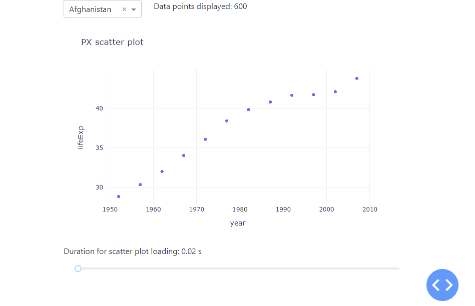
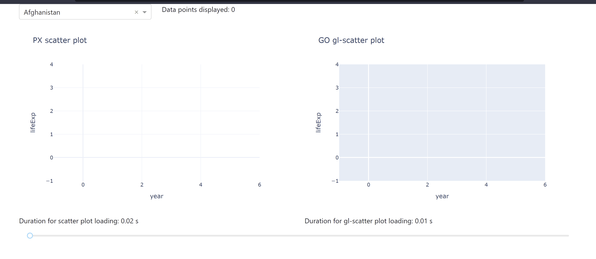

# Chapter 13: Improving app performance

## What you will learn

As dashboards are designed for data analysis and visualisations, at some point you might run into efficiency constraints when the amount of data you are working with becomes too big. To circumvent possible performance issues, this chapter will give you some insights on wyas to improve your app performance. You'll learn about the built-in Dash Developer Tools, how to plot massive amount of data with higher performing plotly graphs, and how to use caching for improving the performance of your app. 

```{admonition} Learning Intentions
- Dash Developer Tools
- Plotly Graphs for Big Data
- Caching
```

## 13.1 Introduction

Let's kick off with a simple app with a scatter plot that display the life expectation over the years for a selected country. To better understand how a growing data set affects the app performance, we duplicated the underlying data set by a value of our choice, using a range slider. As the underlying data set grows, the data points in the scatter plot will be resized as well. Lastly, we used the `datetime` package to tell us the time it takes the app to load. All in all, we receive the following app:




````{dropdown} See the code
    :container: + shadow
    :title: bg-primary text-white font-weight-bold
  
```
# Import packages
from dash import Dash, dcc, Input, Output
import dash_bootstrap_components as dbc
from datetime import datetime
import numpy as np
import pandas as pd
import plotly.express as px

# Setup data
df = px.data.gapminder()[['country', 'year', 'lifeExp']]
dropdown_list = df['country'].unique()

# Initialise the App
app = Dash(__name__, external_stylesheets=[dbc.themes.BOOTSTRAP])

# Create app components
markdown = dcc.Markdown(id='our-markdown')
dropdown = dcc.Dropdown(id='our-dropdown', options=dropdown_list, value=dropdown_list[0])
markdown_scatter = dcc.Markdown(id='markdown-scatter')
slider = dcc.Slider(id='our-slider', min=0, max=8500, marks=None, value=0)

# App Layout
app.layout = dbc.Container(
    [
        dbc.Row([dbc.Col(dropdown, width=3), dbc.Col(markdown, width=9)]),
        dbc.Row([dbc.Col(dcc.Graph(id='our-figure'))]),
        dbc.Row([dbc.Col(markdown_scatter)]),
        dbc.Row(dbc.Col(slider)),
    ]
)


# Configure callbacks
@app.callback(
    Output(component_id='our-markdown', component_property='children'),
    Input(component_id='our-dropdown', component_property='value'),
    Input(component_id='our-slider', component_property='value'),
)
def update_markdown(value_dropdown, value_slider):
    df_sub = df[df['country'].isin([value_dropdown])]
    title = 'Data points displayed: {:,}'.format(len(df_sub.index) * value_slider)
    return title


@app.callback(
    Output(component_id='our-figure', component_property='figure'),
    Output(component_id='markdown-scatter', component_property='children'),
    Input(component_id='our-dropdown', component_property='value'),
    Input(component_id='our-slider', component_property='value'),
)
def update_graph(value_dropdown, value_slider):
    df_sub = df[df['country'].isin([value_dropdown])]
    df_new = pd.DataFrame(np.repeat(df_sub.to_numpy(), value_slider, axis=0), columns=df_sub.columns)
    start_time = datetime.now()
    fig = px.scatter(
        df_new,
        x='year',
        y='lifeExp',
        title='PX scatter plot',
        template='plotly_white',
    )
    fig.update_traces(marker=dict(size=5 + (value_slider / 10000) * 25))
    end_time = datetime.now()
    subtitle = 'Duration for scatter plot loading: {} s'.format(round((end_time - start_time).total_seconds(), 2))
    return fig, subtitle


# Run the App
if __name__ == '__main__':
    app.run_server(debug=True)
```

````

Notice how adjusting the range slider to the right increases the data set used, which increases the amount of time it takes the app to refresh and plot the data.
As you can see, there are huge performance differences betweeen 600 data points and 100 thousand data points used. To handle even much larger data sets, you will learn the different graphs that you can use as well as how to use stored data to improve app performance. Before that, Dash itself comes with a really handy built-in functionality to better analyse and understand the performance of your app -- the Dash Developer Tools. Let's go!

## 13.2 Dash Developer Tools
The Dash Developer Tools is a set of tools to make debugging and developing Dash apps more productive and pleasant. These tools are enabled when developing your Dash app and are not intended when deploying your application to production. In order to make use of the Dash Developer Tools you must run your app with `debug=True`. When you do this, your app will always display a blue circular button on the bottom right corner of your app with angle brackets in it. This button will grant you access to error messages and information about your callbacks.

```{admonition} Dash Developer Tools
For an overview of the other tools within the Developer Tools, look at the [official documentation](https://dash.plotly.com/devtools).
```

Let's look at the Callback Graph. The Dash Developer Tools displays a visual representation of your callbacks: which order they are fired in, how long they take to fully execute, and what data is passed back and forth between the web browser and the server. To open up the Callback Graph, click on the bottom right circular blue button and then on the most left button named "callbacks". You will get the following view:


Let's go through the different items in more detail:

- The rounded green boxes with the numbers in them, which show up in the middle:
    - The top number represents the number of times the function has been called.
    - The bottom number represents how long the request took. This includes the network time (sending the data from the browser client to the backend and back) and the compute time (the total time minus the network time or how long the function spent in Python).
- You are also able to click on a green box to see the detailed information about the callback which would open up in the bottom left of the view. This includes:
    - `type` Whether the callback was a clientside callback or a serverside callback.
    - `call count` The number of times the callback was called during your session.
    - `status` Whether the callback was successful or not.
    - `time (avg milliseconds)` How long the request took. This is the same as the summary on the green box and is basically split up into the components       `total`, `compute` and `network`.
    - `data transfer (avg bytes)`
    - `outputs` A JSON representation of the data that was returned from the callback.
    - `inputs` A JSON representation of the data that was passed to your callback function as Input.
    - `state` A JSON representation of the data that was passed to your callback function as State.
- The blue boxes with a light grey frame around them, which are positioned at the top and bottom, represent the input and output properties respectively. Click on the box to see a JSON representation of their current values.
- The dashed arrows (not visible in the screenshot) would represent `State` elements instead of `Input`.
- The dropdown in the top right corner enables you to switch layouts.

Now, that you know how to check for the performance of your app, let us learn about different higher performing graphs and how to incorporate them into you app.

## 13.3 Plotly Graphs for Big Data
So far, we have used the `plotly.express` library to implement our graphs. This is a very easy and convenient way to do so. However, most plotly charts are rendered with SVG (Scalable Vector Graphics). This provides crisp rendering, publication-quality image export, as SVG images can be scaled in size without loss of quality, and wide browser support. Unfortunately, rendering graphics in SVG can be slow for larger datasets as we have noticed in the first section of this chapter. To overcome this limitation, let's explore the three common methods that will speed up your app when working with larger data sets.

### 13.3.1 ScatterGL

First, let us have a look at the [ScatterGL](https://plotly.com/python/line-and-scatter/#large-data-sets) plot which is a WebGL implementation of the scatter chart type. In addition to Plotly charts rendered with SVG, Plotly has WebGL (Web Graphics Library) alternatives to some chart types. WebGL uses the GPU to render graphics which make them higher performing. The ScatterGL plot is the equivalent to the scatter plot but it is of WebGL type. To use it, you are required to import the `plotly.graph_objects` package.

```{admonition} ScatterGL
See the [official documentation](https://plotly.com/python/webgl-vs-svg/) on how to implement the ScatterGL plot.
```

The following app let's you compare the different durations for data loading when using a ScatterGL plot alongside a regular Scatter plot. You see how the use of a ScatterGL could improve the app performance the larger the data set.



````{dropdown} See the code
    :container: + shadow
    :title: bg-primary text-white font-weight-bold
  
```
# Import packages
from dash import Dash, dcc, Input, Output
import dash_bootstrap_components as dbc
from datetime import datetime
import numpy as np
import pandas as pd
import plotly.express as px
import plotly.graph_objects as go

# Setup data
df = px.data.gapminder()[['country', 'year', 'lifeExp']]
dropdown_list = df['country'].unique()

# Initialise the App
app = Dash(__name__, external_stylesheets=[dbc.themes.BOOTSTRAP])

# Create app components
markdown = dcc.Markdown(id='our-markdown')
dropdown = dcc.Dropdown(id='our-dropdown', options=dropdown_list, value=dropdown_list[0])
markdown_scatter = dcc.Markdown(id='markdown-scatter')
markdown_gl = dcc.Markdown(id='markdown-gl')
slider = dcc.Slider(id='our-slider', min=0, max=50000, marks=None, value=0)

# App Layout
app.layout = dbc.Container(
    [
        dbc.Row([dbc.Col(dropdown, width=3), dbc.Col(markdown, width=9)]),
        dbc.Row([dbc.Col(dcc.Graph(id='our-figure')), dbc.Col(dcc.Graph(id='our-gl-figure'))]),
        dbc.Row([dbc.Col(markdown_scatter), dbc.Col(markdown_gl)]),
        dbc.Row(dbc.Col(slider)),
    ]
)


# Configure callbacks
@app.callback(
    Output(component_id='our-markdown', component_property='children'),
    Input(component_id='our-dropdown', component_property='value'),
    Input(component_id='our-slider', component_property='value'),
)
def update_markdown(value_dropdown, value_slider):
    df_sub = df[df['country'].isin([value_dropdown])]
    title = 'Data points displayed: {:,}'.format(len(df_sub.index) * value_slider)
    return title


@app.callback(
    Output(component_id='our-figure', component_property='figure'),
    Output(component_id='markdown-scatter', component_property='children'),
    Input(component_id='our-dropdown', component_property='value'),
    Input(component_id='our-slider', component_property='value'),
)
def update_graph(value_dropdown, value_slider):
    df_sub = df[df['country'].isin([value_dropdown])]
    df_new = pd.DataFrame(np.repeat(df_sub.to_numpy(), value_slider, axis=0), columns=df_sub.columns)
    start_time = datetime.now()
    fig = px.scatter(
        df_new,
        x='year',
        y='lifeExp',
        title='PX scatter plot',
        template='plotly_white',
    )
    fig.update_traces(marker=dict(size=5 + (value_slider / 30000) * 25))
    end_time = datetime.now()
    subtitle = 'Duration for scatter plot loading: {} s'.format(round((end_time - start_time).total_seconds(), 2))
    return fig, subtitle


@app.callback(
    Output(component_id='our-gl-figure', component_property='figure'),
    Output(component_id='markdown-gl', component_property='children'),
    Input(component_id='our-dropdown', component_property='value'),
    Input(component_id='our-slider', component_property='value'),
)
def update_graph(value_dropdown, value_slider):
    df_sub = df[df['country'].isin([value_dropdown])]
    df_new = pd.DataFrame(np.repeat(df_sub.to_numpy(), value_slider, axis=0), columns=df_sub.columns)
    start_time = datetime.now()
    fig = go.Figure(data=go.Scattergl(
        x=df_new['year'],
        y=df_new['lifeExp'],
        mode='markers',
        marker=dict(colorscale='Viridis', size=5 + (value_slider / 30000) * 25),
    ))
    fig.update_layout(
        title='GO gl-scatter plot',
        xaxis_title='year',
        yaxis_title='lifeExp',
    )
    end_time = datetime.now()
    subtitle = 'Duration for gl-scatter plot loading: {} s'.format(round((end_time - start_time).total_seconds(), 2))
    return fig, subtitle


# Run the App
if __name__ == '__main__':
    app.run_server()
```

````

### 13.3.2 Plotly Resampler

Even though the ScatterGL outperforms the px scatter plot, it slows down when using very large data sets and might not be as fast as you would like it to be when interacting with the plot, for example, zooming in. That's where the `plotly_resampler` package comes in very handy. This package speeds up the figure by downsampling (aggregating) the data respective to the view and then plotting the aggregated points. When you interact with the plot (panning, zooming, etc.), callbacks are used to aggregate data and update the figure.

```{admonition} Plotly Resampler
This is a third-party, community, library, not officially maintained by Plotly. See the [documentation on Github](https://github.com/predict-idlab/plotly-resampler) for more about the Plotly Resampler package. To work with this package, you would need to install `pip install plotly-resampler` as well as `pip install ipywidgets`.
```

The following app let's you compare the different durations for data loading when working with the plotly resampler.


````{dropdown} See the code
    :container: + shadow
    :title: bg-primary text-white font-weight-bold

```
# Import packages
from dash import Dash, dcc, Input, Output
import dash_bootstrap_components as dbc
from datetime import datetime
import numpy as np
import pandas as pd
import plotly.express as px
import plotly.graph_objects as go
from plotly_resampler import FigureResampler

# Setup data
df = px.data.gapminder()[['country', 'year', 'lifeExp']]
dropdown_list = df['country'].unique()

# Initialise the App
app = Dash(__name__, external_stylesheets=[dbc.themes.BOOTSTRAP])

# Create app components
markdown = dcc.Markdown(id='our-markdown')
dropdown = dcc.Dropdown(id='our-dropdown', options=dropdown_list, value=dropdown_list[0])
markdown_scatter = dcc.Markdown(id='markdown-scatter')
markdown_gl = dcc.Markdown(id='markdown-gl')
markdown_resampler = dcc.Markdown(id='markdown-resample')
slider = dcc.Slider(id='our-slider', min=0, max=50000, marks=None, value=0)

# App Layout
app.layout = dbc.Container(
    [
        dbc.Row([dbc.Col(dropdown, width=3), dbc.Col(markdown, width=9)]),
        dbc.Row([dbc.Col(dcc.Graph(id='our-figure')),
                 dbc.Col(dcc.Graph(id='our-gl-figure')),
                 dbc.Col(dcc.Graph(id='our-resample-figure'))]),
        dbc.Row([dbc.Col(markdown_scatter),
                 dbc.Col(markdown_gl),
                 dbc.Col(markdown_resampler)]),
        dbc.Row(dbc.Col(slider)),
    ]
)


# Configure callbacks
@app.callback(
    Output(component_id='our-markdown', component_property='children'),
    Input(component_id='our-dropdown', component_property='value'),
    Input(component_id='our-slider', component_property='value'),
)
def update_markdown(value_dropdown, value_slider):
    df_sub = df[df['country'].isin([value_dropdown])]
    title = 'Data points displayed: {:,}'.format(len(df_sub.index) * value_slider)
    return title


@app.callback(
    Output(component_id='our-figure', component_property='figure'),
    Output(component_id='markdown-scatter', component_property='children'),
    Input(component_id='our-dropdown', component_property='value'),
    Input(component_id='our-slider', component_property='value'),
)
def update_graph(value_dropdown, value_slider):
    df_sub = df[df['country'].isin([value_dropdown])]
    df_new = pd.DataFrame(np.repeat(df_sub.to_numpy(), value_slider, axis=0), columns=df_sub.columns)
    start_time = datetime.now()
    fig = px.scatter(
        df_new,
        x='year',
        y='lifeExp',
        title='PX scatter plot',
        template='plotly_white',
    )
    fig.update_traces(marker=dict(size=5 + (value_slider / 30000) * 25))
    end_time = datetime.now()
    subtitle = 'Duration for scatter plot loading: {} s'.format(round((end_time - start_time).total_seconds(), 2))
    return fig, subtitle


@app.callback(
    Output(component_id='our-gl-figure', component_property='figure'),
    Output(component_id='markdown-gl', component_property='children'),
    Input(component_id='our-dropdown', component_property='value'),
    Input(component_id='our-slider', component_property='value'),
)
def update_graph(value_dropdown, value_slider):
    df_sub = df[df['country'].isin([value_dropdown])]
    df_new = pd.DataFrame(np.repeat(df_sub.to_numpy(), value_slider, axis=0), columns=df_sub.columns)
    start_time = datetime.now()
    fig = go.Figure()
    fig.add_trace(go.Scattergl(
        x=df_new['year'],
        y=pd.to_numeric(df_new['lifeExp']),
        mode='markers',
        marker=dict(colorscale='Viridis', size=5 + (value_slider / 30000) * 25),
    ))
    fig.update_layout(
        title='GO gl-scatter plot',
        xaxis_title='year',
        yaxis_title='lifeExp',
    )
    end_time = datetime.now()
    subtitle = 'Duration for gl-scatter plot loading: {} s'.format(round((end_time - start_time).total_seconds(), 2))
    return fig, subtitle


@app.callback(
    Output(component_id='our-resample-figure', component_property='figure'),
    Output(component_id='markdown-resample', component_property='children'),
    Input(component_id='our-dropdown', component_property='value'),
    Input(component_id='our-slider', component_property='value'),
)
def update_graph(value_dropdown, value_slider):
    df_sub = df[df['country'].isin([value_dropdown])]
    df_new = pd.DataFrame(np.repeat(df_sub.to_numpy(), value_slider, axis=0), columns=df_sub.columns)
    start_time = datetime.now()
    fig = FigureResampler(go.Figure())
    fig.add_trace(go.Scattergl(
        x=df_new['year'],
        y=pd.to_numeric(df_new['lifeExp']),
        mode='markers',
        marker=dict(colorscale='Viridis', size=5 + (value_slider / 30000) * 25),
    ))
    fig.update_layout(
        title='Plotly Resampler scatter plot',
        xaxis_title='year',
        yaxis_title='lifeExp',
    )
    end_time = datetime.now()
    subtitle = 'Duration for Plotly Resampler scatter plot loading: {} s'.format(round((end_time - start_time).total_seconds(), 2))
    return fig, subtitle


# Run the App
if __name__ == '__main__':
    app.run_server(debug=True)
```

````

Here is a minimal example on how to implement a graphic using the plotly resampler package that you might want to copy paste for your own app.

```
# Import packages
from dash import Dash, dcc, Input, Output
import dash_bootstrap_components as dbc
import pandas as pd
import plotly.express as px
import plotly.graph_objects as go
from plotly_resampler import FigureResampler

# Setup data
df = px.data.gapminder()[['country', 'year', 'lifeExp']]
dropdown_list = df['country'].unique()

# Initialise the App
app = Dash(__name__, external_stylesheets=[dbc.themes.BOOTSTRAP])

# Create app components
dropdown = dcc.Dropdown(id='our-dropdown', options=dropdown_list, value=dropdown_list[0])

# App Layout
app.layout = dbc.Container(
    [
        dbc.Row([dbc.Col(dropdown)]),
        dbc.Row([dbc.Col(dcc.Graph(id='our-resample-figure'))]),
    ]
)


# Configure callbacks
@app.callback(
    Output(component_id='our-resample-figure', component_property='figure'),
    Input(component_id='our-dropdown', component_property='value'),
)
def update_graph(value_dropdown):
    df_sub = df[df['country'].isin([value_dropdown])]
    fig = FigureResampler(go.Figure())
    fig.add_trace(go.Scattergl(
        x=df_sub['year'],
        y=pd.to_numeric(df_sub['lifeExp']),
        mode='markers',
    ))
    fig.update_layout(
        title='Plotly Resampler scatterGL plot',
        xaxis_title='year',
        yaxis_title='lifeExp',
    )
    return fig


# Run the App
if __name__ == '__main__':
    app.run_server(debug=True)
```

### 13.3.3 Datashader

Another high performing way of exploring correlations of large data sets is to use the [datashader](https://plotly.com/python/datashader/) in combination with plotly. Datashader creates rasterized representations of large datasets for easier visualization, with a pipeline approach consisting of several steps: projecting the data on a regular grid aggregating it by count and creating a color representation of the grid. Usually, the minimum count will be plotted in black, the maximum in white, and with brighter colors ranging logarithmically in between.

Compared to the two methods above, the datashader differentiates not only in speed but in the way it visualises data. Instead of the actual data points it represents the occurence of the observed data, therefore letting you explore the correlation, especially any accumulations of your data set really fast. We stay with the bespoken example above to introduce the datashader but change the dropdown to select the continent instead of the country to really make use of the specifications of the datashader. Before use, make sure to install the `datashader` package.

```{attention}
As the datashader needs real numbers to process properly, we will use the numeric conversion that comes within the `pandas` package for the input years and life expectation i.e., we will set
- df_new['year'] = pd.to_numeric(df_new['year'])
- df_new['lifeExp'] = pd.to_numeric(df_new['lifeExp'])
```

The following app shows the datashader in action. Use the code below to make it work also on your computer. 

#### [ADD GIF, THAT SHOWS APP IN ACTION AND SELECTS TWO OR THREE DIFFERENT CONTINENTS FOR A HIGH SLIDER VALUE]

````{dropdown} See the code
    :container: + shadow
    :title: bg-primary text-white font-weight-bold
  
```
# Import packages
from dash import Dash, dcc, Input, Output
import dash_bootstrap_components as dbc
import datashader as ds
from datetime import datetime
import numpy as np
import pandas as pd
import plotly.express as px

# Setup data
df = px.data.gapminder()[['continent', 'year', 'lifeExp']]
dropdown_list = df['continent'].unique()

# Initialise the App
app = Dash(__name__, external_stylesheets=[dbc.themes.BOOTSTRAP])

# Create app components
markdown = dcc.Markdown(id='our-markdown')
dropdown = dcc.Dropdown(id='our-dropdown', options=dropdown_list, value=dropdown_list[0])
markdown_scatter = dcc.Markdown(id='markdown-scatter')
slider = dcc.Slider(id='our-slider', min=0, max=50000, marks=None, value=0)

# App Layout
app.layout = dbc.Container(
    [
        dbc.Row([dbc.Col(dropdown, width=3), dbc.Col(markdown, width=9)]),
        dbc.Row([dbc.Col(dcc.Graph(id='our-figure'))]),
        dbc.Row([dbc.Col(markdown_scatter)]),
        dbc.Row(dbc.Col(slider)),
    ]
)


# Configure callbacks
@app.callback(
    Output(component_id='our-markdown', component_property='children'),
    Input(component_id='our-dropdown', component_property='value'),
    Input(component_id='our-slider', component_property='value'),
)
def update_markdown(value_dropdown, value_slider):
    df_sub = df[df['continent'].isin([value_dropdown])]
    title = 'Data points aggregated: {:,}'.format(len(df_sub.index) * value_slider)
    return title


@app.callback(
    Output(component_id='our-figure', component_property='figure'),
    Output(component_id='markdown-scatter', component_property='children'),
    Input(component_id='our-dropdown', component_property='value'),
    Input(component_id='our-slider', component_property='value'),
)
def update_graph(value_dropdown, value_slider):
    df_sub = df[df['continent'].isin([value_dropdown])]
    df_new = pd.DataFrame(np.repeat(df_sub.to_numpy(), value_slider, axis=0), columns=df_sub.columns)
    df_new['year'] = pd.to_numeric(df_new['year'])
    df_new['lifeExp'] = pd.to_numeric(df_new['lifeExp'])
    start_time = datetime.now()
    cvs = ds.Canvas(plot_width=100, plot_height=100)
    agg = cvs.points(df_new, 'year', 'lifeExp')
    zero_mask = agg.values == 0
    agg.values = np.log10(agg.values, where=np.logical_not(zero_mask))
    agg.values[zero_mask] = np.nan
    fig = px.imshow(agg, origin='lower', labels={'color': 'Log10(count)'})
    end_time = datetime.now()
    subtitle = 'Duration for datashader loading: {} s'.format(round((end_time - start_time).total_seconds(), 2))
    return fig, subtitle


# Run the App
if __name__ == '__main__':
    app.run_server(debug=True)
```

````

## 13.4 Caching

Caching, also known as Memoization, is a method used in computer science to speed up calculations by storing data so that future requests for that data can be served faster. Typically, this data stored in a cache is the result of an earlier computation. This way repeated function calls are made with the same parameters won't have to be calculated multiple times. One popular use case may be recurvise functions. More general, whenever you process repititive but difficult or time-consuming calculations within your app you might want to use caching as it allows you to store calculations to speed up your app performance.

```{admonition} Memoization
For an exemplary introduction to memoization and the implementation in Python also have a look at [Towards Data Science](https://towardsdatascience.com/memoization-in-python-57c0a738179a) or [Real Python](https://realpython.com/lru-cache-python/).
```

Let's stick with a minimal example of the one that we have used throughout this chapter i.e., only a dropdown with a graph, but adding a repititve, time consuming functionality. Defining our own function `calculation_function`, we assure that whenever the callback for the graph gets triggered by selecting another country we delay the app performance by three seconds.

Here is when caching comes into play. By storing the functions' values for the selected countries i.e., remembering the country in the cache, the respective calculation do not has to be executed the next time. We will use the `lru_cache` (LRU for Least Recently Used) decorator from the `functools` package that goes infront our function and takes in the maximal size of values that can be stored as a parameter.

The app below with the respective code gives you a minimal example on how to implement caching.

#### [ADD GIF, THAT SHOWS APP IN ACTION AND SELECTS TWO DIFFERENT COUNTRIES AND THEN RETURNS TO A COUNTRY ALREADY ONCE SELECTED]

```
# Import packages
from dash import Dash, dcc, Input, Output
import dash_bootstrap_components as dbc
from functools import lru_cache
import plotly.express as px
import time

# Setup data
df = px.data.gapminder()[['country', 'year', 'lifeExp']]
dropdown_list = df['country'].unique()

# Define own functionality and initialise cache
@lru_cache(maxsize=len(dropdown_list))
def calculation_function(string):
    time.sleep(3)
    return string


# Initialise the App
app = Dash(__name__, external_stylesheets=[dbc.themes.BOOTSTRAP])

# Create app components
dropdown = dcc.Dropdown(id='our-dropdown', options=dropdown_list, value=dropdown_list[0])

# App Layout
app.layout = dbc.Container(
    [
        dbc.Row([dbc.Col(dropdown)]),
        dbc.Row([dbc.Col(dbc.Spinner(children=dcc.Graph(id='our-figure')))]),
    ]
)


# Configure callbacks
@app.callback(
    Output(component_id='our-figure', component_property='figure'),
    Input(component_id='our-dropdown', component_property='value'),
)
def update_graph(value_dropdown):
    calculation_function(value_dropdown)
    df_sub = df[df['country'].isin([value_dropdown])]
    fig = px.scatter(
        df_sub,
        x='year',
        y='lifeExp',
        title='PX scatter plot',
        template='plotly_white',
    )
    fig.update_traces(marker=dict(size=20))
    return fig


# Run the App
if __name__ == '__main__':
    app.run_server(debug=True)
```

## Summary

This chapter gave an introduction on how to analyse large data sets with Dash as you will have to face performance issues at some point in time. The first functionality that will help you to understand the performance of your app are the built-in Dash Developer Tools. When it comes to implementing higher performance within your app you have learned about different ways of higher performing graphs: ScatterGL, Plotly Resampler and the Datashader. Last, memorising difficult as well as repetitive calculations can be handled storing the results in the cache. Combining everything you have learned so far you will be able to build dash apps not just functional but performant.
