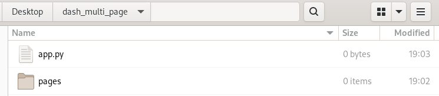

# Chapter 14: Introduction to Multi-page Apps

## What you will learn
In this chapter we will introduce multi-page apps which will allow us to build more complex apps.
```{admonition} Learning Intentions
- How to structure multi-page apps project
- Navigate between apps
```

## Why separate app into multiple pages?
  - <b>Advantages</b>
    - Easy to develop small apps and features
    - Easy to troubleshoot bugs
    - New apps can be built on to old apps
  - <b>Disadvantages</b>
    - Extra infrastructure is required
    - Slightly more complex apps

## Structure of Multi-page Apps
  - Storyboarding and building out pages
    - <b>Do we need this?</b>

Let's start our `multi-page app` by creating a root directory folder called `dash_multi_page`.  Within the `dash_multi_page` directory create a subdirectory called `pages` and the main app file called `app.py`:



Pages are displayed in the `dash.page_container` component that we will add to `app.layout`.  We'll borrow from an [example](https://github.com/AnnMarieW/dash-multi-page-app-demos/tree/main/multi_page_example1) on Github and create an app that uses a `navigation bar` with a `dropdown menu`:

In `app.py` copy/paste the following code:

```python

import dash
import dash_bootstrap_components as dbc

app = dash.Dash(__name__, use_pages=True, external_stylesheets=[dbc.themes.BOOTSTRAP])

navbar = dbc.NavbarSimple(
    dbc.DropdownMenu(
        [
            dbc.DropdownMenuItem(page["name"], href=page["path"])
            for page in dash.page_registry.values()
            if page["module"] != "pages.not_found_404"
        ],
        nav=True,
        label="More Pages",
    ),

)

app.layout = dbc.Container(
    [navbar, dash.page_container],
    fluid=True,
)

if __name__ == "__main__":
    app.run_server(debug=True)


```

  - File and folder layouts
    - Create main `app.py` file is root directory
    - Create subdirectory `/pages`
      - Add individual apps to `/pages` directory
        - Each page needs to contain a `layout`
        - Registering pages
          -  call ```dash.register_page(__name__)```
          - ```dash.page_registry``` is an `ordered dictionary` containing each page's paths, name, title, etc.
  - Callbacks
  - Building out the app.py file
