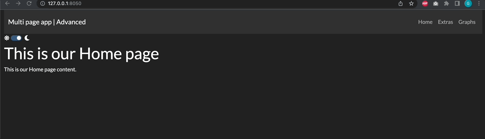

# chapter 15: Advanced Features of Multi-page Apps

## What you will learn
In this chapter we will build a more advanced multi page App, starting from the framework introduced in the previous chapter. 
```{admonition} Learning Intentions
- Visualise and navigate the `page_registry`
- Include images into multi-page Apps
- Customise several features of multi-page Apps such as: URLs, page sort, meta tags
```
By the end of this chapter, you'll be able to build the following App:

## Advanced multi-page App Introduction
As a starting point for the chapter, let's strt by building a multi-page App structure with all the knowledge from the previous chapter. Starting from this template, we'll be adding a couple of features in every section.

Our starting template is be the following:


The App structure consists in: 
- an `app.py` file
- `assets` folder, which is currently empty
- `pages` folder with the following pages: `Home`, `Graphs`, `Extras`, `About`.

We want to build an App with a website-looking layout and therefore we've customised the `app.py` file in the following way:
- Our header is represented by a `abc.Navbar` component containing the title of our App and one `dbc.NavLink` for each page in our registry.
- Below the header, we've included a `theme_toggle` which is a theme switcher. We've picked two themes from `dbc.themes` and the switcher will allow to switch between the two
- Note that when instatiating our `app`, we've enabled the `use_pages=True` option and used the `external_stylesheets` to define the default theme (which is `url_theme2` and also added enhanced fonts with the option `dbc.icons.FONT_AWESOME`).

The obtained `app.py` is the following:

````{dropdown} See the code
    :container: + shadow
    :title: bg-primary text-white font-weight-bold
  
```
from dash import Dash, html
import dash_bootstrap_components as dbc
import dash
from dash_bootstrap_templates import ThemeSwitchAIO

# Configure Themes
url_theme1 = dbc.themes.FLATLY
url_theme2 = dbc.themes.DARKLY
theme_toggle = ThemeSwitchAIO(
    aio_id="theme",
    themes=[url_theme2, url_theme1],
    icons={"left": "fa fa-sun", "right": "fa fa-moon"},
)
dbc_css = "https://cdn.jsdelivr.net/gh/AnnMarieW/dash-bootstrap-templates/dbc.min.css"

# App
app = Dash(__name__, use_pages=True, external_stylesheets=[[url_theme2, dbc_css], dbc.icons.FONT_AWESOME])

header = dbc.Navbar(
    dbc.Container(
        [
            html.A(
                dbc.Row([
                    dbc.Col(dbc.NavbarBrand("Multi page app | Advanced"))
                ],
                align="center"),
            href="/",
            style={"textDecoration": "none"}
            ),
            dbc.Row([
                dbc.NavbarToggler(id="navbar-toggler"),
                    dbc.Nav([
                        dbc.NavLink(page["name"], href=page["path"])
                        for page in dash.page_registry.values() if page["module"] != "pages.not_found_404"
                    ])
            ])
        ],
        fluid=True,
    ),
    dark=True,
    color='dark'
)

app.layout = dbc.Container([header, theme_toggle, dash.page_container], fluid=True)

if __name__ == '__main__':
	app.run_server(debug=False)
```

````

Each page code is very basic and will be enhanced in the following sections.

## Navigating the page registry


## Content:
- Show and describe the following App as the baseline
- Go through the following enhancements to the app:
  - Creation of a button which print out the registry on the console and examine it
  - Add assets folder with images and show them
  - Rename URLs
  - Sort pages differently (e.g. Graph page before Extras)
  - Add a meta tag example


