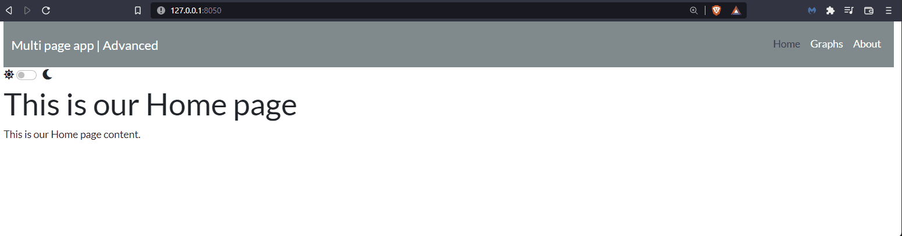
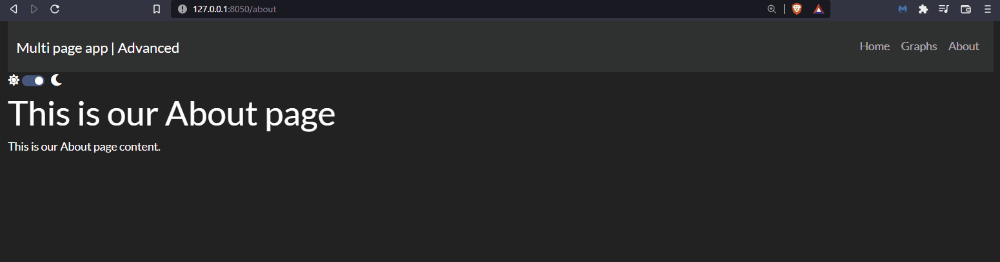
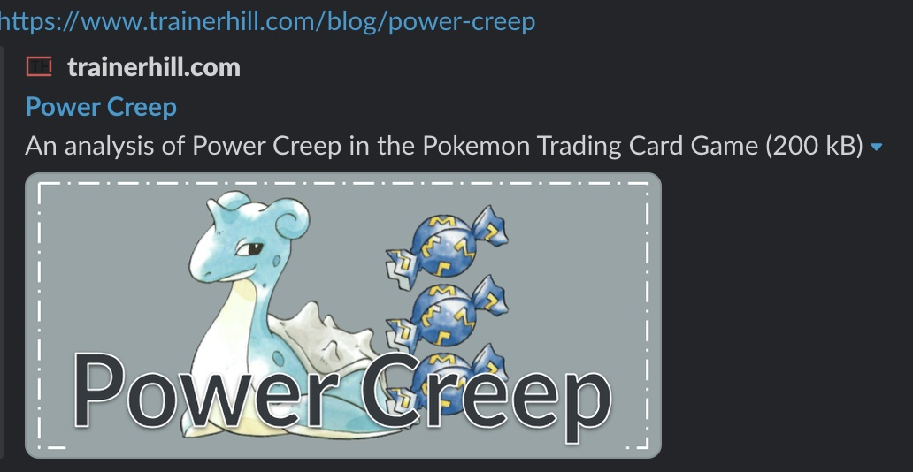
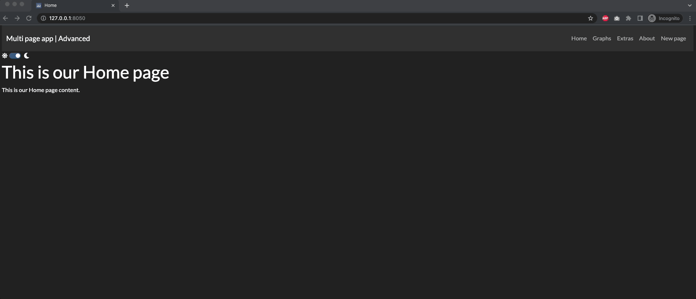
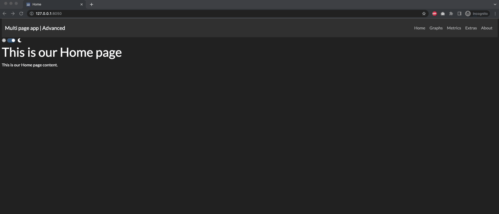

# Chapter 15: Advanced Features of Multi-page Apps

## What you will learn
In this chapter we will cover more advanced features of Dash Pages, as we build a professional multi-page App.
```{admonition} Learning Intentions
- Add a custom 404 page
- Navigate the `page_registry`
- Customise order of pages, title and urls
- Include meta tags
- Add theme to app
```

By the end of this chapter, you'll be able to build this app:



[Click to download the complete code file for this chapter](https://github.com/open-resources/dash_curriculum/blob/main/tutorial/part5/ch15_files/app_final.zip?raw=true).

```{attention} 
To run this app successfully, you will need to install the `dash-bootstrap-templates` and the `dash-labs` packages.

> pip install dash-bootstrap-templates

> pip install dash-labs
```

## 15.1 Default and Custom 404
Multi pages apps include, by default, a landing page whenever the user tries to reach an invalid URL.
The default 404-page looks like the following:


However, the 404-page can be customised. In order to do so, we created a new file named `not_found_404.py` inside the pages folder and add the desired layout content.

```
import dash
from dash import html

dash.register_page(__name__)

layout = html.Div(children=[
    html.H1(children='Page not found'),

    html.Div(children='''
        This is a custom 404 page layout
    '''),
])
```

Then, we add the below line of code to the `app.py` file to ensure that the 404 page does not appear as a link in the navbar, since we only want the Home, About, and Graphs pages on the navbar. 

`for page in dash.page_registry.values() if page["module"] != "pages.not_found_404"`

Run the app and try to type a fake name in the url to see the custom-amde 404 page displayed:


## 15.2 Page registry
The `dash_labs` module has a function called `print_registry()` which allows to print the registry into the terminal to see the meta data of each registered page.

Un-hashtag the below line of code in the `app.py` file, and rerun your app.

`print_registry(exclude="layout")`

If you examine your terminal, you will see the following output (we've included the output only for the home page in the screenshot. The complete output includes the other pages):


As you can see, the registry stores a lot of information for each page, let's focus on some properties ([see the docs for the full list](https://dash.plotly.com/urls#reference-for-dash.register_page))

- `path`: is the URL of the page. The path of the home page is always assigned a `'/'`. A multi page app **must always be assigned a home page path.**
- `name`: name of the link. If null, the app filename will be used. Not to be confused with `__name__`.
- `order`: the order of the pages in the app - commonly used when creating the page links in the app.py file (navlink and navbar in our case). If order of pages is not supplied, the page with path '/' will receive order 0, then the remaining pages are sorted alphabetically.
- `title`: name of the page to be displayed in the browser tab. If null, the app filename will be used.
- `description` and `image` are extra properties that, if specified, allow the adding of meta information to our app URL when shared. `image` should contain the image filename located into the `assets` folder.

## 15.3 Multi-page order
By looking at the app we have so far, you'll notice that the order of the links in the navbar are Home, Graphs, and About, from left to right. This is because we assigned the number 0 to the `order` property of the home.py file, the number 1 to the graphs_v2_fin.py file, and the number 2 to the about.py file. Had we chosen not to supply an order, the app would have displayed the pages in an alphabetical order: "Home" first because it's the home page, "About" second, and "Graphs" third.

Here's what the page registry looks like: 
- pages/home.py : `dash.register_page(__name__, path='/', order=0)`
- pages/about.py : `dash.register_page(__name__, order=2)`
- pages/graphs_v2_fin.py : `dash.register_page(__name__, order=1)`

Get your feet wet and try to change the order of the home page so it appears last (far right) in the Navbar. 

## 15.4 Names, titles, and URLs of pages
The graphs page of our app is represented by the file `graphs_v2_fin.py`. Dash will automatically assign the file name to the `title`, `name` and `path` properties of the page registry. However, in our case, we made the app look more professional by assigning new names and titles in the page registry. 

- pages/graphs_v2_fin.py : `dash.register_page(__name__, order=1, name='Graphs', title='Dash App | Graphs')`.

Notice that we did not modify the `path` property of the page registry. Consequently, the url of the graphs page will remain `/graphs-v2-fin`. 

Now try this yourself: go into one of the pages and update the `title` and `name` properties with other values. Rerun the app and see how the text displayed in the navbar and the text displayed in the browser tab changes.

## 15.5 Updating the default `pages` directory
We can further customise a multipage app by renaming the folder which contains all pages. By default, the folder should be named `pages`; however, we can simply specify a custom folder name when instantiating our `app` if we prefer a different name.

Let's suppose we chose to rename the folder with all the app's pages to `app sections` instead of `pages`. After we do that, we need to assign the new folder name to the `pages_folder` property in the `app.py` file:

`app = Dash(__name__, use_pages=True, pages_folder='app sections')`.

```{note}
When renaming the `pages` directory, all parts of the code that refer to the `pages` folder must be updated with the new name. An example of this is the code used in the `app.py` file to build the `Navbar`. 
- from: `for page in dash.page_registry.values() if page["module"] != "pages.not_found_404"`
- to: `for page in dash.page_registry.values() if page["module"] != "app sections.not_found_404"`
```

## 15.6 Meta tags
Meta tags allow a card to be displayed with a preview of our app when sharing the link to our app (for example, on Twitter, LinkedIn, Plotly Forum, etc.). For the web to automatically create a page preview, you would need to define the `title`, `description` and the `image` properties of the page registry.

To test this feature, we would need the app to be published; here's an example of a published app, made by a Dash community member, which includes meta tags.



The meta tag properties within the Power Creep app are defined as such:

- `title= 'Power Creep'`
- `description= 'An analysis of Power Creep in the Pokemon Trading Card Game'` 
- `image`: an image placed in the `assets` folder of the app

So, coming back to our app, if you would like to create meta tags for the Graphs page, you would need to add the `description` and `image` properties to its page registry as such: 
```
dash.register_page(__name__,
		order=1,
		name='Graphs',
		title='Dash App | Graphs',
		description='Graphs to visualize the gapminder dataset.',
		image=graph_preview.png)
```
Make sure to create your desired image and place that file, `graph_preview.png`, in the `assets` folder.

## 15.7 App themes
As a reminder, the `app.py` file is what brings all the pages together and finalizes the build of the multi page app.

We want to give this app a more professional look; therefore we've customised the `app.py` file in the following way:
- Our header is represented by a `dbc.Navbar` component containing the title of our App and one `dbc.NavLink` for each page in our registry. From the registry, we exclude one page ``if page["module"] != "pages.not_found_404"``. This is a default page that is used when the user tries to reach an invalid URL. In the next section we'll see how it works and how we can customise it.
- Below the header, we've included a `theme_toggle` which allow to switch between two themes. We've picked two themes from `dbc.themes` (tipically a dark and a light one) and the switcher will allow to switch between the two.
- Note that when instantiating our `app`, we've enabled the `use_pages=True` option and used the `external_stylesheets` to define the default theme (which is `url_theme2`) together with enhanced fonts with the option `dbc.icons.FONT_AWESOME`.

**App file:**

````{dropdown} See the code
    :container: + shadow
    :title: bg-primary text-white font-weight-bold
  
```
from dash import Dash, html
import dash_bootstrap_components as dbc
import dash
from dash_bootstrap_templates import ThemeSwitchAIO
from dash_labs import print_registry

# Configure Themes
url_theme1 = dbc.themes.FLATLY
url_theme2 = dbc.themes.DARKLY
theme_toggle = ThemeSwitchAIO(
    aio_id="theme",
    themes=[url_theme2, url_theme1],
    icons={"left": "fa fa-sun", "right": "fa fa-moon"},
)
dbc_css = "https://cdn.jsdelivr.net/gh/AnnMarieW/dash-bootstrap-templates/dbc.min.css"

# App
app = Dash(__name__, use_pages=True, external_stylesheets=[[url_theme2, dbc_css], dbc.icons.FONT_AWESOME], pages_folder='pages')

# print_registry(exclude="layout")

header = dbc.Navbar(
    dbc.Container(
        [
            html.A(
                dbc.Row([
                    dbc.Col(dbc.NavbarBrand("Multi page app | Advanced"))
                ],
                align="center"),
            href="/",
            style={"textDecoration": "none"}
            ),
            dbc.Row([
                dbc.NavbarToggler(id="navbar-toggler"),
                    dbc.Nav([
                        dbc.NavLink(page["name"], href=page["path"])
                            for page in dash.page_registry.values() if page["module"] != "pages.not_found_404"
                    ])
            ])
        ],
        fluid=True,
    ),
    dark=True,
    color='dark'
)

app.layout = dbc.Container([header, theme_toggle, dash.page_container], fluid=True)

if __name__ == '__main__':
	app.run_server(debug=False)
```

````

Each page code is very basic and will be enhanced in the following sections.

## Exercises
(1) Starting from the App we've built in this chapter (which can be downloaded [here](https://github.com/open-resources/dash_curriculum/blob/main/tutorial/part5/ch15_files/app_vfin.zip?raw=true)), add a new page with the following features:
- The new page file should be named `new_page.py`
- The content of the page should be the App developed in the [exercise 2 from chapter 8](https://open-resources.github.io/dash_curriculum/part2/chapter8.html#exercises)
````{dropdown} See Solution
    :container: + shadow
    :title: bg-primary text-white font-weight-bold

This is how the `new_page.py` should look like. Place this file inside the `app sections` folder (the remaining App files do not require any change).
```
from dash import Dash, dcc, Output, Input, callback
import dash
import pandas as pd
import plotly.express as px
import dash_bootstrap_components as dbc

# data
df = px.data.gapminder()
df = df.groupby(['year','continent']).agg({'pop':'sum', 'gdpPercap':'mean','lifeExp':'mean'}).reset_index()

# Dash App
dash.register_page(__name__)

# Create app components
title_ = dcc.Markdown(children='Gapminder Stacked Bar Charts', style={'textAlign': 'center','fontSize': 20})
dropdown_ = dcc.Dropdown(id='metric-dropdown', placeholder = 'Select a metric',
                        options= [{'label': 'Population', 'value': 'pop'},
                                {'label': 'GDP per capita', 'value': 'gdpPercap'},
                                {'label': 'Life Expectancy', 'value': 'lifeExp'}])
graph_ = dcc.Graph(id='figure1')

# App Layout
layout = dbc.Container(
    [
        dbc.Row([dbc.Col([title_], width=12)]),
        dbc.Row(
            [
                dbc.Col([dropdown_], width=2),
                dbc.Col([graph_], width=10),
            ]
        )
    ]
)

# Callbacks
@callback(
    Output('figure1','figure'),
    Input('metric-dropdown', 'value')
)
def update_markdown(metric_):
    fig = px.bar(df, x='year', y=metric_, color='continent', template='plotly_dark')
    return fig
```

````

(2) Continue what we have built in exercise 1. Make the following adjustments to the newly added page:
- Update the order of the `new_page.py`: make it the third page of our App, after `Graphs`.
- Update the name of the new page to: `Metrics`
- Update the title of the new page to: `Gapminder | Metrics`
````{dropdown} See Solution
    :container: + shadow
    :title: bg-primary text-white font-weight-bold

To slove this exercise, we just need to update the `dash.register_page()` statements of the following files:
- `new_page.py` should be registered as: `dash.register_page(__name__, order='2', name='Metrics', title='Gapminder | Metrics')`
- `extras.py` should be registered as: `dash.register_page(__name__, order='3')`
- `about.py` should be registered as: `dash.register_page(__name__, order='4')`


````


## Summary
In this chapter, we have gone through several features that are specific to multi page apps. There are additional functionalities and examples that can be found in the [Dash documentation](https://dash.plotly.com/urls).

This also concludes the section dedicated to multi page apps.
