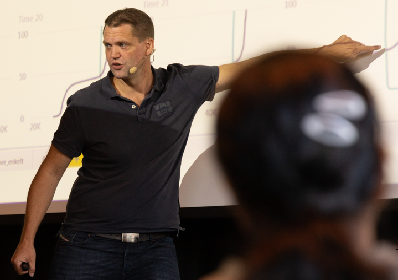

# About
The Dash Open-Source Curriculum is a result of months of collaboration between Plotly staff members, professors from the University of British Columbia and New York University, and a devoted team of Dash community members from all over the world. The intention behind the curriculum is to support teachers and students with the learning of data science programs. 

# Authors

Gabriele Albini - 
Gabriele is an Engineer from Milan, Italy. He has taken part in various BI and data roles within large and small organisations. During his career, he developed strong interests in data visualisation and data insights, and his main focus currently is Machine Learning implementations. Outside working hours, Gabriele enjoys metal music and he loves playing the guitar and travelling. Follow him on [Linkedin](https://www.linkedin.com/in/gabriele-albini-85100549/) and [Github](https://github.com/gabri-al). 

***

Shane Mattner -
Shane is an embedded firmware engineer living in San Francisco, California. He's worked as a firmware, electrical, and controls engineer on various consumer and industrial products. Plotly and Dash have become an integral part of his engineering toolkit that makes data collection and analysis easy. Follow him on [Linkedin](https://www.linkedin.com/in/shane-mattner-071b7941/) and [Github](https://github.com/shanemmattner).

***

Marcel Zeuch - 
Marcel is a mathematician living in Frankfurt, Germany.  He worked as a management consultant as well as a quantitative and data analyst. He has been using Plotly and Dash since 2020 and is the co-author of a Data Science compendium, published by Springer. He is passionate about Data Science and visualisations, entrepreneurship and finance. Follow him on [LinkedIn](https://de.linkedin.com/in/marcel-zeuch) and [Github](https://github.com/MarcelZeuch).

***

Arne Petter - 
Arne Petter holds a master’s degree in finance and business strategy, and has worked as an analyst in the Nordic power market before he recently joined [Itera](https://www.itera.com/) Bergen in Norway as a managing consultant. He’s passionate about efficient storytelling, and has found Plotly Dash to be one of the finest tools available for gaining and sharing knowledge and insights with data and visualizations. He was the world’s first recipient of the Plotly gold badge on StackOverflow, and still holds the position as the all-time highest ranking contributor under the [Plotly tag](https://stackoverflow.com/tags/plotly/topusers) on StackOverflow. Follow him on [Linkedin](https://www.linkedin.com/in/arne-petter-drageset-459b608/) and [StackOverflow](https://stackoverflow.com/users/3437787/vestland).

